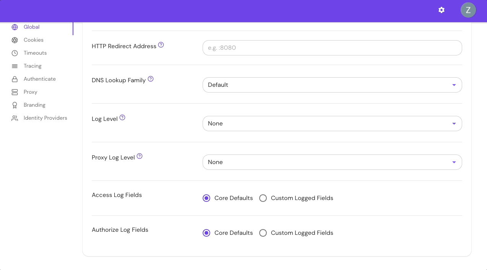
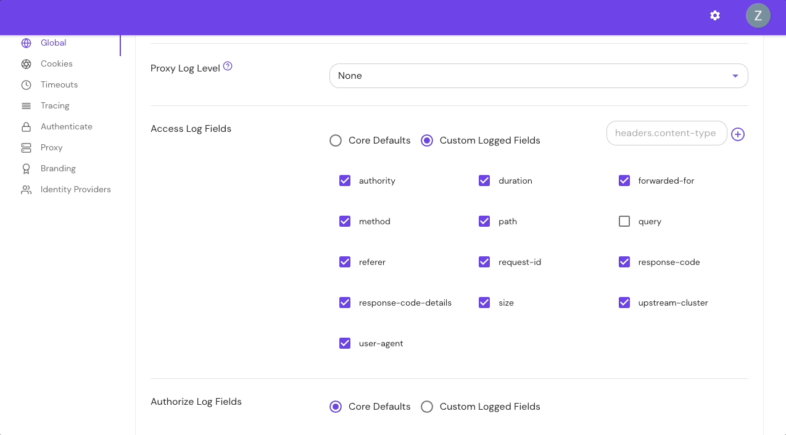

import Tabs from '@theme/Tabs';
import TabItem from '@theme/TabItem';

# Access Log Fields

## Summary

The **Access Log Fields** setting controls which fields will be included in the access logs. For each incoming request, the proxy service will emit a log entry with the message `http-request` containing these fields.

The default log fields should be appropriate for most deployments.

## How to configure

<Tabs>
<TabItem label="Core" value="Core">

| **Config file key** | **Environment variable** | **Type** | **Default** |
| :-- | :-- | :-- | :-- |
| `access_log_fields` | `ACCESS_LOG_FIELDS` | Array of strings | See [Access Fields and Defaults](#access-fields-and-defaults) |

### Examples

```yaml
access_log_fields:
  - authority
  - duration
  - path
```

```bash
ACCESS_LOG_FIELDS=authority,duration,path
```

**Custom headers example:**

```yaml
access_log_fields:
  - headers.user-agent
  - headers.content-type
```

```bash
ACCESS_LOG_FIELDS=headers.user-agent,headers.content-type
```

</TabItem>
<TabItem label="Enterprise" value="Enterprise">

Configure **Access Log Fields** in the Console:



Add **Custom Headers** in the Console:



</TabItem>
<TabItem label="Kubernetes" value="Kubernetes">

| **[Parameter name](/docs/deploy/k8s/reference#spec)** | **Type** | **Default** |
| :-- | :-- | :-- |
| `accessLogFields` | Array of strings | See [Access Fields and Defaults](#access-fields-and-defaults) |

### Examples

```yaml
accessLogFields:
  - authority
  - duration
  - path
```

**Custom headers example**

```yaml
accessLogFields:
  - headers.user-agent
  - headers.content-type
```

</TabItem>
</Tabs>

## Access log fields and defaults

The table below lists all available access log fields:

| **Field name** | **Description** | **Default field** |
| :-- | :-- | :-- |
| `authority` | The HTTP request `:authority` or `Host` header value. Can be a domain name or IP address and may contain a port number (for example, `www.example.com`) | Yes |
| `duration` | The amount of time the request takes to complete in seconds | Yes |
| `forwarded-for` | This is the value of the [`X-Forwarded-For`](/docs/reference/x-forwarded-for-http-header) header (as sent to the upstream service) | Yes |
| `ip` | The user's IP address. Note that this depends on setting the [`xff_num_trusted_hops`](/docs/reference/the-number-of-trusted-hops) option appropriately. | No |
| `method` | The HTTP request method, such as `GET`, `POST`, or `PUT` | Yes |
| `path` | The HTTP request path (for example, `/some/path`) | Yes |
| `referer` | The HTTP request referer, or the address of the web page from which the resource has been requested | Yes |
| `request-id` | The request's unique identifier as assigned by Pomerium | Yes |
| `response-code` | The HTTP Response Code (for example `200` or `500`) | Yes |
| `response-code-details` | The response code details set by Envoy (for example, `via_upstream` or `route_not_found`; see the [Envoy docs](https://www.envoyproxy.io/docs/envoy/latest/configuration/http/http_conn_man/response_code_details) for more information) | Yes |
| `size` | The HTTP Response size in bytes | Yes |
| `upstream-cluster` | The cluster the request was sent to (the cluster name is assigned by Pomerium, for example `route-3bb74f76f9d71f9c` or `pomerium-control-plane-http`) | Yes |
| `user-agent` | The User-Agent field sent by the user's browser | Yes |
| `query` | The HTTP request query (for example, `?test=one&other=13`) | No |
| \* [`headers.{CustomHeaderName}`](#custom-headers-fields) | An HTTP Request Header identified by the `HeaderName` (for example, `headers.X-Amzn-Trace-Id` might return `Root=1-64c03960-37809588421513e42f260f56`) | No |

\* The `headers.{CustomHeaderName}` field is only available in **Core** and **Enterprise**, not Kubernetes.

:::danger

Query parameters often contain sensitive information. Do not enable the `query` log field without careful consideration.

:::

## Access log behavior

### Find access logs

To find access logs logged by the proxy service, filter your Pomerium logs for entries containing `"message": "http-request"`:

```json
{
  "level": "info",
  "service": "envoy",
  "upstream-cluster": "route-6f431f0be965b608",
  "method": "GET",
  "authority": "verify.pomerium.com",
  "path": "/img/json.svg",
  "user-agent": "Mozilla/5.0 (Macintosh; Intel Mac OS X 10_15_7) AppleWebKit/537.36 (KHTML, like Gecko) Chrome/115.0.0.0 Safari/537.36",
  "referer": "https://verify.localhost.pomerium.io/index.css",
  "forwarded-for": "XXX.XXX.X.XXX",
  "request-id": "6f3ad640-cb15-48b4-b79f-9adb94dd654c",
  "duration": 224.860959,
  "size": 5127,
  "response-code": 200,
  "response-code-details": "via_upstream",
  "time": "2023-08-03T16:55:14-04:00",
  "message": "http-request"
}
```

### Display specific logs

If `access_log_fields` is not defined, all the available default fields will be logged.

To log only a specific field, or multiple fields, add the desired field(s) to your configuration file.

For example, if you add the following fields to `access_log_fields`:

```yaml
access_log_fields:
  - authority
  - path
```

Your logs would look similar to the below example:

```json
{
  "level": "info",
  "service": "envoy",
  "authority": "verify.pomerium.com",
  "path": "/img/json.svg",
  "time": "2023-08-04T12:12:35-04:00",
  "message": "http-request"
}
```

### Log custom headers fields

The `headers.{CustomHeaderName}` field allows you to enter custom headers. Adding one or multiple custom headers will display only those headers.

For example, if you add the following custom headers to `access_field_logs`:

```yaml
access_log_fields:
  - headers.user-agent
  - headers.content-type
```

The custom headers will appear in the `headers` field:

```json
{
  "level": "info",
  "service": "envoy",
  "headers": {
    "content-type": "application/json",
    "user-agent": "Mozilla/5.0 (Macintosh; Intel Mac OS X 10_15_7) AppleWebKit/537.36 (KHTML, like Gecko) Chrome/115.0.0.0 Safari/537.36"
  },
  "time": "2023-08-04T11:37:01-04:00",
  "message": "http-request"
}
```
