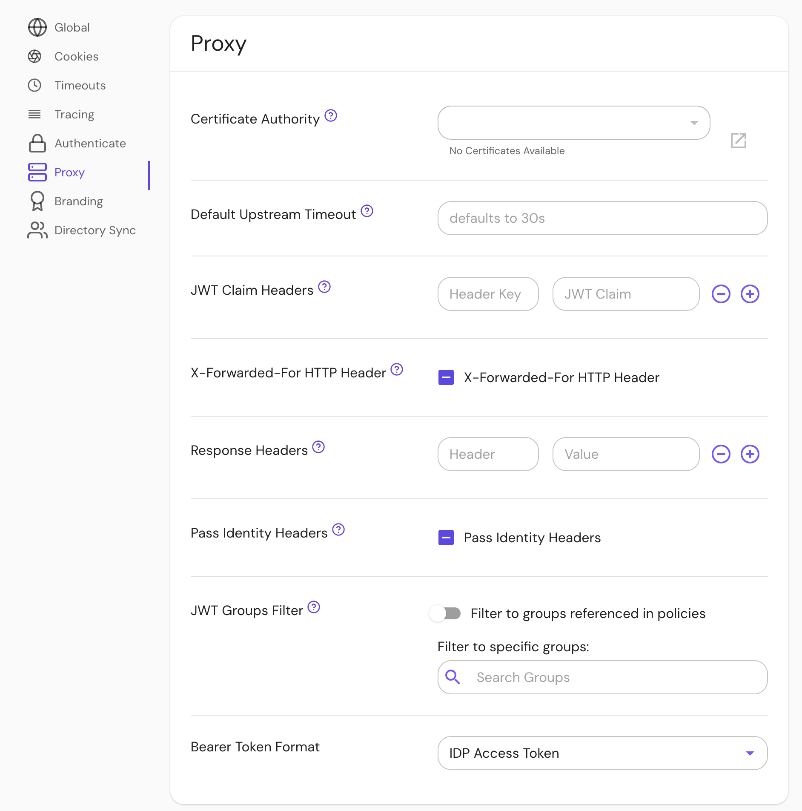

import Tabs from '@theme/Tabs';
import TabItem from '@theme/TabItem';

# Bearer Token Format

## Summary

**Bearer Token Format** controls how HTTP bearer token authentication is handled. There are 3 possible options: `default`, `idp_access_token` and `idp_identity_token`.

HTTP bearer tokens are tokens stored in the `Authorization` header prefixed by `Bearer `:

```text
GET / HTTP/1.1
Authorization: Bearer Token
```

Pomerium's `default` behavior is to pass bearer tokens to upstream applications without interpreting them. Pomerium also supports creating sessions from tokens issued by an identity provider without needing to initiate an interactive login. If the `idp_access_token` option is used, then the bearer token will be interpreted as an IdP-issued access token. If the `idp_identity_token` option is used, then the bearer token will be interpreted as an IdP-issued identity token.

Since v0.30 access and identity tokens are supported by all IdPs, except Apple does not support access tokens, and GitHub does not support identity tokens.

This option can also be configured at the route-level.

## How to Configure

<Tabs>
<TabItem value="Core" label="Core">

| **Config file keys**  | **Environment variables** | **Type** | **Default** |
| :-------------------- | :------------------------ | :------- | :---------- |
| `bearer_token_format` | `BEARER_TOKEN_FORMAT`     | `string` | `default`   |

### Examples

```yaml
bearer_token_format: idp_access_token
```

```bash
BEARER_TOKEN_FORMAT=idp_access_token
```

#### Microsoft Entra

The `az` CLI can be used to get an access-token:

```bash
curl -H "Authorization: Bearer $(az account get-access-token --query accessToken --output tsv)" https://example.localhost.pomerium.io
```

### Options

- `default`: Pass bearer tokens to upstream applications without interpreting them.
- `idp_access_token`: The bearer token will be interpreted as an IdP-issued access token.
- `idp_identity_token`: The bearer token will be interpreted as an IdP-issued identity token.

</TabItem>
<TabItem value="Enterprise" label="Enterprise">

Set **Bearer Token Format** under **Proxy** settings in the Console:



### Options

- _Unset_: At the route level, use the global setting. At the global level, use "Default".
- "Unknown": Same as "Default".
- "Default": Pass bearer tokens to upstream applications without interpreting them.
- "IDP Access Token": The bearer token will be interpreted as an IdP-issued access token.
- "IDP Identity Token": The bearer token will be interpreted as an IdP-issued identity token.

</TabItem>
<TabItem value="Kubernetes" label="Kubernetes">

```yaml
bearerTokenFormat: idp_access_token
```

See [Kubernetes - Global Configuration](/docs/deploy/k8s/configure) for more information.

</TabItem>
</Tabs>
