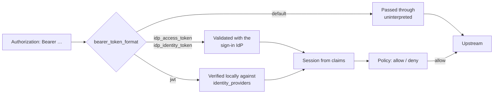
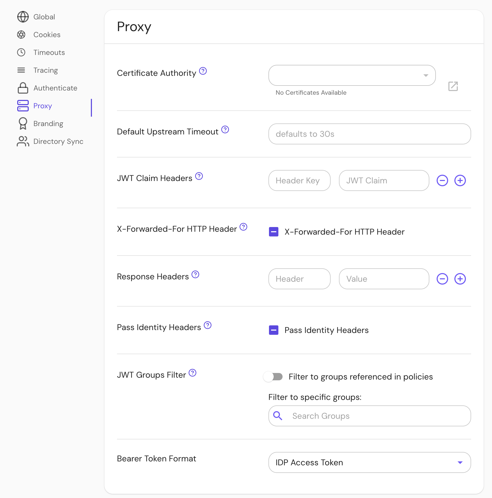

---
# cSpell:ignore SPIFFE SVIDs

id: bearer-token-format
title: Bearer Token Format
description: |
  Bearer token format controls how HTTP bearer token authentication is handled.
keywords:
  - reference
  - Bearer Token Format
pagination_prev: null
pagination_next: null
toc_max_heading_level: 2
---

import TabItem from '@theme/TabItem';
import Tabs from '@theme/Tabs';

# Bearer Token Format

## Summary

**Bearer Token Format** controls how HTTP bearer token authentication is handled. There are 4 possible options: `default`, `idp_access_token`, `idp_identity_token` and `jwt`.

HTTP bearer tokens are tokens stored in the `Authorization` header prefixed by `Bearer `:

```text
GET / HTTP/1.1
Authorization: Bearer Token
```

Pomerium's `default` behavior is to pass bearer tokens to upstream applications without interpreting them. Pomerium also supports creating sessions from tokens issued by an identity provider without needing to initiate an interactive login. If the `idp_access_token` option is used, then the bearer token will be interpreted as an IdP-issued access token. If the `idp_identity_token` option is used, then the bearer token will be interpreted as an IdP-issued identity token.

Since v0.30 access and identity tokens are supported by all IdPs, except Apple does not support access tokens, and GitHub does not support identity tokens.

If the `jwt` option is used, then the bearer token will be verified as a JWT issued by one of the trusted providers declared in [`identity_providers`](/docs/reference/identity-providers). Unlike the IdP options, the issuer does not need to be the route's sign-in identity provider, which makes this option suitable for machine identities such as Kubernetes service account tokens, SPIFFE JWT-SVIDs, and CI tokens. See [Machine-to-Machine Access with Bearer Tokens](/docs/capabilities/bearer-token-access) for details.

This option can also be configured at the route-level.

## How bearer authentication works

`bearer_token_format` decides what Pomerium does with the `Authorization: Bearer` header on a route:

1. **Extract.** If the route's format calls for interpreting the token, Pomerium takes the value after `Bearer ` from the `Authorization` header.
2. **Interpret.** The format says what the token is — an IdP access token, an IdP identity token, or a JWT from a trusted issuer — and Pomerium verifies it accordingly.
3. **Build a session.** A session is derived from the verified token and its claims. The same token maps to the same session, so repeated requests are cheap.
4. **Authorize.** The route's [policy](/docs/internals/ppl) runs against the token's claims. Authorization is entirely policy-driven; verifying the token does not by itself grant access.

Two rules apply to every bearer route:

- A cookie and a bearer token are mutually exclusive. A session cookie comes from a browser; a bearer token comes from a machine. A request carrying both is rejected with `400 Bad Request` rather than guessing which one to trust.
- A missing token is a denial, not a sign-in prompt. If a bearer route receives a request with no token, Pomerium returns `401 Unauthorized`. It does not redirect to the identity provider, because there is no browser to follow the redirect.

## The four token formats

| Format | The token is… | How Pomerium checks it |
| :-- | :-- | :-- |
| `default` | Opaque to Pomerium | Passed through to the upstream unchanged. This is the behavior when the setting is unset. |
| `idp_access_token` | An OAuth access token from your IdP | Validated with the identity provider; audiences are constrained by [`idp_access_token_allowed_audiences`](/docs/reference/idp-access-token-allowed-audiences). |
| `idp_identity_token` | An OIDC identity (ID) token from your IdP | Validated with the identity provider. |
| `jwt` | A JWT from any issuer you trust | Verified locally against the public keys of a trusted provider declared in [`identity_providers`](/docs/reference/identity-providers), scoped to that provider's audiences. |


```mermaid
flowchart LR
  A["Authorization: Bearer …"] --> B{bearer_token_format}
  B -->|default| C[Passed through<br/>uninterpreted]
  B -->|idp_access_token<br/>idp_identity_token| D[Validated with the<br/>sign-in IdP]
  B -->|jwt| E[Verified locally against<br/>identity_providers]
  D --> F[Session from claims]
  E --> F
  F --> G[Policy: allow / deny]
  C --> H[Upstream]
  G -->|allow| H
```

For the `jwt` format, [`identity_providers`](/docs/reference/identity-providers) documents the verification model and per-provider settings, and [Machine-to-Machine Access with Bearer Tokens](/docs/capabilities/bearer-token-access) walks through the workflow end to end.

## How to Configure

<Tabs>
<TabItem value="Core" label="Core">

| **Config file keys**  | **Environment variables** | **Type** | **Default** |
| :-------------------- | :------------------------ | :------- | :---------- |
| `bearer_token_format` | `BEARER_TOKEN_FORMAT`     | `string` | `default`   |

### Examples

```yaml
bearer_token_format: idp_access_token
```

```bash
BEARER_TOKEN_FORMAT=idp_access_token
```

#### Microsoft Entra

The `az` CLI can be used to get an access-token:

```bash
curl -H "Authorization: Bearer $(az account get-access-token --query accessToken --output tsv)" https://example.localhost.pomerium.io
```

### Options

- `default`: Pass bearer tokens to upstream applications without interpreting them.
- `idp_access_token`: The bearer token will be interpreted as an IdP-issued access token.
- `idp_identity_token`: The bearer token will be interpreted as an IdP-issued identity token.
- `jwt`: The bearer token will be verified as a JWT issued by a trusted provider (see [`identity_providers`](/docs/reference/identity-providers)).

</TabItem>
<TabItem value="Enterprise" label="Enterprise">

Set **Bearer Token Format** under **Proxy** settings in the Console:



### Options

- _Unset_: At the route level, use the global setting. At the global level, use "Default".
- "Unknown": Same as "Default".
- "Default": Pass bearer tokens to upstream applications without interpreting them.
- "IDP Access Token": The bearer token will be interpreted as an IdP-issued access token.
- "IDP Identity Token": The bearer token will be interpreted as an IdP-issued identity token.
- "JWT": The bearer token will be verified as a JWT issued by a trusted provider (see [`identity_providers`](/docs/reference/identity-providers)).

</TabItem>
<TabItem value="Kubernetes" label="Kubernetes">

```yaml
bearerTokenFormat: idp_access_token
```

See [Kubernetes - Global Configuration](/docs/deploy/k8s/configure) for more information.

</TabItem>
</Tabs>
