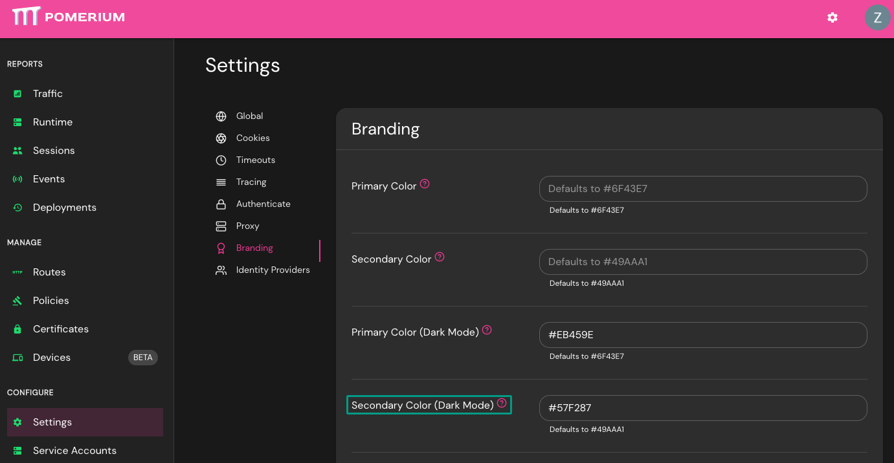

# Branding Settings

**Branding Settings** is an Enterprise feature that allows you to customize your Console, logo, favicon, error messages, and more.

This reference covers all of Pomerium's branding settings:

- [Primary Color](#primary-color)
- [Secondary Color](#secondary-color)
- [Primary Color (Dark Mode)](#primary-color-dark-mode)
- [Secondary Color (Dark Mode)](#secondary-color-dark-mode)
- [Favicon URL](#favicon-url)
- [Logo URL](#logo-url)
- [Error Message Header](#error-message-header)

## Primary Color {#primary-color}

**Primary Color** sets the primary color for the **Enterprise Console** and **Route Error Details** pages when users are in **Light Mode**.

### How to configure {#primary-color-how-to-configure}

| **Type**   | **Default**                 |
| :--------- | :-------------------------- |
| `hex code` | Pomerium Purple (`#6F43E7`) |

See [Custom Branding / Errors](/docs/capabilities/branding) for more information.

### Examples {#primary-color-examples}

Customize **Primary Color** in the Console:

## Secondary Color {#secondary-color}

**Secondary Color** sets the primary color for the **Enterprise Console** and **Route Error Details** pages when users are in **Light Mode**.

### How to configure {#secondary-color-how-to-configure}

| **Type**   | **Default**                 |
| :--------- | :-------------------------- |
| `hex code` | Pomerium Purple (`#6F43E7`) |

See [Custom Branding / Errors](/docs/capabilities/branding) for more information.

### Examples {#secondary-color-examples}

Customize **Secondary Color** in the Console:

## Primary Color (Dark Mode) {#primary-color-dark-mode}

**Primary Color (Dark Mode)** sets the primary color for the **Enterprise Console** and **Route Error Details** pages when users are in **Dark Mode**.

### How to configure {#primary-color-dark-mode-how-to-configure}

| **Type**   | **Default**                 |
| :--------- | :-------------------------- |
| `hex code` | Pomerium Purple (`#6F43E7`) |

See [Custom Branding / Errors](/docs/capabilities/branding) for more information.

### Examples {#primary-color-dark-mode-examples}

Customize **Primary Color (Dark Mode)** in the Console:

## Secondary Color (Dark Mode) {#secondary-color-dark-mode}

**Secondary Color (Dark Mode)** sets the secondary color for the **Enterprise Console** and **Route Error Details** pages when users are in **Dark Mode**.

### How to configure {#secondary-color-dark-mode-how-to-configure}

| **Type**   | **Default**                |
| :--------- | :------------------------- |
| `hex code` | Pomerium Green (`#49AAA1`) |

See [Custom Branding / Errors](/docs/capabilities/branding) for more information.

### Examples {#secondary-color-dark-mode-examples}

Customize **Secondary Color (Dark Mode)** in the Console:

## Favicon URL {#favicon-url}

**Favicon URL** customizes the Favicon displayed in the Enterprise Console and Open Source endpoints.

### How to configure {#favicon-url-how-to-configure}

| **Type** | **Default**      |
| :------- | :--------------- |
| `URL`    | Pomerium Favicon |

See [Custom Branding / Errors](/docs/capabilities/branding) for more information.

### Examples {#favicon-url-examples}

Customize **Favicon URL** in the Console:

## Logo URL {#logo-url}

**Logo URL** customizes the logo displayed in the Enterprise Console and Open Source endpoints.

### How to configure {#logo-url-how-to-configure}

| **Type** | **Default**   |
| :------- | :------------ |
| `URL`    | Pomerium Logo |

See [Custom Branding / Errors](/docs/capabilities/branding) for more information.

### Examples {#logo-url-examples}

Customize **Logo URL** in the Console:

## Error Message Header {#error-message-header}

**Error Message Header** customizes the error message that Pomerium displays on the Error Details page for `403 Unauthorized` errors.

Error messages must be written in plain text or [Markdown](https://www.markdownguide.org/basic-syntax/), and are only applied to routes where the **Show Error Details** setting is enabled.

### How to configure {#error-message-header-how-to-configure}

| **Type** | **Default**            |
| :------- | :--------------------- |
| `string` | Pomerium error message |

See [Custom Branding / Errors](/docs/capabilities/branding) for more information.

### Examples {#error-message-header-examples}

Customize the **Error Message Header** in the Console:

1. Enter your custom error message 

1. Select **Show Error Details** for the route where you want to display the custom error message 

1. View your custom error message 
