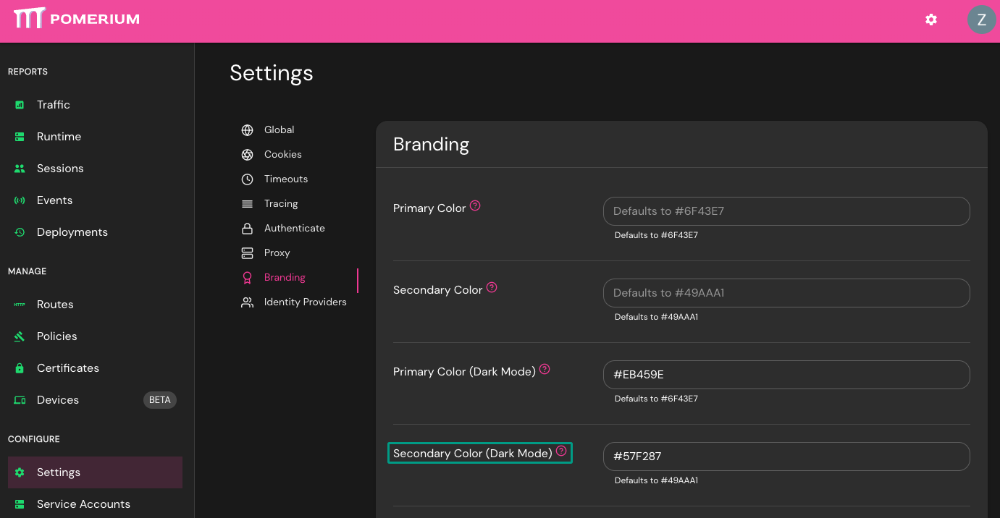

# Secondary Color (Dark Mode)

**Type:** `hex code`  
**Example:** `#49AAA1`  
**Default:**  Pomerium Purple (`#49AAA1`)

**Secondary Color (Dark Mode)** sets the secondary color for the **Enterprise Console** and **Route Error Details** pages when users are in **Dark Mode**.

See [Custom Branding / Errors](/docs/capabilities/branding) for more information.

