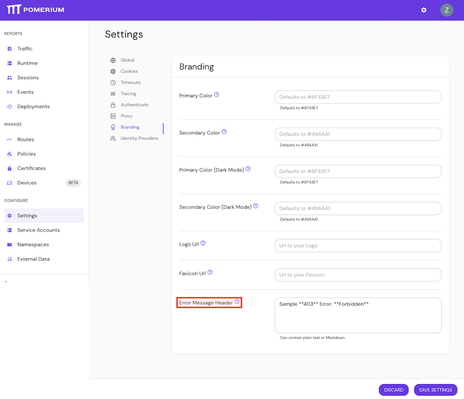

# Error Message Header

**Type:** `string`  
**Default:** `string` (`''`)

**Error Message Header** customizes the error message that Pomerium displays on the Error Details page for `403 Unauthorized` errors.

Error messages must be written in plain text or [Markdown](https://www.markdownguide.org/basic-syntax/), and are only applied to routes where the **Show Error Details** setting is enabled.

