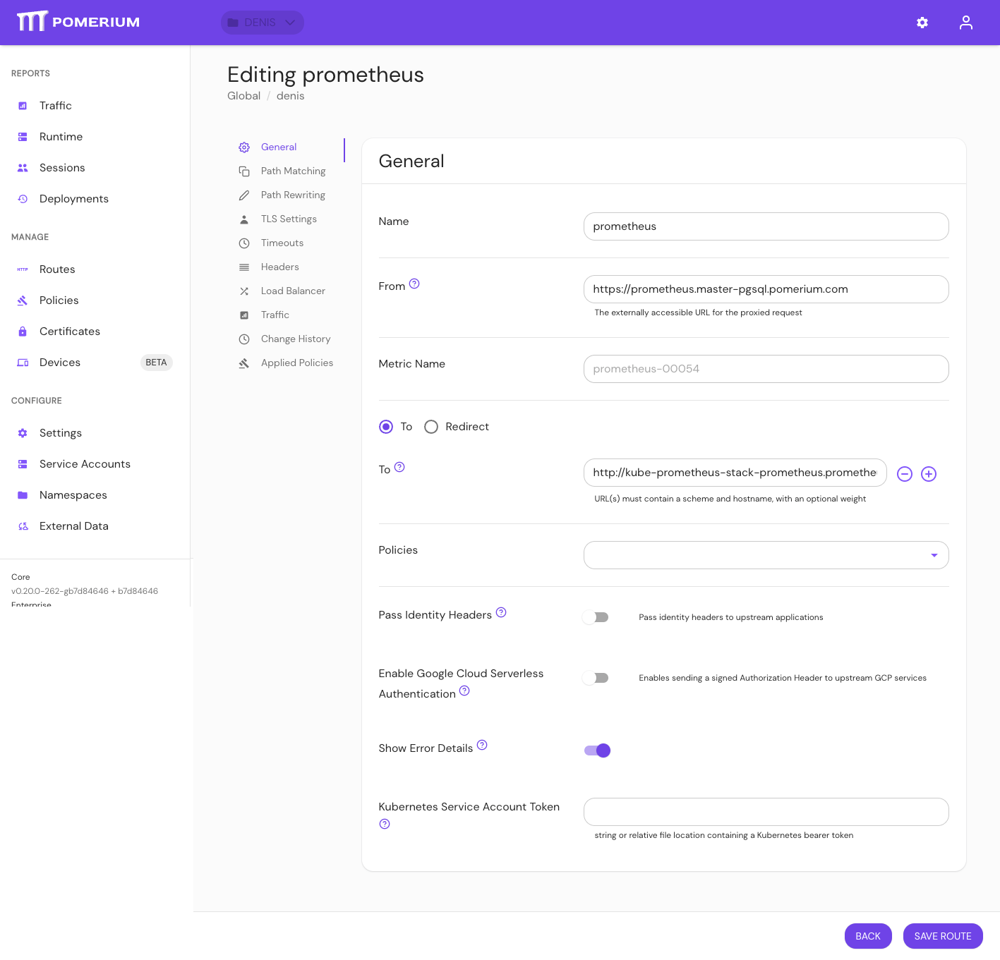

import Tabs from '@theme/Tabs';
import TabItem from '@theme/TabItem';

# Error Message Header

## Summary

**Error Message Header** customizes the error message that Pomerium displays on the Error Details page for `403 Unauthorized` errors.

Error messages must be written in plain text or [Markdown](https://www.markdownguide.org/basic-syntax/), and are only applied to routes where the **Show Error Details** setting is enabled.

## How to configure

| **Type** | **Default** |
| :--- | :--- |
| `string` | Pomerium error message |

See [Custom Branding / Errors](/docs/capabilities/branding) for more information.

### Examples

Customize the **Error Message Header** in the Console:

1. Enter your custom error message

2. Select **Show Error Details** for the route you want to display the custom error message

3. View your custom error message

