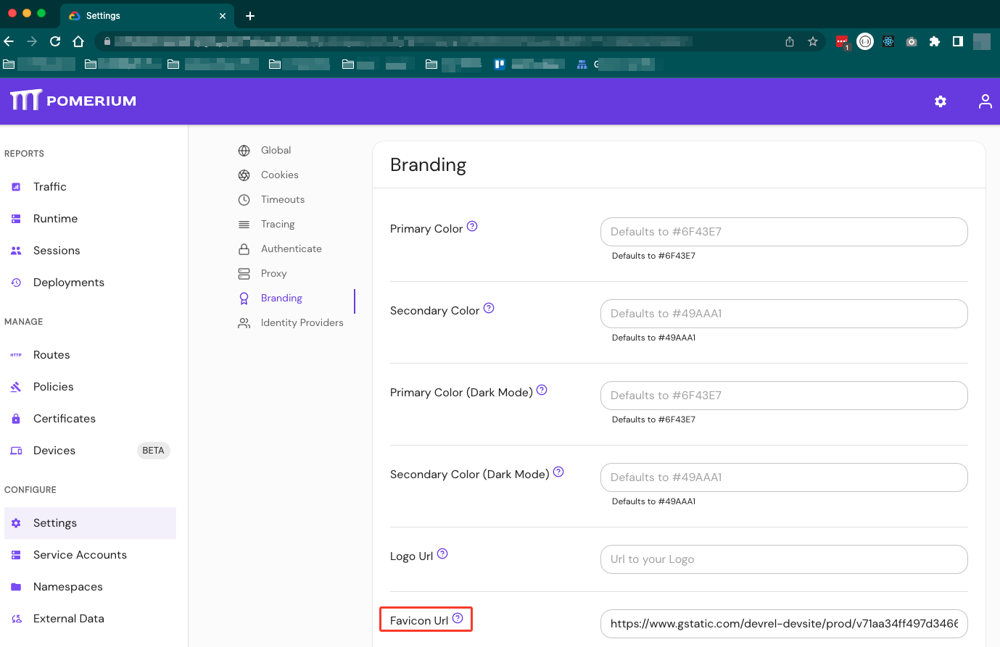

# Favicon URL

---

**Type:** `URL`  
**Example:** `https://subdomain.domain.com/favicon.png`  
**Default:** Pomerium Favicon  

---

**Favicon URL** customizes the Favicon displayed in the Enterprise Console and Open Source endpoints. 

See [Custom Branding / Errors](/docs/capabilities/branding) for more information.

