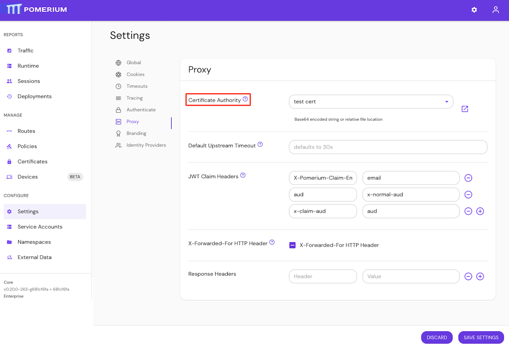

import Tabs from '@theme/Tabs';
import TabItem from '@theme/TabItem';

# Certificate Authority

<Tabs>
<TabItem value="Core" label="Core">

---

**Config file key:** `certificate_authority` or `certificate_authority_file` <br/>
**Environment variable:** `CERTIFICATE_AUTHORITY` or `CERTIFICATE_AUTHORITY_FILE` <br/>
**Type:** `string` <br/>
**Optional**

**Examples:**

```yaml
# config file key
certificate_authority: base64-encoded-string

# environment variable
CERTIFICATE_AUTHORITY_FILE=/relative/file/location
```

</TabItem>
<TabItem value="Enterprise" label="Enterprise">

---

**Config file key:** `certificate_authority` or `certificate_authority_file` <br/>
**Environment variable:** `CERTIFICATE_AUTHORITY` or `CERTIFICATE_AUTHORITY_FILE` <br/>
**Type:** `string` <br/>
**Optional**

Configure **Certificate Authority** in the Enterprise Console:



</TabItem>
<TabItem value="Kubernetes" label="Kubernetes">

---

Kubernetes does not support `certificate_authority`

</TabItem>
</Tabs>

---

**Certificate Authority** defines a set of root certificate authorities (CAs) that Pomerium uses when communicating with other TLS-protected services.

:::tip **Note:**

Unlike route-specific CA settings, this setting augments (rather than replaces) the system's trust store. Routes that specify a CA will ignore those provided here.

:::

:::warning

Be sure to include the intermediary certificate.

:::
