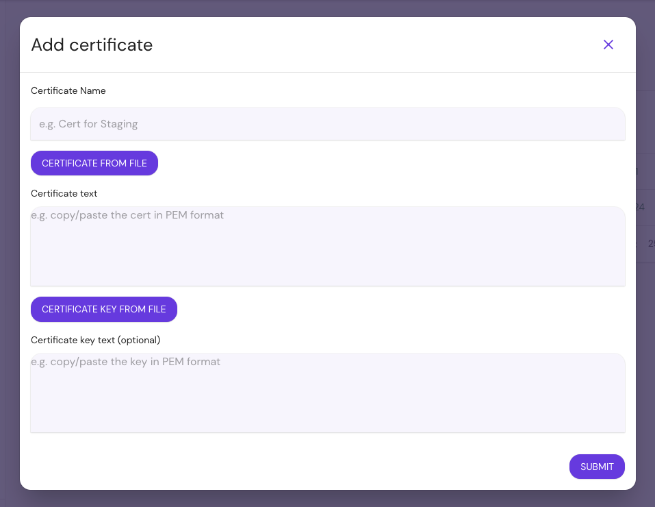
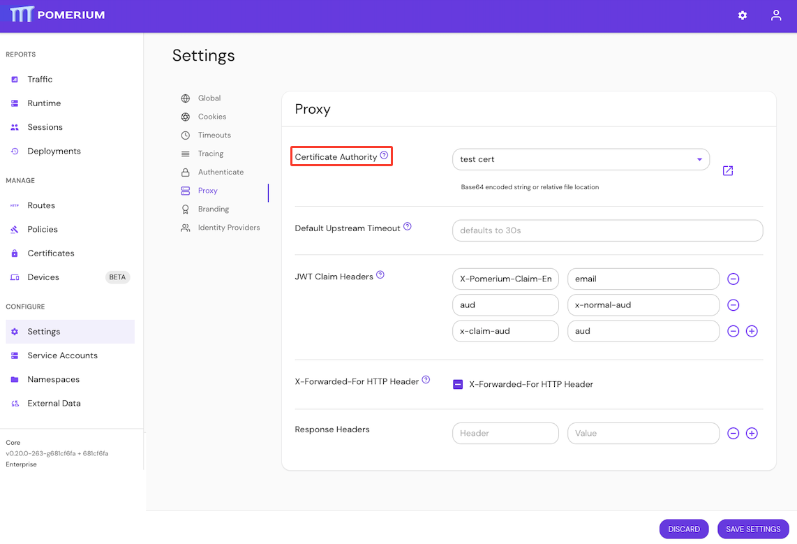

import Tabs from '@theme/Tabs';
import TabItem from '@theme/TabItem';

# Certificates Settings

This reference covers all of Pomerium's **Certificates Settings**:

- [Certificates](#certificates)
- [Certificate CA](#certificate-authority)
- [Client Certificate Authority](#client-certificate-authority)
- [Client CRL](#client-crl)

:::tip **Note**

All certificates supplied to Pomerium must be in **PEM** format.

:::

## Certificates

**Certificates** are the X.509 _public-key_ and _private-key_ pair used to establish secure HTTP and gRPC connections. Any combination of these settings can be used together and are additive. You can also use any of these settings in conjunction with [`Autocert`](/docs/reference/autocert) to get OCSP stapling.

Certificates loaded into Pomerium from these config values are used to attempt secure connections between end-users and services, between Pomerium services, and to upstream endpoints.

:::tip **Note**

Pomerium will check your system's trust/key store for valid certificates first. If your certificate solution imports into the system store, you don't need to also specify them with these configuration keys.

:::

### How to configure

<Tabs>
<TabItem value="Core" label="Core">

| **Config file keys** | **Environment variables** | **Type** | **Usage** |
| :-- | :-- | :-- | :-- |
| `certificates` | Not settable as environment variable | `string` (Array of relative file locations for multiple certificates) | **required** (if insecure not set) |
| `certificate` and `certificate_key` | `CERTIFICATE` and `CERTIFICATE_KEY` | `string` (base64-encoded string) | **required** (if insecure not set) |
| `certificate_file` and `certificate_key_file` | `CERTIFICATE_FILE` and `CERTIFICATE_KEY_FILE` | `string` (Relative file location for a single certificate) | **required** (if insecure not set) |

</TabItem>
<TabItem value="Enterprise" label="Enterprise">

Add **Certificates** in the Enterprise Console:



View **Certificates**:


</TabItem>
<TabItem value="Kubernetes" label="Kubernetes">

```yaml
Spec:
  Certificates: pomerium/wildcard-localhost
```

See Kubernetes [Ingress Configuration](/docs/deploy/k8s/reference#spec) for more information.

</TabItem>
</Tabs>

### Examples

Specify multiple certificates at once:

```yaml
# Array of relative file locations for multiple certs
certificates:
  - cert: '$HOME/.acme.sh/authenticate.example.com_ecc/fullchain.cer'
    key: '$HOME/.acme.sh/authenticate.example.com_ecc/authenticate.example.com.key'
  - cert: '$HOME/.acme.sh/verify.example.com_ecc/fullchain.cer'
    key: '$HOME/.acme.sh/verify.example.com_ecc/verify.example.com.key'
  - cert: '$HOME/.acme.sh/prometheus.example.com_ecc/fullchain.cer'
    key: '$HOME/.acme.sh/prometheus.example.com_ecc/prometheus.example.com.key'
```

Set a single certificate and key covering multiple domains and/or a wildcard subdomain:

```yaml
# Relative file location for a single cert
certificate_file: '$HOME/.acme.sh/*.example.com/fullchain.crt'
certificate_key: '$HOME/.acme.sh/*.example.com/*.example.com.key'
```

:::tip **Note:**

All certificates supplied to Pomerium must be in **PEM** format.

:::

## Certificate Authority

**Certificate Authority** defines a set of root certificate authorities (CAs) that Pomerium uses when communicating with other TLS-protected services.

:::tip **Note:**

Unlike route-specific CA settings, this setting augments (rather than replaces) the system's trust store. Routes that specify a CA will ignore those provided here.

:::

:::warning

Be sure to include the intermediary certificate.

:::

### How to configure

<Tabs>
<TabItem value="Core" label="Core">

| **Config file keys** | **Environment variables** | **Type** | **Usage** |
| :-- | :-- | :-- | :-- |
| `certificate_authority` | `CERTIFICATE_AUTHORITY` | `string` | **optional** |
| `certificate_authority_file` | `CERTIFICATE_AUTHORITY_FILE` | `string` | **optional** |

</TabItem>
<TabItem value="Enterprise" label="Enterprise">

Configure **Certificate Authority** in the Enterprise Console:



</TabItem>
<TabItem value="Kubernetes" label="Kubernetes">

Kubernetes does not support `certificate_authority`

</TabItem>
</Tabs>

### Examples

```yaml
# config file key
certificate_authority: base64-encoded-string

# environment variable
CERTIFICATE_AUTHORITY_FILE=/relative/file/location
```

## Client Certificate Authority

**Client Certificate Authority** is the X.509 _public-key_ used to validate [mTLS client certificates](/docs/capabilities/mtls-clients).

If not set, no client certificate will be required.

### How to configure

<Tabs>
<TabItem value="Core" label="Core">

| **Config file keys** | **Environment variables** | **Type** | **Usage**    |
| :------------------- | :------------------------ | :------- | :----------- |
| `client_ca`          | `CLIENT_CA`               | `string` | **optional** |
| `client_ca_file`     | `CLIENT_CA_FILE`          | `string` | **optional** |

</TabItem>
<TabItem value="Enterprise" label="Enterprise">

`client_ca` and `client_ca_file` are bootstrap configuration settings and are not configurable in the Console.

</TabItem>
<TabItem value="Kubernetes" label="Kubernetes">

Kubernetes does not support `client_certificate_ca`

</TabItem>
</Tabs>

### Examples

```yaml
client_ca: base64-encoded-string
client_ca_file: base64-encoded-string

CLIENT_CA=/relative/file/location
CLIENT_CA_FILE=/relative/file/location
```

## Client CRL

**Client CRL** is the [certificate revocation list](https://en.wikipedia.org/wiki/Certificate_revocation_list) (in **PEM** format) for client certificates.

If not set, no CRL will be used.

### How to configure

<Tabs>
<TabItem value="Core" label="Core">

| **Config file keys** | **Environment variables** | **Type** | **Usage**    |
| :------------------- | :------------------------ | :------- | :----------- |
| `client_crl`         | `CLIENT_CRL`              | `string` | **optional** |
| `client_crl_file`    | `CLIENT_CRL_FILE`         | `string` | **optional** |

</TabItem>
<TabItem value="Enterprise" label="Enterprise">

`client_crl` and `client_crl_file` are bootstrap configuration settings and are not configurable in the Console.

</TabItem>
<TabItem value="Kubernetes" label="Kubernetes">

Kubernetes does not support `client_crl`

</TabItem>
</Tabs>

### Examples

```yaml
# config file key
client_crl: base64-encoded-string
client_crl_file: base64-encoded-string

# environment variable
CLIENT_CRL=/relative/file/location
CLIENT_CRL_FILE=/relative/file/location
```
