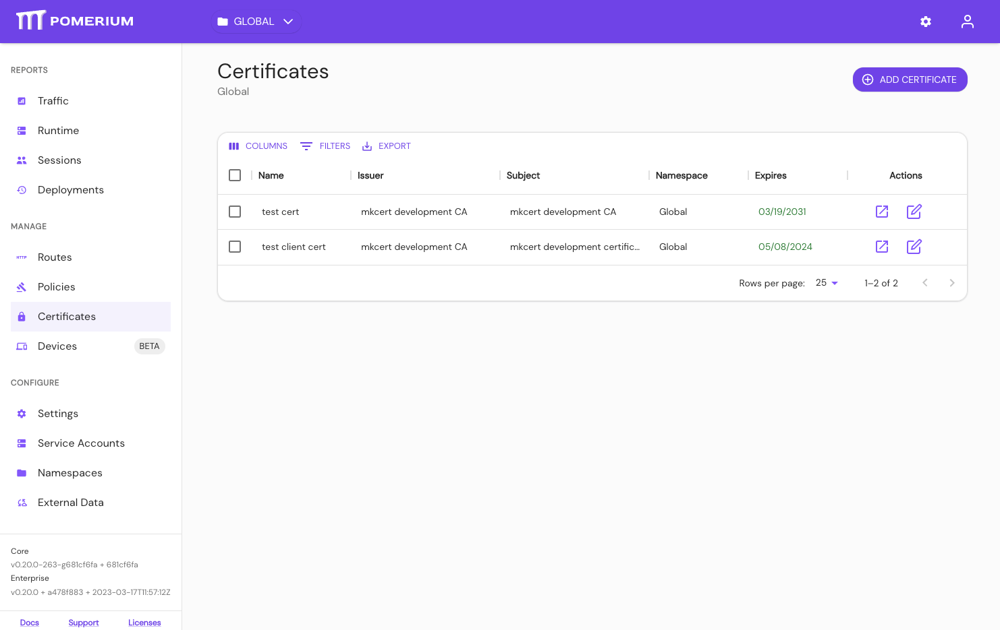

import Tabs from '@theme/Tabs';
import TabItem from '@theme/TabItem';

# Certificates

## Summary

**Certificates** are the X.509 _public-key_ and _private-key_ pair used to establish secure HTTP and gRPC connections. Any combination of the above settings can be used together and are additive. You can also use any of these settings in conjunction with [`Autocert`](/docs/reference/autocert) to get OCSP stapling.

Certificates loaded into Pomerium from these config values are used to attempt secure connections between end-users and services, between Pomerium services, and to upstream endpoints.

:::tip **Note**

Pomerium will check your system's trust/key store for valid certificates first. If your certificate solution imports into the system store, you don't need to also specify them with these configuration keys.

:::

## How to configure

<Tabs>
<TabItem value="Core" label="Core">

| **Config file keys** | **Environment variables** | **Type** | **Usage** |
| :--- | :--- | :--- | :--- |
| `certificates` | Not settable as environment variable | `string` (Array of relative file locations for multiple certificates) | **required** (if insecure not set) |
| `certificate` and `certificate_key` | `CERTIFICATE` and `CERTIFICATE_KEY` | `string` (base64-encoded string) | **required** (if insecure not set) |
| `certificate_file` and `certificate_key_file` | `CERTIFICATE_FILE` and `CERTIFICATE_KEY_FILE` | `string` (Relative file location for a single certificate) | **required** (if insecure not set) |

</TabItem>
<TabItem value="Enterprise" label="Enterprise">

Add **Certificates** in the Enterprise Console:


View **Certificates**:



:::tip **Note:**

All certificates supplied to Pemerium must be in **PEM** format.

:::

</TabItem>
<TabItem value="Kubernetes" label="Kubernetes">

```yaml
Spec:
  Certificates:
    pomerium/wildcard-localhost
```

See Kubernetes [Ingress Configuration](/docs/deploying/k8s/reference#spec) for more information.

</TabItem>
</Tabs>

### Examples

Specify multiple certificates at once:

```yaml
# Array of relative file locations for multiple certs
certificates:
  - cert: '$HOME/.acme.sh/authenticate.example.com_ecc/fullchain.cer'
    key: '$HOME/.acme.sh/authenticate.example.com_ecc/authenticate.example.com.key'
  - cert: '$HOME/.acme.sh/verify.example.com_ecc/fullchain.cer'
    key: '$HOME/.acme.sh/verify.example.com_ecc/verify.example.com.key'
  - cert: '$HOME/.acme.sh/prometheus.example.com_ecc/fullchain.cer'
    key: '$HOME/.acme.sh/prometheus.example.com_ecc/prometheus.example.com.key'
```

Set a single certificate and key covering multiple domains and/or a wildcard subdomain:

```yaml
# Relative file location for a single cert
certificate_file: '$HOME/.acme.sh/*.example.com/fullchain.crt'
certificate_key: '$HOME/.acme.sh/*.example.com/*.example.com.key'
```

:::tip **Note:**

All certificates supplied to Pemerium must be in **PEM** format.

:::
