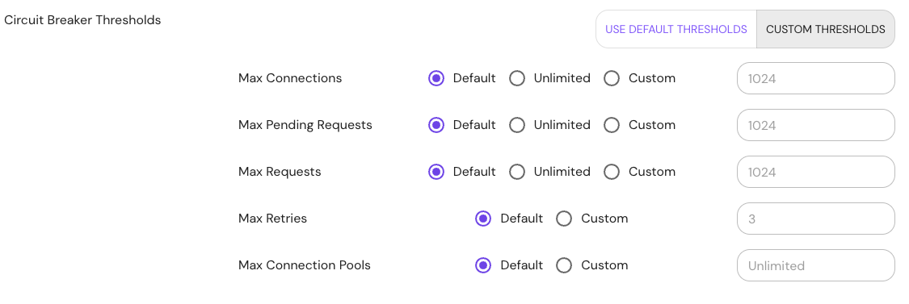

import Tabs from '@theme/Tabs';
import TabItem from '@theme/TabItem';

# Circuit Breaker Thresholds

## Summary

In Pomerium requests will automatically fail when circuit breaker thresholds are reached. The following thresholds are available:

- Max Connections: The maximum number of connections that Pomerium will establish to all hosts in a route's upstream cluster. Default is `1024`.
- Max Pending Requests: The maximum number of requests that will be queued while waiting for a ready connection pool connection. Default is `1024`.
- Max Requests: The maximum number of requests that can be outstanding to all route upstream hosts in a cluster at any given time. Default is `1024`.
- Max Retries: The maximum number of retries that can be outstanding to all hosts in a route upstream cluster at any given time. Default is `3`.
- Max Connection Pools: The maximum number of connection pools that can be concurrently instantiated. Default is unlimited.

Thresholds can be set at the global level or the individual route level. Each threshold is optional.

## How to Configure

<Tabs>
<TabItem value="Core" label="Core">

| **Config file keys** | **Environment variables** | **Type** | **Usage** |
| :-- | :-- | :-- | :-- |
| `circuit_breaker_thresholds` | `CIRCUIT_BREAKER_THRESHOLDS` | `object` | **optional** |

### Available Thresholds

- `max_connections`
- `max_pending_requests`
- `max_requests`
- `max_retries`
- `max_connection_pools`

### Examples

```yaml
circuit_breaker_thresholds:
  max_connections: 128
```

```bash
CIRCUIT_BREAKER_THRESHOLDS='{"max_connections":128}'
```

</TabItem>
<TabItem value="Enterprise" label="Enterprise">
Set the circuit breaker thresholds under **Proxy** settings in the Console:



</TabItem>
<TabItem label="Kubernetes" value="Kubernetes">

| **[Parameter name](/docs/deploy/k8s/reference#spec)** | **Type** | **Usage** |
| :-- | :-- | :-- |
| `circuitBreakerThresholds` | Object | **optional** |

### Available Thresholds

- `maxConnections`
- `maxPendingRequests`
- `maxRequests`
- `maxRetries`
- `maxConnectionPools`

### Examples

```yaml
circuitBreakerThresholds:
  maxConnections: 128
```

</TabItem>
</Tabs>
