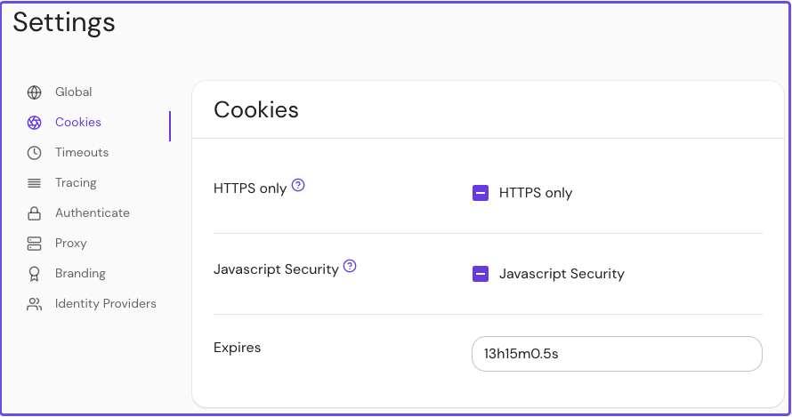

import Tabs from '@theme/Tabs';
import TabItem from '@theme/TabItem';

# Cookie Expiration

## Summary

**Cookie Expiration** sets the lifetime of session cookies. After this interval, users must reauthenticate.

## How to configure

| **Type** | **Default** |
| :--- | :--- |
| `string` ([Go Duration](https://golang.org/pkg/time/#Duration.String) formatting) | `14h` |

<Tabs>
<TabItem value="Core" label="Core">

### Core

| **Config file keys** | **Environment variables** |
| :--- | :--- |
| `cookie_expiration` | `COOKIE_EXPIRATION` |

</TabItem>
<TabItem value="Enterprise" label="Enterprise">

### Enterprise

Set **Cookie Expiration** in the Console:


</TabItem>
<TabItem value="Kubernetes" label="Kubernetes">

### Kubernetes

| **Name** |
| :--- |
| `authenticate.expiration` |

See Kubernetes [Cookie Reference](/docs/deploying/k8s/reference#cookie) for more information.

</TabItem>
</Tabs>

### Examples

```yaml
# config file key
cookie_expiration: 13h15m0.5s

# environment variable
COOKIE_EXPIRATION=13h15m0.5s

# ingress
cookie.expiration: 13h15m0.5s
```
