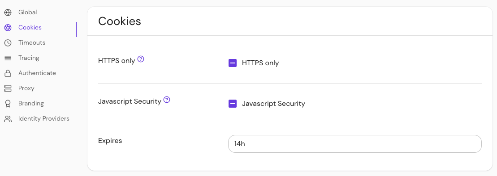

import Tabs from '@theme/Tabs';
import TabItem from '@theme/TabItem';

# Cookie Secure

## Summary

If true, **Cookie Secure** instructs browsers to only send user session cookies over HTTPS.

:::warning

Setting this to `false` may result in session cookies being sent in clear text.

:::

## How to configure

| **Type**  | **Default** |
| :-------- | :---------- |
| `boolean` | `true`      |

<Tabs>
<TabItem value="Core" label="Core">

| **Config file keys** | **Environment variables** |
| :------------------- | :------------------------ |
| `cookie_secure`      | `COOKIE_SECURE`           |

</TabItem>
<TabItem value="Enterprise" label="Enterprise">

Configure **Cookie Secure** with the **HTTPS only** toggle button in the Console. The button has three states:

- **Unset** ("-") uses the value in your configuration file
- **Checkmark** sets `cookie_secure` to `true`
- **Empty** sets `cookie_secure` to `false`



</TabItem>
<TabItem value="Kubernetes" label="Kubernetes">

| **Name**        |
| :-------------- |
| `cookie.secure` |

See Kubernetes [Cookie Reference](/docs/deploying/k8s/reference#cookie) for more information.

</TabItem>
</Tabs>

### Examples

```yaml
# config file key
cookie_secure: false

# environment variable
COOKIE_SECURE=false

# ingress
cookie.secure: false
```
