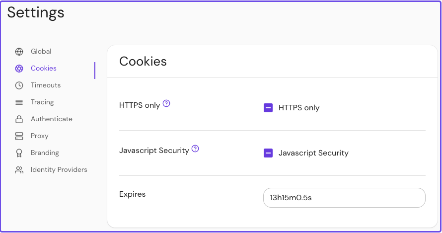

import Tabs from '@theme/Tabs';
import TabItem from '@theme/TabItem';

# Cookies Settings

This reference covers all of Pomerium's **Cookies Settings**:

- [Cookie Name](#cookie-name)
- [Cookie Secret](#cookie-secret)
- [Cookie Domain](#cookie-domain)
- [Cookie Secure](#cookie-secure)
- [Cookie HTTP Only](#cookie-http-only)
- [Cookie Expiration](#cookie-expiration)
- [Cookie Same Site](#cookie-samesite)
- [Cookie Secret File](#cookie-secret-file)

## Cookie Name

**Cookie Name** sets the name of the session cookie sent to clients.

### How to configure

<Tabs>
<TabItem value="Core" label="Core">

| **Config file keys** | **Environment variables** | **Type** | **Default** |
| :------------------- | :------------------------ | :------- | :---------- |
| `cookie_name`        | `COOKIE_NAME`             | `string` | `_pomerium` |

</TabItem>
<TabItem value="Enterprise" label="Enterprise">

`cookie_name` is a bootstrap configuration setting and is not configurable in the Console.

</TabItem>
<TabItem value="Kubernetes" label="Kubernetes">

| **Name**      | **Type** | **Default** |
| :------------ | :------- | :---------- |
| `cookie.name` | `string` | `_pomerium` |

See Kubernetes [Cookie Reference](/docs/deploying/k8s/reference#cookie) for more information.

</TabItem>
</Tabs>

### Examples

```yaml
# config file key
cookie_name: cookie_name

# environment variable
COOKIE_NAME=cookie_name

# ingress
cookie.name: cookie_name
```

## Cookie Secret

**Cookie Secret** is the secret used to encrypt and sign session cookies. If you don't provide a cookie secret, Pomerium will generate one for you.

### How to configure

<Tabs>
<TabItem value="Core" label="Core">

| **Config file keys** | **Environment variables** | **Type** | **Usage**    |
| :------------------- | :------------------------ | :------- | :----------- |
| `cookie_secret`      | `COOKIE_SECRET`           | `string` | **optional** |

</TabItem>
<TabItem value="Enterprise" label="Enterprise">

`cookie_secret` is a bootstrap configuration setting and is not configurable in the Console.

</TabItem>
<TabItem value="Kubernetes" label="Kubernetes">

See Kubernetes [bootstrap secrets](/docs/deploying/k8s/configure#bootstrap-secrets) for more information.

</TabItem>
</Tabs>

### Examples

Generate a random, base64-encoded key:

```shell
head -c32 /dev/urandom | base64
```

Add the value to your configuration:

```yaml
cookie_secret: tdkuWzUelRukP/6VYzopfh6kis7y5u5Ldl3MrIq9ZR0=

COOKIE_SECRET=tdkuWzUelRukP/6VYzopfh6kis7y5u5Ldl3MrIq9ZR0=
```

## Cookie Domain

**Cookie Domain** sets the scope of session cookies issued by Pomerium.

If you specify the domain explicitly, then subdomains would also be included.

### How to configure

<Tabs>
<TabItem value="Core" label="Core">

| **Config file keys** | **Environment variables** | **Type** | **Usage** | **Default** |
| :-- | :-- | :-- | :-- | :-- |
| `cookie_domain` | `COOKIE_DOMAIN` | `string` | **optional** | The host that set the cookie |

</TabItem>
<TabItem value="Enterprise" label="Enterprise">

`cookie_domain` is a bootstrap configuration setting and is not configurable in the Console.

</TabItem>
<TabItem value="Kubernetes" label="Kubernetes">

| **Name**        | **Type** | **Usage**    | **Default**                  |
| :-------------- | :------- | :----------- | :--------------------------- |
| `cookie.domain` | `string` | **optional** | The host that set the cookie |

See Kubernetes [Cookie Reference](/docs/deploying/k8s/reference#cookie) for more information.

</TabItem>
</Tabs>

### Examples

```yaml
# config file key
cookie_domain: localhost.pomerium.io

# environment variable
COOKIE_DOMAIN=localhost.pomerium.io

# ingress
cookie.domain: localhost.pomerium.io
```

## Cookie Secure

If true, **Cookie Secure** instructs browsers to only send user session cookies over HTTPS.

:::warning

Setting this to `false` may result in session cookies being sent in clear text.

:::

### How to configure

<Tabs>
<TabItem value="Core" label="Core">

| **Config file keys** | **Environment variables** | **Type**  | **Default** |
| :------------------- | :------------------------ | :-------- | :---------- |
| `cookie_secure`      | `COOKIE_SECURE`           | `boolean` | `true`      |

</TabItem>
<TabItem value="Enterprise" label="Enterprise">

Configure **Cookie Secure** with the **HTTPS only** toggle button in the Console. The button has three states:

- **Unset** ("-") uses the value in your configuration file
- **Checkmark** sets `cookie_secure` to `true`
- **Empty** sets `cookie_secure` to `false`


</TabItem>
<TabItem value="Kubernetes" label="Kubernetes">

| **Name**        | **Type**  | **Default** |
| :-------------- | :-------- | :---------- |
| `cookie.secure` | `boolean` | `true`      |

See Kubernetes [Cookie Reference](/docs/deploying/k8s/reference#cookie) for more information.

</TabItem>
</Tabs>

### Examples

```yaml
# config file key
cookie_secure: false

# environment variable
COOKIE_SECURE=false

# ingress
cookie.secure: false
```

## Cookie HTTP Only

If true, **Cookie HTTP Only** forbids JavaScript from accessing the cookie.

### How to configure

<Tabs>
<TabItem value="Core" label="Core">

| **Config file keys** | **Environment variables** | **Type**  | **Default** |
| :------------------- | :------------------------ | :-------- | :---------- |
| `cookie_http_only`   | `COOKIE_HTTP_ONLY`        | `boolean` | `true`      |

</TabItem>
<TabItem value="Enterprise" label="Enterprise">

Configure **Cookie HTTP Only** with the **Javascript Security** toggle button in the Console. The button has three states:

- **Unset** ("-") uses the value in your configuration file
- **Checkmark** sets `cookie_http_only` to `true`
- **Empty** sets `cookie_http_only` to `false`


</TabItem>
<TabItem value="Kubernetes" label="Kubernetes">

| **Name**          | **Type**  | **Default** |
| :---------------- | :-------- | :---------- |
| `cookie.httpOnly` | `boolean` | `true`      |

See Kubernetes [Cookie Reference](/docs/deploying/k8s/reference#cookie) for more information.

</TabItem>
</Tabs>

### Examples

```yaml
# config file key
cookie_http_only: false

# environment variable
COOKIE_HTTP_ONLY=false

# ingress
cookie.httpOnly: false
```

## Cookie Expiration

**Cookie Expiration** sets the lifetime of session cookies. After this interval, users must reauthenticate.

### How to configure

<Tabs>
<TabItem value="Core" label="Core">

| **Config file keys** | **Environment variables** | **Type** | **Default** |
| :-- | :-- | :-- | :-- |
| `cookie_expiration` | `COOKIE_EXPIRATION` | `string` ([Go Duration](https://golang.org/pkg/time/#Duration.String) formatting) | `14h` |

</TabItem>
<TabItem value="Enterprise" label="Enterprise">

Set **Cookie Expiration** in the Console: 

</TabItem>
<TabItem value="Kubernetes" label="Kubernetes">

| **Name** | **Type** | **Default** |
| :-- | :-- | :-- |
| `authenticate.expiration` | `string` ([Go Duration](https://golang.org/pkg/time/#Duration.String) formatting) | `14h` |

See Kubernetes [Cookie Reference](/docs/deploying/k8s/reference#cookie) for more information.

</TabItem>
</Tabs>

### Examples

```yaml
# config file key
cookie_expiration: 13h15m0.5s

# environment variable
COOKIE_EXPIRATION=13h15m0.5s

# ingress
cookie.expiration: 13h15m0.5s
```

## Cookie SameSite

**Cookie SameSite** sets the [SameSite](https://developer.mozilla.org/en-US/docs/Web/HTTP/Headers/Set-Cookie#samesitesamesite-value) option for cookies.

### How to configure

<Tabs>
<TabItem value="Core" label="Core">

| **Config file keys** | **Environment variables** | **Type** | **Usage** | **Default** | **Options** |
| :-- | :-- | :-- | :-- | :-- | :-- |
| `cookie_same_site` | `COOKIE_SAME_SITE` | `string` | **optional** | ` Lax` (unset) | `None` |
|  |  |  |  |  | `Lax` |
|  |  |  |  |  | `Strict` |

</TabItem>
<TabItem value="Enterprise" label="Enterprise">

`cookie_same_site` is a bootstrap configuration setting and is not configurable in the Console.

</TabItem>
<TabItem value="Kubernetes" label="Kubernetes">

| **Name**          | **Type** | **Usage**    | **Default**    | **Options** |
| :---------------- | :------- | :----------- | :------------- | :---------- |
| `cookie.sameSite` | `string` | **optional** | ` Lax` (unset) | `None`      |
|                   |          |              |                | `Lax`       |
|                   |          |              |                | `Strict`    |

</TabItem>
</Tabs>

### Examples

```yaml
# config file key
cookie_same_site: Lax

# environment variable
COOKIE_SAME_SITE=Strict

# ingress
cookie.sameSite: None
```

## Cookie Secret File

**Cookie Secret File** sets the path to the file containing a secret used to encrypt and sign session cookies.

### How to configure

<Tabs>
<TabItem value="Core" label="Core">

| **Config file keys** | **Environment variables** | **Type** | **Usage** |
| :-- | :-- | :-- | :-- |
| `cookie_secret_file` | `COOKIE_SECRET_FILE` | `string` | **required** (for proxy service) |

</TabItem>
<TabItem value="Enterprise" label="Enterprise">

`cookie_secret_file` is a bootstrap configuration setting and is not configurable in the Console.

</TabItem>
<TabItem value="Kubernetes" label="Kubernetes">

See Kubernetes [Secrets reference](/docs/deploying/k8s/reference#spec) for more information.

</TabItem>
</Tabs>

### Examples

Generate a random, base64-encoded key:

```shell
head -c32 /dev/urandom | base64
```

Add the value to your configuration:

```yaml
cookie_secret_file: '/run/secrets/POMERIUM_COOKIE_SECRET'

COOKIE_SECRET_FILE='/run/secrets/POMERIUM_COOKIE_SECRET'
```

This is useful when deploying in environments that provide secret management like [Docker Swarm](https://docs.docker.com/engine/swarm/secrets/).
