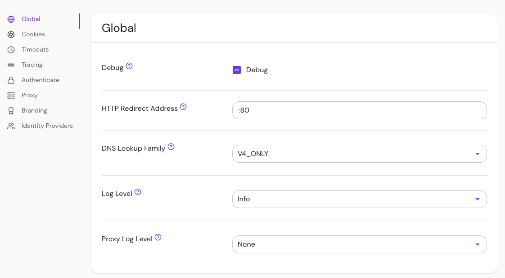

import Tabs from '@theme/Tabs';
import TabItem from '@theme/TabItem';

# Debug

## Summary

:::danger

Enabling the `debug` flag could result in sensitive information being logged.

:::

**Debug** enables Pomerium to stream colored, human-readable logs to [standard out](<https://en.wikipedia.org/wiki/Standard_streams#Standard_output_(stdout)>). By default, Pomerium produces JSON-encoded logs.

In production, it is recommended to set Debug to `false`.

## How to configure

| **Type**  | **Usage**    | **Default** |
| :-------- | :----------- | :---------- |
| `boolean` | **optional** | `false`     |

<Tabs>
<TabItem value="Core" label="Core">

| **Config file keys** | **Environment variables** |
| :------------------- | :------------------------ |
| `pomerium_debug`     | `POMERIUM_DEBUG`          |

</TabItem>
<TabItem value="Enterprise" label="Enterprise">

Set **Debug** with the **Debug** toggle button in the Console. The button has three states:

- **Unset** ("-") uses the value stored in your local configuration file
- **Checkmark** sets `debug` to `true`
- **Empty** sets `debug` to `false`



</TabItem>
<TabItem value="Kubernetes" label="Kubernetes">

See Kubernetes [--debug](docs/deploy/k8s/install#runtime-parameters) for more information.

</TabItem>
</Tabs>

### Examples

If `true`:

```log
10:37AM INF cmd/pomerium version=v0.0.1-dirty+ede4124
10:37AM INF proxy: new route from=verify.localhost.pomerium.io to=https://verify.pomerium.com
10:37AM INF proxy: new route from=ssl.localhost.pomerium.io to=http://neverssl.com
10:37AM INF proxy/authenticator: grpc connection OverrideCertificateName= addr=auth.localhost.pomerium.io:443
```

If `false`:

```json
{"level":"info","version":"v0.0.1-dirty+ede4124","time":"2019-02-18T10:41:03-08:00","message":"cmd/pomerium"}
{"level":"info","from":"verify.localhost.pomerium.io","to":"https://verify.pomerium.com","time":"2019-02-18T10:41:03-08:00","message":"proxy: new route"}
{"level":"info","from":"ssl.localhost.pomerium.io","to":"http://neverssl.com","time":"2019-02-18T10:41:03-08:00","message":"proxy: new route"}
{"level":"info","OverrideCertificateName":"","addr":"auth.localhost.pomerium.io:443","time":"2019-02-18T10:41:03-08:00","message":"proxy/authenticator: grpc connection"}
```
