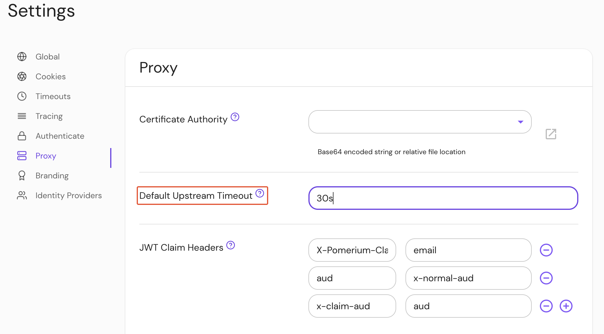

import Tabs from '@theme/Tabs';
import TabItem from '@theme/TabItem';

# Default Upstream Timeout

## Summary

**Default Upstream Timeout** is the default timeout applied to a proxied route when no `timeout` key is specified by the policy.

See [Global Timeouts](/docs/reference/global-timeouts) for more information.

## How to configure

<Tabs>
<TabItem value="Core" label="Core">

| **Config file keys** | **Environment variables** | **Type** | **Default** |
| :-- | :-- | :-- | :-- |
| `default_upstream_timeout` | `DEFAULT_UPSTREAM_TIMEOUT` | `string` | `30s` ([Go Duration](https://pkg.go.dev/time#Duration) formatting) |

### Examples

```yaml
default_upstream_timeout: 30s
```

```bash
DEFAULT_UPSTREAM_TIMEOUT: 1h45m
```

</TabItem>
<TabItem value="Enterprise" label="Enterprise">

Set **Default Upstream Timeout** in the Console:



</TabItem>
<TabItem value="Kubernetes" label="Kubernetes">

Kubernetes does not support `default_upstream_timeout`

</TabItem>
</Tabs>
