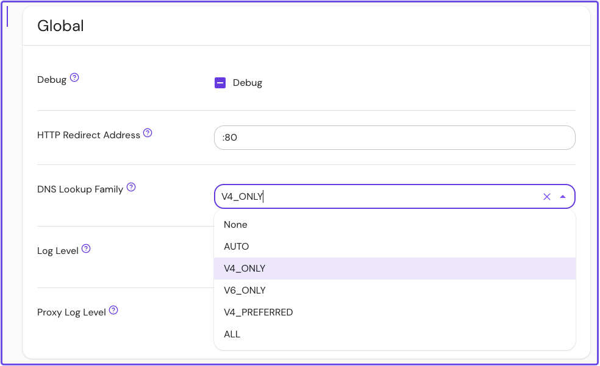

import Tabs from '@theme/Tabs';
import TabItem from '@theme/TabItem';

# DNS Lookup Family

<Tabs>
<TabItem value="Core" label="Core">

---

**Config file keys:** `dns_lookup_family` <br/>
**Environment variables:** `DNS_LOOKUP_FAMILY` <br/>
**Type:** `string` <br/>
**Default:** `V4_PREFERRED` <br/>
**Options:**
- `AUTO`
- `V4_ONLY`
- `V6_ONLY`
- `V4_PREFERRED`
- `ALL` <br/>

**Example:**
```yaml
default_lookup_family: AUTO

DEFAULT_LOOKUP_FAMILY: V6_ONLY
```

</TabItem>
<TabItem value="Enterprise" label="Enterprise">

---

**Config file keys:** `dns_lookup_family` <br/>
**Environment variables:** `DNS_LOOKUP_FAMILY` <br/>
**Type:** `string` <br/>
**Default:** `V4_PREFERRED` <br/>
**Options:**
- `AUTO`
- `V4_ONLY`
- `V6_ONLY`
- `V4_PREFERRED`
- `ALL` <br/>



</TabItem>
<TabItem value="Kubernetes" label="Kubernetes">

---

Kubernetes does not support `dns_lookup_family`

</TabItem>
</Tabs>

---

**DNS Lookup Family** sets the DNS IP address resolution policy. If not specified, the value defaults to `V4_PREFERRED`.

| **Option** | **Description** |
| :-- | :-- |
| `NONE` | TBD |
| `AUTO` | DNS resolver will first perform a lookup for addresses in the IPv6 family and fallback to a lookup for addresses in the IPv4 family |
| `V4_ONLY` | DNS resolver will only perform a lookup for addresses in the IPv4 family |
| `V6_ONLY` | DNS resolver will only perform a lookup for addresses in the IPv6 family |
| `V4_PREFERRED` | DNS resolver will first perform a lookup for addresses in the IPv4 family and fallback to a lookup for addresses in the IPv6 family |
| `ALL` | DNS resolver will perform a lookup for both IPv4 and IPv6 families, and return all resolved addresses |

See the [Envoy docs](https://www.envoyproxy.io/docs/envoy/latest/api-v3/config/cluster/v3/cluster.proto.html#enum-config-cluster-v3-cluster-dnslookupfamily) for more information about these options.
