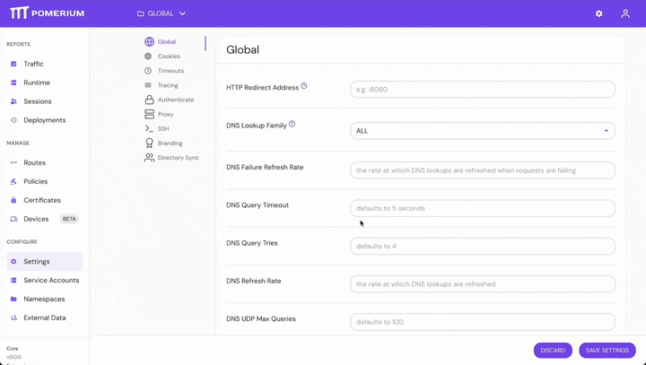
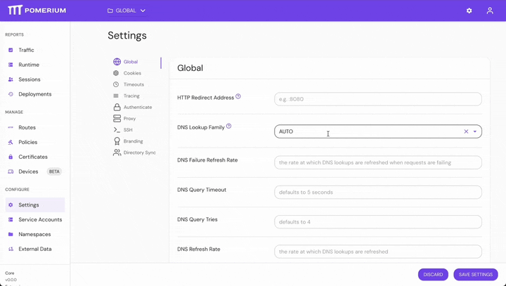
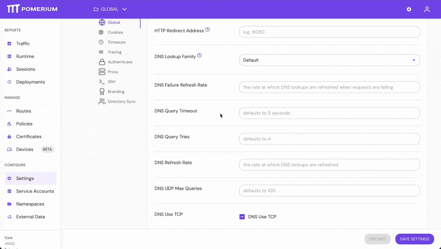
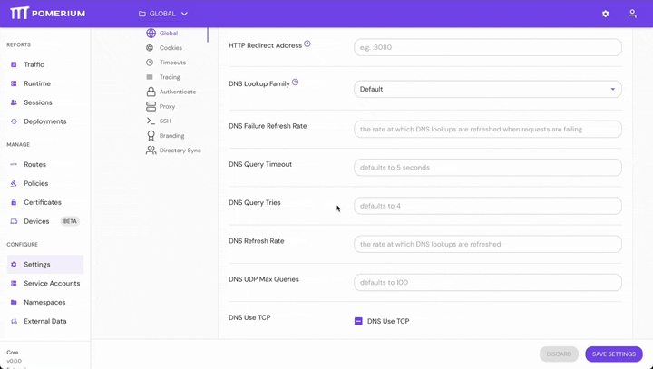
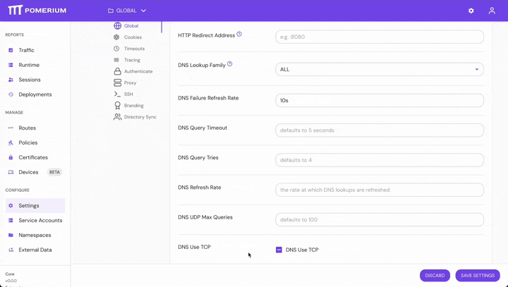

import Tabs from '@theme/Tabs';
import TabItem from '@theme/TabItem';

# DNS

This reference covers all of Pomerium's **DNS Settings**:

- [Failure Refresh Rate](#failure-refresh-rate)
- [Lookup Family](#lookup-family)
- [Query Timeout](#query-timeout)
- [Query Tries](#query-tries)
- [Refresh Rate](#refresh-rate)
- [UDP Max Queries](#udp-max-queries)
- [Use TCP](#use-tcp)

## Failure Refresh Rate

**Failure Refresh Rate** sets the DNS refresh rate when requests are failing.

### How to Configure

<Tabs>
<TabItem value="Core" label="Core">

| **Config file keys** | **Environment variables** | **Type** | **Default** |
| :-- | :-- | :-- | :-- |
| `dns_failure_refresh_rate` | `DNS_FAILURE_REFRESH_RATE` | `string` ([Go Duration](https://golang.org/pkg/time/#Duration.String) formatting) | `5s` |

#### Examples

```yaml
dns_failure_refresh_rate: 10s
```

</TabItem>
<TabItem value="Enterprise" label="Enterprise">

Set **Failure Refresh Rate** in the Console:



</TabItem>
<TabItem value="Kubernetes" label="Kubernetes">

```yaml
dns:
  failureRefreshRate: 10s
```

</TabItem>
</Tabs>

## Lookup Family

**Lookup Family** sets the DNS IP address resolution policy.

### How to Configure

<Tabs>
<TabItem value="Core" label="Core">

| **Config file keys** | **Environment variables** | **Type** | **Default**    |
| :------------------- | :------------------------ | :------- | :------------- |
| `dns_lookup_family`  | `DNS_LOOKUP_FAMILY`       | `string` | `V4_PREFERRED` |

#### Examples

```yaml
default_lookup_family: AUTO
```

```bash
DEFAULT_LOOKUP_FAMILY=V6_ONLY
```

</TabItem>
<TabItem value="Enterprise" label="Enterprise">

Set **Lookup Family** in the Console:



</TabItem>
<TabItem value="Kubernetes" label="Kubernetes">

```yaml
dns:
  lookupFamily: V6_ONLY
```

</TabItem>
</Tabs>

### Options

| **Options** | **Description** |
| :-- | :-- |
| `DEFAULT` (Enterprise only) | Defers to configuration settings or default if none specified |
| `AUTO` | DNS resolver will first perform a lookup for addresses in the IPv6 family and fallback to a lookup for addresses in the IPv4 family |
| `V4_ONLY` | DNS resolver will only perform a lookup for addresses in the IPv4 family |
| `V6_ONLY` | DNS resolver will only perform a lookup for addresses in the IPv6 family |
| `V4_PREFERRED` | DNS resolver will first perform a lookup for addresses in the IPv4 family and fallback to a lookup for addresses in the IPv6 family |
| `ALL` | DNS resolver will perform a lookup for both IPv4 and IPv6 families, and return all resolved addresses |

See the [Envoy docs](https://www.envoyproxy.io/docs/envoy/latest/api-v3/config/cluster/v3/cluster.proto.html#enum-config-cluster-v3-cluster-dnslookupfamily) for more information about these options.

## Query Timeout

**Query Timeout** sets the timeout for DNS queries.

### How to Configure

<Tabs>
<TabItem value="Core" label="Core">

| **Config file keys** | **Environment variables** | **Type** | **Default** |
| :-- | :-- | :-- | :-- |
| `dns_query_timeout` | `DNS_QUERY_TIMEOUT` | `string` ([Go Duration](https://golang.org/pkg/time/#Duration.String) formatting) | `5s` |

#### Examples

```yaml
dns_query_timeout: 10s
```

</TabItem>
<TabItem value="Enterprise" label="Enterprise">

Set **Query Timeout** in the Console:



</TabItem>
<TabItem value="Kubernetes" label="Kubernetes">

```yaml
dns:
  queryTimeout: 10s
```

</TabItem>
</Tabs>

## Query Tries

**Query Tries** sets the number of times a DNS query will be re-tried.

### How to Configure

<Tabs>
<TabItem value="Core" label="Core">

| **Config file keys** | **Environment variables** | **Type**  | **Default** |
| :------------------- | :------------------------ | :-------- | :---------- |
| `dns_query_tries`    | `DNS_QUERY_TRIES`         | `integer` | `4`         |

#### Examples

```yaml
dns_query_tries: 7
```

</TabItem>
<TabItem value="Enterprise" label="Enterprise">

Set **Query Tries** in the Console:



</TabItem>
<TabItem value="Kubernetes" label="Kubernetes">

```yaml
dns:
  queryTries: 7
```

</TabItem>
</Tabs>

## Refresh Rate

**Refresh Rate** sets the DNS refresh rate.

### How to Configure

<Tabs>
<TabItem value="Core" label="Core">

| **Config file keys** | **Environment variables** | **Type** | **Default** |
| :-- | :-- | :-- | :-- |
| `dns_refresh_rate` | `DNS_REFRESH_RATE` | `string` ([Go Duration](https://golang.org/pkg/time/#Duration.String) formatting) | DNS record TTL, or `5s` if not set |

#### Examples

```yaml
dns_refresh_rate: 10s
```

</TabItem>
<TabItem value="Enterprise" label="Enterprise">

Set **Refresh Rate** in the Console:


</TabItem>
<TabItem value="Kubernetes" label="Kubernetes">

```yaml
dns:
  refreshRate: 10s
```

</TabItem>
</Tabs>

## UDP Max Queries

**UDP Max Queries** sets the maximum number of queries before a new UDP port is opened.

### How to Configure

<Tabs>
<TabItem value="Core" label="Core">

| **Config file keys**  | **Environment variables** | **Type**  | **Default** |
| :-------------------- | :------------------------ | :-------- | :---------- |
| `dns_udp_max_queries` | `DNS_UDP_MAX_QUERIES`     | `integer` | `100`       |

#### Examples

```yaml
dns_udp_max_queries: 100
```

</TabItem>
<TabItem value="Enterprise" label="Enterprise">

Set **UDP Max Queries** in the Console:


</TabItem>
<TabItem value="Kubernetes" label="Kubernetes">

```yaml
dns:
  udpMaxQueries: 100
```

</TabItem>
</Tabs>

## Use TCP

**Use TCP** configures Pomerium to use TCP instead of UDP for DNS queries.

### How to Configure

<Tabs>
<TabItem value="Core" label="Core">

| **Config file keys** | **Environment variables** | **Type**  | **Default** |
| :------------------- | :------------------------ | :-------- | :---------- |
| `dns_use_tcp`        | `DNS_USE_TCP`             | `boolean` | `false`     |

#### Examples

```yaml
dns_use_tcp: true
```

</TabItem>
<TabItem value="Enterprise" label="Enterprise">

Set **Use TCP** in the Console:



</TabItem>
<TabItem value="Kubernetes" label="Kubernetes">

```yaml
dns:
  useTcp: true
```

</TabItem>
</Tabs>
