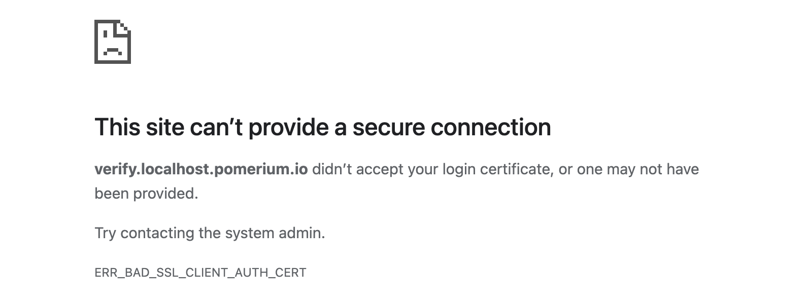

---
# cSpell:ignore LS0tLS1CRUdJTiBDRVJUSUZJQ0FURS0tLS0tCk LS0tLS1CRUdJTiBYNTA5IENSTC0tLS0tCk

id: downstream-mtls-settings
title: Downstream mTLS Settings
keywords:
  - reference
  - client certificate
  - mTLS
pagination_prev: null
pagination_next: null
---

import Tabs from '@theme/Tabs';
import TabItem from '@theme/TabItem';

# Downstream mTLS Settings

Downstream mTLS settings control the client certificate requirements for end users connecting to Pomerium-managed routes. (To configure a client certificate presented by Pomerium to an _upstream_ service, see the [TLS Client Certificate](/docs/reference/routes/tls#tls-client-certificate) setting.)

These settings are grouped in the YAML configuration file under the key `downstream_mtls`.

## Certificate Authority (CA) {#ca}

**CA** is a bundle of PEM-encoded X.509 certificates that will be treated as trust anchors when verifying client certificates. Both root and intermediate CA certificates can be used as trust anchors.

Any per-route certificate authorities set using the (deprecated) [TLS Downstream Client CA](/docs/reference/routes/tls#tls-downstream-client-certificate-authority) option will be added to this CA bundle.

The Subject Name of all configured CA certificates will be advertised in the initial TLS handshake, and so should not include any sensitive information.

The CA setting is **required** for downstream mTLS.

:::info

This setting previously used the config file keys `client_ca` and `client_ca_file` and the environment variables `CLIENT_CA` and `CLIENT_CA_FILE`.

:::

### How to configure {#ca-how-to-configure}

The CA bundle can be specified inline (with the `ca` key or the `DOWNSTREAM_MTLS_CA` environment variable) or as a path to a file on disk (with the `ca_file` key or the `DOWNSTREAM_MTLS_CA_FILE` environment variable). It is considered an error to specify both.

<Tabs groupId="deployment-type">
<TabItem value="Core" label="Core">

| **Config file keys** | **Environment variables** | **Type** |
| :-- | :-- | :-- |
| `downstream_mtls.ca` | `DOWNSTREAM_MTLS_CA` | string (base64-encoded PEM certificate bundle) |
| `downstream_mtls.ca_file` | `DOWNSTREAM_MTLS_CA_FILE` | string (path to PEM certificate bundle) |

</TabItem>
<TabItem value="Enterprise" label="Enterprise">

These settings are not configurable in the Enterprise Console.

</TabItem>
<TabItem value="Kubernetes" label="Kubernetes">

The Ingress Controller does not support these settings.

</TabItem>
</Tabs>

### Examples {#ca-examples}

```yaml
downstream_mtls:
  ca: LS0tLS1CRUdJTiBDRVJUSUZJQ0FURS0tLS0tCk...
```

```yaml
downstream_mtls:
  ca_file: /path/to/trusted/CAs.pem
```

```bash
DOWNSTREAM_MTLS_CA=LS0tLS1CRUdJTiBDRVJUSUZJQ0FURS0tLS0tCk...
```

```bash
DOWNSTREAM_MTLS_CA_FILE=/path/to/trusted/CAs.pem
```

## Certificate Revocation List (CRL) {#crl}

**CRL** is a bundle of PEM-encoded certificate revocation lists to be consulted during certificate validation. Any certificates listed as revoked will not be trusted. If a CRL is provided for any CA in a client certificate's trust chain, a CRL must be provided for all CAs in the trust chain.

### How to configure {#crl-how-to-configure}

A CRL bundle can be specified inline (with the `crl` key or the `DOWNSTREAM_MTLS_CRL` environment variable) or as a path to a file on disk (with the `crl_file` key or the `DOWNSTREAM_MTLS_CRL_FILE` environment variable). It is considered an error to specify both.

<Tabs groupId="deployment-type">
<TabItem value="Core" label="Core">

| **Config file keys** | **Environment variables** | **Type** |
| :-- | :-- | :-- |
| `downstream_mtls.crl` | `DOWNSTREAM_MTLS_CRL` | string (base64-encoded PEM CRL bundle) |
| `downstream_mtls.crl_file` | `DOWNSTREAM_MTLS_CRL_FILE` | string (path to PEM CRL bundle) |

</TabItem>
<TabItem value="Enterprise" label="Enterprise">

These settings are not configurable in the Enterprise Console.

</TabItem>
<TabItem value="Kubernetes" label="Kubernetes">

The Ingress Controller does not support these settings.

</TabItem>
</Tabs>

### Examples {#crl-examples}

```yaml
downstream_mtls:
  crl: LS0tLS1CRUdJTiBYNTA5IENSTC0tLS0tCk...
```

```yaml
downstream_mtls:
  crl_file: /path/to/CRLs.pem
```

```bash
DOWNSTREAM_MTLS_CRL=LS0tLS1CRUdJTiBYNTA5IENSTC0tLS0tCk...
```

```bash
DOWNSTREAM_MTLS_CRL_FILE=/path/to/CRLs.pem
```

## Enforcement Mode

**Enforcement Mode** controls Pomerium's behavior when a client does not present a trusted client certificate. There are three options:

1. `policy_with_default_deny` — Pomerium will serve an HTML error page when making a request to any user-defined route without a trusted client certificate. (This is the default behavior.)

   

   Note that in this mode, client certificates are not required for internal Pomerium routes, such as the authenticate URL (if using the self-hosted authenticate service) or the /.pomerium/ details page.

   Any requests without a trusted client certificate will be logged by the authorize service, with the deny reason `client-certificate-required` (if no certificate was presented) or `invalid-client-certificate` (if an untrusted or invalid certificate was presented).

2. `policy` — Pomerium will not require client certificates for any routes unless explicitly required by a route policy.

   This mode allows you to configure only certain routes to require a trusted client certificate. To configure a route to require client certificates, add a policy Deny rule with the `invalid_client_certificate` criterion. (See [Pomerium Policy Language](/docs/capabilities/ppl) for more information.)

   As in the previous mode, Pomerium will serve an HTML error page for any routes where client certificates are required but no trusted certificate is presented, and likewise these requests will be logged by the authorize service.

3. `reject_connection` — Pomerium will require a trusted client certificate during the initial TLS handshake. Any connection attempts that do not present a trusted client certificate will be rejected.

   Users will see a browser default error page. For example:

   

   This matches the default behavior of many popular reverse proxies, such as Apache httpd and Caddy.

   Note that in this mode, client certificates will be required even for internal Pomerium routes, such as the authenticate URL (if using the self-hosted authenticate service) and the /.pomerium/ details page. In particular, any upstream services that perform [JWT verification](/docs/capabilities/getting-users-identity) will not be able to access the default JWKS endpoint. You may need to host your own JWKS endpoint, or provide some other means of distributing the JWT verification key.

   Also note that in this mode, requests without a trusted client certificate will never reach the Pomerium authorize service, and so no record of these requests will be logged.

### How to configure {#enforcement-mode-how-to-configure}

<Tabs groupId="deployment-type">
<TabItem value="Core" label="Core">

| **Config file keys** | **Environment variables** | **Type** |
| :-- | :-- | :-- |
| `downstream_mtls.enforcement` | `DOWNSTREAM_MTLS_ENFORCEMENT` | string (one of `policy_with_default_deny`, `policy`, or `reject_connection`) |

</TabItem>
<TabItem value="Enterprise" label="Enterprise">

This setting is not configurable in the Enterprise Console.

</TabItem>
<TabItem value="Kubernetes" label="Kubernetes">

The Ingress Controller does not support this setting.

</TabItem>
</Tabs>

### Examples {#enforcement-mode-examples}

```yaml
downstream_mtls:
  enforcement: reject_connection
```

```bash
DOWNSTREAM_MTLS_ENFORCEMENT=reject_connection
```

## Match Subject Alt Names {#match-sans}

**Match Subject Alt Names** can be used to add an additional constraint when validating client certificates: each certificate must contain a Subject Alternative Name (SAN) of a particular type, whose value matches the provided regular expression.

Client certificates satisfying _at least one_ of the provided match conditions will be allowed.

Supported SAN types include:

- `dns` — a DNS name
- `email` — an email address (this is the `rfc822Name` as specified in [RFC 5280 §4.2.1.6](https://datatracker.ietf.org/doc/html/rfc5280#section-4.2.1.6))
- `ip_address` — an IP address (either IPv4 or IPv6)
- `uri` — a Uniform Resource Identifier (URI)

The provided regular expression must match against the entire SAN entry. The regular expressions use Google's [RE2 syntax](https://github.com/google/re2/wiki/Syntax).

SAN IPv4 addresses will be expressed in dotted decimal notation (e.g. "127.0.0.1") when matching against the provided regular expression. SAN IPv6 addresses will be expressed as specified in [RFC 5952](https://datatracker.ietf.org/doc/html/rfc5952#section-4).

### How to configure {#match-sans-how-to-configure}

<Tabs groupId="deployment-type">
<TabItem value="Core" label="Core">

| **Config file keys** | **Environment variables** | **Type** |
| :-- | :-- | :-- |
| `downstream_mtls.match_subject_alt_names` | n/a | array of mappings from SAN type to regular expression |

</TabItem>
<TabItem value="Enterprise" label="Enterprise">

This setting is not configurable in the Enterprise Console.

</TabItem>
<TabItem value="Kubernetes" label="Kubernetes">

The Ingress Controller does not support this setting.

</TabItem>
</Tabs>

### Examples {#match-sans-examples}

To require that all client certificates have a DNS SAN with a domain name ending in ".corp.example.com":

```yaml
downstream_mtls:
  match_subject_alt_names:
    - dns: '.*\.corp\.example\.com'
```

To require that all client certificates have _either_ a DNS SAN containing the string "beyondcorp" _or_ an email address SAN with the domain "example.com":

```yaml
downstream_mtls:
  match_subject_alt_names:
    - dns: '.*beyondcorp.*'
    - email: '.*@example\.com'
```

## Max Verify Depth

**Max Verify Depth** sets a limit on the depth of a certificate chain presented by the client. The depth is defined as the number of certificates in the verified trust chain, _excluding_ the trust anchor. (The trust anchor can be any root or intermediate CA certificate included in the trusted [**CA**](#ca) bundle.) This limit does not override any `pathlen` constraints set within the CA certificates themselves.

When set to 0, no specific limit is enforced.

For compatibility with previous Pomerium releases, the default is 1. That is, only certificates _directly_ issued by a CA included in the trusted CA bundle are allowed.

:::note

The default value for this setting may change in a future Pomerium release.

:::

The following diagram illustrates a CA setup with a root CA, an intermediate CA, and a second intermediate CA issued by the first intermediate CA:


In this scenario, with **Max Verify Depth** set to 1, only "Certificate A" would be allowed (as it is issued directly by the root CA). When set to 2, then both "Certificate A" and "Certificate B" would be allowed, but not "Certificate C." When set to 3 or greater, then all of "Certificate A," "Certificate B," and "Certificate C" would be allowed.

Note that a client presenting "Certificate B" must also include the "Intermediate CA 1" certificate, as it is not part of the trusted CA bundle. Likewise, a client presenting "Certificate C" must also include both the "Intermediate CA 1" and "Intermediate CA 2" certificates.

### How to configure {#max-verify-depth-how-to-configure}

<Tabs groupId="deployment-type">
<TabItem value="Core" label="Core">

| **Config file keys** | **Environment variables** | **Type** |
| :-- | :-- | :-- |
| `downstream_mtls.max_verify_depth` | `DOWNSTREAM_MTLS_MAX_VERIFY_DEPTH` | unsigned integer |

</TabItem>
<TabItem value="Enterprise" label="Enterprise">

This setting is not configurable in the Enterprise Console.

</TabItem>
<TabItem value="Kubernetes" label="Kubernetes">

The Ingress Controller does not support this setting.

</TabItem>
</Tabs>

### Examples {#max-verify-depth-examples}

To allow client certificate chains including the leaf certificate and at most one client-supplied intermediate CA certificate (before a trusted root or intermediate CA):

```yaml
downstream_mtls:
  max_verify_depth: 2
```

```bash
DOWNSTREAM_MTLS_MAX_VERIFY_DEPTH=2
```

To remove the default limit:

```yaml
downstream_mtls:
  max_verify_depth: 0
```

```bash
DOWNSTREAM_MTLS_MAX_VERIFY_DEPTH=0
```
