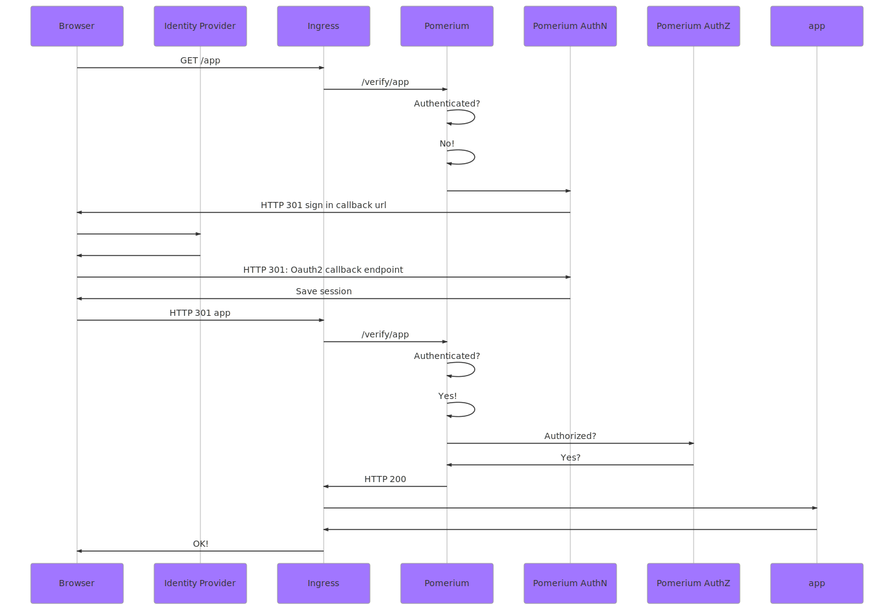

---
# cSpell:ignore signin entrypoints forwardedheaders middlewares forwardauth

id: forward-auth
title: Forward Auth
description: |
  Forward authentication creates an endpoint that can be used with third-party proxies.
keywords:
  - reference
  - Forward Auth
pagination_prev: null
pagination_next: null
---

# Forward Auth

- Environmental Variable: `FORWARD_AUTH_URL`
- Config File Key: `forward_auth_url`
- Type: `URL` (must contain a scheme and hostname)
- Example: `https://forwardauth.corp.example.com`
- Resulting Verification URL: `https://forwardauth.corp.example.com/?uri={URL-TO-VERIFY}`
- Optional

Forward authentication creates an endpoint that can be used with third-party proxies that do not have rich access control capabilities ([nginx](http://nginx.org/en/docs/http/ngx_http_auth_request_module.html), [nginx-ingress](https://kubernetes.github.io/ingress-nginx/examples/auth/oauth-external-auth/), [ambassador](https://www.getambassador.io/reference/services/auth-service/), [traefik](https://docs.traefik.io/middlewares/forwardauth/)). Forward authentication allows you to delegate authentication and authorization for each request to Pomerium.

#### Request flow



#### Examples

##### NGINX Ingress

Some reverse-proxies, such as nginx split access control flow into two parts: verification and sign-in redirection. Notice the additional path `/verify` used for `auth-url` indicating to Pomerium that it should return a `401` instead of redirecting and starting the sign-in process.

```yaml
apiVersion: extensions/v1beta1
kind: Ingress
metadata:
  name: verify
  annotations:
    kubernetes.io/ingress.class: 'nginx'
    certmanager.k8s.io/issuer: 'letsencrypt-prod'
    nginx.ingress.kubernetes.io/auth-url: https://forwardauth.corp.example.com/verify?uri=$scheme://$host$request_uri
    nginx.ingress.kubernetes.io/auth-signin: 'https://forwardauth.corp.example.com/?uri=$scheme://$host$request_uri'
spec:
  tls:
    - hosts:
        - verify.corp.example.com
      secretName: quickstart-example-tls
  rules:
    - host: verify.corp.example.com
      http:
        paths:
          - path: /
            backend:
              serviceName: verify
              servicePort: 80
```

#### Traefik docker-compose

If the `forward_auth_url` is also handled by Traefik, you will need to configure Traefik to trust the `X-Forwarded-*` headers as described in [the documentation](https://docs.traefik.io/v2.2/routing/entrypoints/#forwarded-headers).

```yml
version: '3'

services:
  traefik:
    # The official v2.2 Traefik docker image
    image: traefik:v2.2
    # Enables the web UI and tells Traefik to listen to docker
    command:
      - '--api.insecure=true'
      - '--providers.docker=true'
      - '--entrypoints.web.address=:80'
      - '--entrypoints.web.forwardedheaders.insecure=true'
    ports:
      # The HTTP port
      - '80:80'
      # The Web UI (enabled by --api.insecure=true)
      - '8080:8080'
    volumes:
      # So that Traefik can listen to the Docker events
      - /var/run/docker.sock:/var/run/docker.sock
  verify:
    # A container that exposes an API to show its IP address
    image: pomerium/verify:latest
    labels:
      - 'traefik.http.routers.verify.rule=Host(`verify.corp.example.com`)'
      # Create a middleware named `foo-add-prefix`
      - 'traefik.http.middlewares.test-auth.forwardauth.authResponseHeaders=x-pomerium-claim-email,x-pomerium-claim-id,x-pomerium-claim-groups,x-pomerium-jwt-assertion'
      - 'traefik.http.middlewares.test-auth.forwardauth.address=http://forwardauth.corp.example.com/?uri=https://verify.corp.example.com'
      - 'traefik.http.routers.verify.middlewares=test-auth@docker'
```
