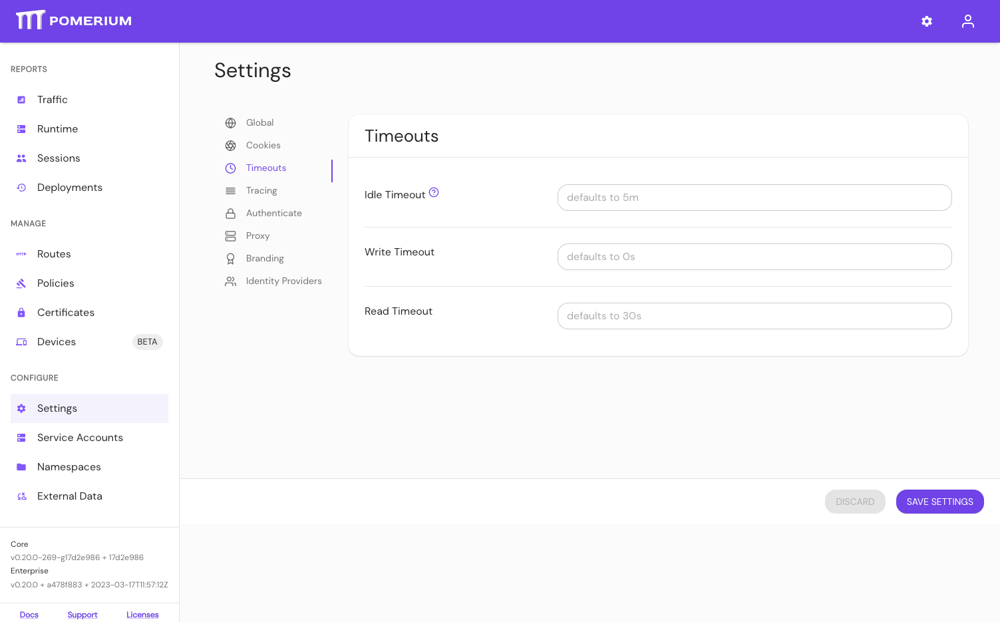

import Tabs from '@theme/Tabs';
import TabItem from '@theme/TabItem';

# Global Timeouts

## Summary

**Global Timeouts** set the global server timeouts. Timeouts can also be set for individual [routes](/docs/reference/routes).

## How to configure

<Tabs>
<TabItem value="Core" label="Core">

| **Config file keys** | **Environment variables** | **Type** | **Defaults** | **Definition** |
| :-- | :-- | :-- | :-- | :-- |
| `timeout_read` | `TIMEOUT_READ` | `string` ([Go Duration](https://golang.org/pkg/time/#Duration.String) formatting) | `30s` | The amount of time for the entire request stream to be received from the client. |
| `timeout_write` | `TIMEOUT_WRITE` | `string` ([Go Duration](https://golang.org/pkg/time/#Duration.String) formatting) | `0` | The max stream duration is the maximum time that a stream’s lifetime will span. An HTTP request/response exchange fully consumes a single stream. Therefore, this value must be greater than `read_timeout` as it covers both request and response time. |
| `timeout_idle` | `TIMEOUT_IDLE` | `string` ([Go Duration](https://golang.org/pkg/time/#Duration.String) formatting) | `5m` | The idle timeout is the time at which a downstream or upstream connection will be terminated if there are no active streams. |

### Examples

```yaml
timeout_read: 30s
```

```bash
TIMEOUT_WRITE=0
```

</TabItem>
<TabItem value="Enterprise" label="Enterprise">

Set **Global Timeouts** in the Console: 

</TabItem>
<TabItem value="Kubernetes" label="Kubernetes">

| **[Parameter name](/docs/deploy/k8s/reference#timeouts)** | **Type** | **Defaults** | **Definition** |
| :-- | :-- | :-- | :-- |
| `timeouts.read` | `string` ([Go Duration](https://golang.org/pkg/time/#Duration.String) formatting) | `30s` | The amount of time for the entire request stream to be received from the client. |
| `timeouts.write` | `string` ([Go Duration](https://golang.org/pkg/time/#Duration.String) formatting) | `0` | The max stream duration is the maximum time that a stream’s lifetime will span. An HTTP request/response exchange fully consumes a single stream. Therefore, this value must be greater than `read_timeout` as it covers both request and response time. |
| `timeouts.idle` | `string` ([Go Duration](https://golang.org/pkg/time/#Duration.String) formatting) | `5m` | The idle timeout is the time at which a downstream or upstream connection will be terminated if there are no active streams. |

### Examples

```yaml
timeouts:
  read: 30s
```

```yaml
timeouts:
  write: 0
```

```yaml
timeouts:
  idle: 5m
```

</TabItem>
</Tabs>
