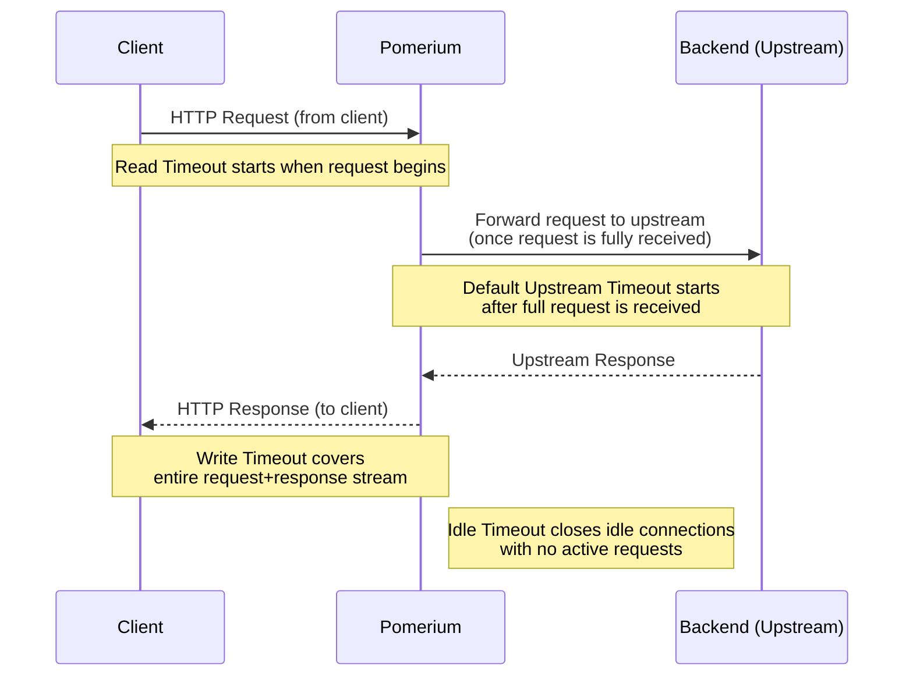

import Tabs from '@theme/Tabs';
import TabItem from '@theme/TabItem';

# Global Timeouts

**Global Timeouts** set the global server timeouts for HTTP request and response streams.

You can set also set [route-level timeouts](/docs/reference/routes/timeouts).

## Timeout Flow Overview

The following diagram shows how different timeouts apply throughout the request lifecycle:



## Timeout Settings Overview

| **Timeout** | **Direction** | **Default** | **Purpose** |
| --- | --- | --- | --- |
| **Read Timeout** | Downstream | 30s | Time allowed to receive complete request from client |
| **Write Timeout** | Downstream | 0 (disabled) | Total time for entire request/response cycle |
| **Idle Timeout** | Bidirectional | 5m | Closes inactive connections when idle |
| **Default Upstream Timeout** | Upstream | 30s | Time allowed for backend to respond |

## Read Timeout

**Read Timeout** sets the maximum duration allowed for the entire downstream HTTP request to be received. This timeout starts when the downstream client initiates the request and ends when Pomerium has fully received the complete request (including headers and body) from the client.

Setting this timeout to `0` disables it. (This is not recommended, as it could allow malicious clients to consume resources with slow or incomplete requests.)

### How to configure

<Tabs>
<TabItem value="Core" label="Core">

| **Config file keys** | **Environment variables** | **Type** | **Default** |
| :-- | :-- | :-- | :-- |
| `timeout_read` | `TIMEOUT_READ` | [Go Duration] string | `30s` |

### Examples

```yaml
timeout_read: 30s
```

```bash
TIMEOUT_READ=30s
```

</TabItem>
<TabItem value="Enterprise" label="Enterprise">

Set **Global Timeouts** in the Console: 

</TabItem>
<TabItem value="Kubernetes" label="Kubernetes">

| **[Parameter name](/docs/deploy/k8s/reference#timeouts)** | **Type** | **Defaults** |
| :-- | :-- | :-- |
| `timeouts.read` | [Go Duration] string | `30s` |

### Examples

```yaml
timeouts:
  read: 30s
```

</TabItem>
<TabItem value="Enterprise via Terraform" label="Enterprise via Terraform">

| **[Parameter name](https://registry.terraform.io/providers/pomerium/pomerium/latest/docs/resources/settings)** | **Type** | **Defaults** |
| :-- | :-- | :-- |
| `timeout_read ` | String | `30s` |

### Examples

```hcl
timeout_read = "30s"
```

</TabItem>
</Tabs>

## Write Timeout

**Write Timeout** sets the maximum duration allowed for an entire HTTP request/response cycle to complete. This includes both the time to receive the request from the downstream client and the time to send the complete response back. This timeout should be greater than the [**Read Timeout**](#read-timeout) setting as it encompasses the entire request/response lifecycle.

Setting this timeout to `0` disables it, meaning there is no time limit for request/response completion.

### How to configure

<Tabs>
<TabItem value="Core" label="Core">

| **Config file keys** | **Environment variables** | **Type** | **Default** |
| :-- | :-- | :-- | :-- |
| `timeout_write` | `TIMEOUT_WRITE` | [Go Duration] string | `0` (no timeout) |

### Examples

```yaml
timeout_write: 0
```

```bash
TIMEOUT_WRITE=0
```

</TabItem>
<TabItem value="Enterprise" label="Enterprise">

Set **Global Timeouts** in the Console: 

</TabItem>
<TabItem value="Kubernetes" label="Kubernetes">

| **[Parameter name](/docs/deploy/k8s/reference#timeouts)** | **Type** | **Default** |
| :-- | :-- | :-- |
| `timeouts.write` | [Go Duration] string | `0` (no timeout) |

### Examples

```yaml
timeouts:
  write: 0
```

</TabItem>
<TabItem value="Enterprise via Terraform" label="Enterprise via Terraform">

| **[Parameter name](https://registry.terraform.io/providers/pomerium/pomerium/latest/docs/resources/settings)** | **Type** | **Default** |
| :-- | :-- | :-- |
| `timeout_write` | String | `0` (no timeout) |

### Examples

```hcl
timeout_write = "0"
```

</TabItem>
</Tabs>

## Idle Timeout

**Idle Timeout** sets the duration after which an upstream or downstream connection will be terminated if there are no active requests or responses.

Setting this timeout to `0` disables it, allowing connections to remain open indefinitely when idle.

### How to configure

<Tabs>
<TabItem value="Core" label="Core">

| **Config file keys** | **Environment variables** | **Type** | **Default** |
| :-- | :-- | :-- | :-- |
| `timeout_idle` | `TIMEOUT_IDLE` | [Go Duration] string | `5m` |

### Examples

```yaml
timeout_idle: 5m
```

```bash
TIMEOUT_IDLE=5m
```

</TabItem>
<TabItem value="Enterprise" label="Enterprise">

Set **Global Timeouts** in the Console: 

</TabItem>
<TabItem value="Kubernetes" label="Kubernetes">

| **[Parameter name](/docs/deploy/k8s/reference#timeouts)** | **Type** | **Default** |
| :-- | :-- | :-- |
| `timeouts.idle` | [Go Duration] string | `5m` |

### Examples

```yaml
timeouts:
  idle: 5m
```

</TabItem>
<TabItem value="Enterprise via Terraform" label="Enterprise via Terraform">

| **[Parameter name](https://registry.terraform.io/providers/pomerium/pomerium/latest/docs/resources/settings)** | **Type** | **Default** |
| :-- | :-- | :-- |
| `timeout_idle ` | String | `5m` |

### Examples

```hcl
timeout_idle = "5m"
```

</TabItem>
</Tabs>

## Default Upstream Timeout

**Default Upstream Timeout** is the default timeout applied to a proxied route when no `timeout` key is specified by the policy.

### How to configure

<Tabs>
<TabItem value="Core" label="Core">

| **Config file keys** | **Environment variables** | **Type** | **Default** |
| :-- | :-- | :-- | :-- |
| `default_upstream_timeout` | `DEFAULT_UPSTREAM_TIMEOUT` | [Go Duration] string | `30s` |

### Examples

```yaml
default_upstream_timeout: 30s
```

```bash
DEFAULT_UPSTREAM_TIMEOUT=1h45m
```

</TabItem>
<TabItem value="Enterprise" label="Enterprise">

Set **Default Upstream Timeout** in the Console:


</TabItem>
<TabItem value="Kubernetes" label="Kubernetes">

Kubernetes does not support `default_upstream_timeout`

</TabItem>
</Tabs>

[go duration]: https://golang.org/pkg/time/#Duration.String
