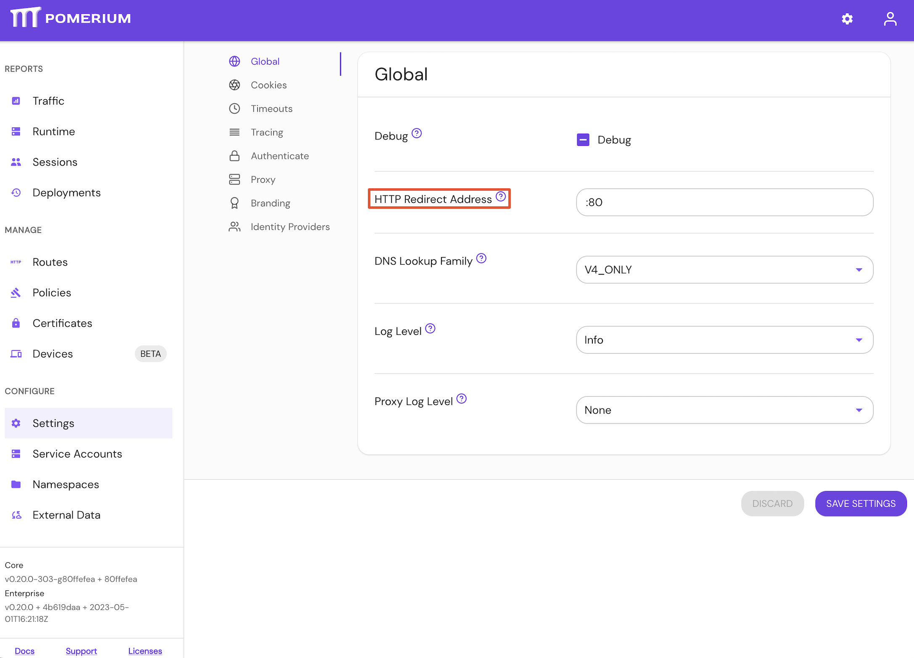

import Tabs from '@theme/Tabs';
import TabItem from '@theme/TabItem';

# HTTP Redirect Address

## Summary

If set, **HTTP Redirect Address** specifies the host and port to redirect HTTP to HTTPS traffic on. If unset, no redirect server is started.

## How to configure

| **Type** | **Usage**    |
| :------- | :----------- |
| `string` | **optional** |

<Tabs>
<TabItem value="Core" label="Core">

| **Config file keys** | **Environment variables** |
| :------------------- | :------------------------ |
| `http_redirect_addr` | `HTTP_REDIRECT_ADDR`      |

</TabItem>
<TabItem value="Enterprise" label="Enterprise">

Set **HTTP Redirect Address** in the Console: 

</TabItem>
<TabItem value="Kubernetes" label="Kubernetes">

**HTTP Redirect Address** is not customizable in Kubernetes

</TabItem>
</Tabs>

### Examples

```yaml
# config file key
http_redirect_addr: :80

# environment variable
HTTP_REDIRECT_ADDR=:8080
```
