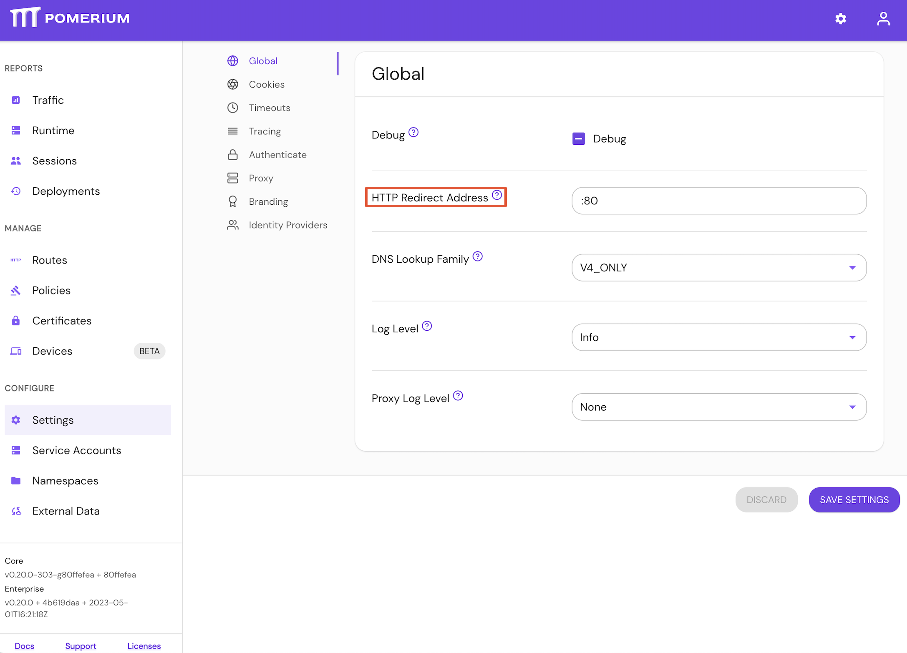

import TabItem from '@theme/TabItem';
import Tabs from '@theme/Tabs';

import EnterpriseConfiguration from '../../../src/components/EnterpriseConfiguration';

# HTTP Redirect Address

## Summary

If set, **HTTP Redirect Address** specifies the host and port to redirect HTTP to HTTPS traffic on. If unset, no redirect server is started.

## How to configure

<Tabs>
<TabItem value="Core" label="Core">

| **Config file keys** | **Environment variables** | **Type** | **Usage**    |
| :------------------- | :------------------------ | :------- | :----------- |
| `http_redirect_addr` | `HTTP_REDIRECT_ADDR`      | `string` | **optional** |

### Examples

```yaml
http_redirect_addr: :80
```

```bash
HTTP_REDIRECT_ADDR=:8080
```

</TabItem>
<TabItem value="Enterprise" label="Enterprise">
<EnterpriseConfiguration name="http_redirect_addr" resource="settings">

Set **HTTP Redirect Address** in the Console: 

</EnterpriseConfiguration>
</TabItem>
<TabItem value="Kubernetes" label="Kubernetes">

**HTTP Redirect Address** is not customizable in Kubernetes

</TabItem>
</Tabs>
