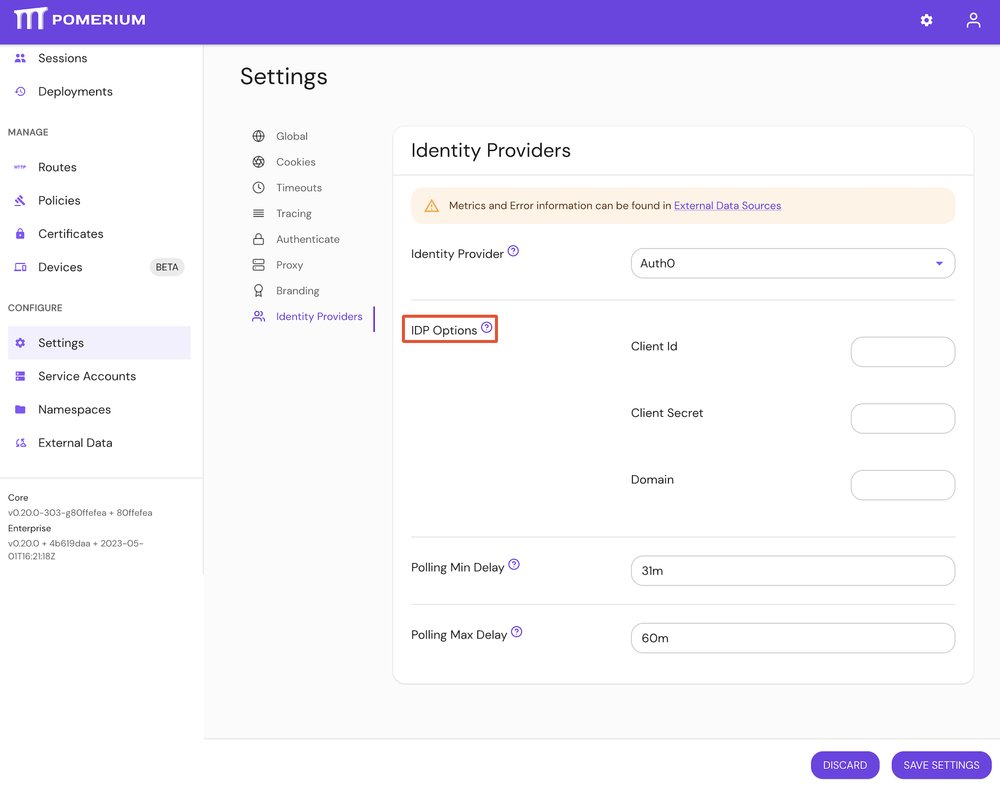

import Tabs from '@theme/Tabs';
import TabItem from '@theme/TabItem';

# Identity Provider Client Secret

## Summary

**Identity Provider Client Secret** is the OAuth 2.0 Secret Identifier retrieved from your identity provider. See your identity provider's documentation, and Pomerium's [identity provider](/docs/identity-providers/) docs for details.

:::tip **Note:**

Pomerium uses the [**Hosted Authenticate Service**](/docs/capabilities/hosted-authenticate-service) by default.

If you want to run Pomerium with a self-hosted authenticate service, include an [**identity provider**](/docs/identity-providers) and [**authenticate service URL**](/docs/reference/authenticate-service-url) in your configuration.

See [**Self-Hosted Authenticate Service**](/docs/capabilities/self-hosted-authenticate-service) for more information.

:::

## How to configure

| **Type** | **Usage** |
| :--- | :--- |
| `string` | **required** (unless using [idp_client_secret_file](./identity-provider-client-secret-file)) |

<Tabs>
<TabItem value="Core" label="Core">

| **Config file keys** | **Environment variables** |
| :--- | :--- |
| `idp_client_secret` | `IDP_CLIENT_SECRET` |

</TabItem>
<TabItem value="Enterprise" label="Enterprise">

Configure **Identity Provider Client Secret** under **IDP Settings** in the Console:



</TabItem>
<TabItem value="Kubernetes" label="Kubernetes">

See [`identityProvider.secret`](/docs/deploying/k8s/reference#identityprovider) for more information

</TabItem>
</Tabs>

### Examples

```yaml
# config file key
idp_client_secret: idp_client_secret

# environment variable
IDP_CLIENT_SECRET=idp_client_secret
```
