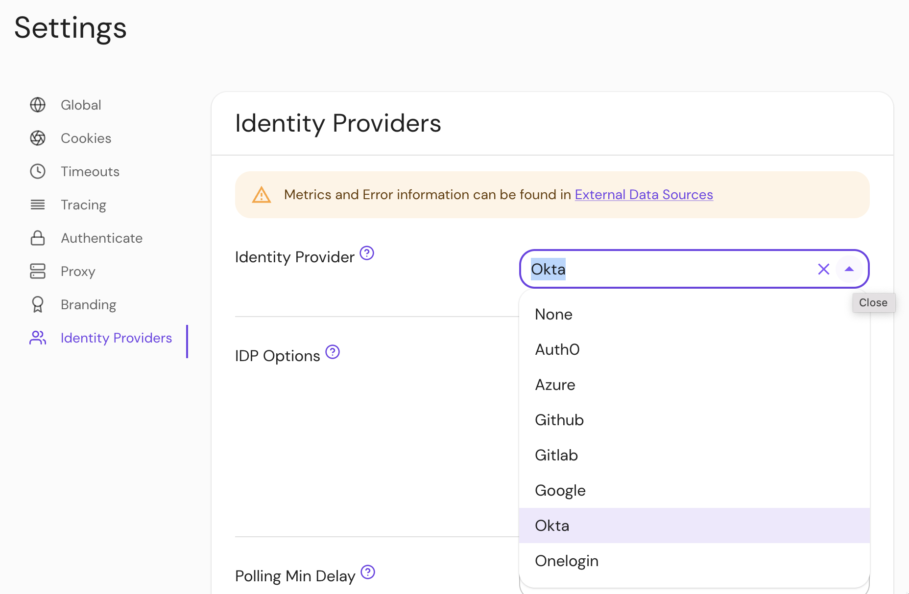

import Tabs from '@theme/Tabs';
import TabItem from '@theme/TabItem';

# Identity Provider Name

## Summary

**Identity Provider Name** is the short-hand name of a built-in OpenID Connect (OIDC) identity provider used for authentication.

See [identity provider](/docs/identity-providers/) for details.

:::tip **Note:**

Pomerium uses the [**Hosted Authenticate Service**](/docs/capabilities/hosted-authenticate-service) by default.

If you want to run Pomerium with a self-hosted authenticate service, include an [**identity provider**](/docs/identity-providers) and [**authenticate service URL**](/docs/reference/authenticate-service-url) in your configuration.

See [**Self-Hosted Authenticate Service**](/docs/capabilities/self-hosted-authenticate-service) for more information.

:::

## How to configure

To use a generic identity provider, set `idp_provider` to `oidc`.

| **Type** | **Usage** | **Options** |
| :--- | :--- | :--- |
| `string` | **required** (unless [self-hosting](/docs/capabilities/self-hosted-authenticate-service)) | `auth0` |
| | | `azure` |
| | | `google` |
| | | `okta` |
| | | `onelogin` |
| | | `ping` |
| | | `cognito` |
| | | `github` |
| | | `gitlab` |
| | | `oidc` |

<Tabs>
<TabItem value="Core" label="Core">

| **Config file keys** | **Environment variables** |
| :--- | :--- |
| `idp_provider` | `IDP_PROVIDER` |

</TabItem>
<TabItem value="Enterprise" label="Enterprise">

Set **Identity Provider Name** under the **Identity Provider** options in the Console:



</TabItem>
<TabItem value="Kubernetes" label="Kubernetes">

See [`identityProvider.provider`](/docs/deploying/k8s/reference#identityprovider) for more information

</TabItem>
</Tabs>

### Examples

```yaml
# config file key
idp_provider: auth0

# environment variable
IDP_PROVIDER=github
```
