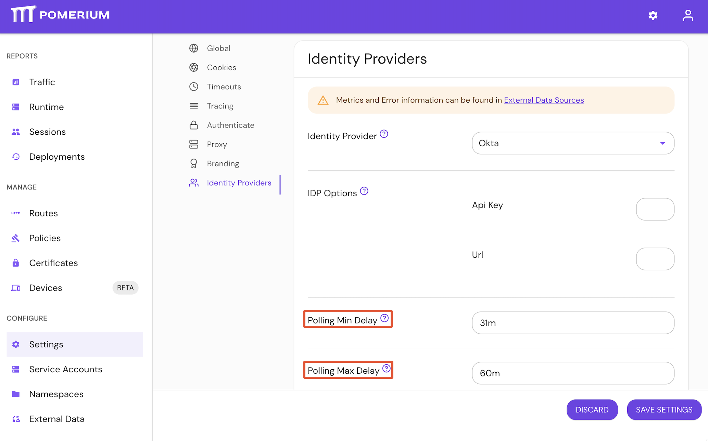

import Tabs from '@theme/Tabs';
import TabItem from '@theme/TabItem';

# Identity Provider Refresh Directory Settings

## Summary

**Identity Provider Refresh Directory Settings** consists of **Polling Min Delay** and **Polling Max Delay**. As of v0.19.0, these settings are only available in the Enterprise Console.

Polling Min Delay sets the interval of time that Pomerium will sync your identity provider directory. Polling Max Delay is the maximum time allowed each run.

:::warning

Use the Refresh Directory Settings at your own risk. If you set a too low value, you may reach your identity provider's API rate limit.

:::

:::tip **Note:**

Pomerium uses the [**Hosted Authenticate Service**](/docs/capabilities/hosted-authenticate-service) by default.

If you want to run Pomerium with a self-hosted authenticate service, include an [**identity provider**](/docs/identity-providers) and [**authenticate service URL**](/docs/reference/authenticate-service-url) in your configuration.

See [**Self-Hosted Authenticate Service**](/docs/capabilities/self-hosted-authenticate-service) for more information.

:::

## How to configure

<Tabs>
<TabItem value="Core" label="Core">

:::caution

As of Pomerium v0.19.0, Identity Provider Refresh Directory Settings are no longer supported for Pomerium Core configurations. Please see the [Upgrade Guide](/docs/releases/upgrading#idp-directory-sync) for more information.

:::

| **Type** | **Defaults** | **Value** |
| :-- | :-- | :-- |
| `string` ([Go Duration](https://golang.org/pkg/time/#Duration.String) formatting) | `idp_refresh_directory_interval` | `10m` |
|  | `idp_refresh_directory_timeout` | `1m` |

| **Config file keys**             | **Environment variables**        |
| :------------------------------- | :------------------------------- |
| `idp_refresh_directory_interval` | `IDP_REFRESH_DIRECTORY_INTERVAL` |
| `idp_refresh_directory_timeout`  | `IDP_REFRESH_DIRECTORY_TIMEOUT`  |

</TabItem>
<TabItem value="Enterprise" label="Enterprise">

Configure **Identity Provider Refresh Directory Settings** with **Polling Min Delay** and **Polling Max Delay** in the Console:



</TabItem>
<TabItem value="Kubernetes" label="Kubernetes">

| **Name**                    |
| :-------------------------- |
| `refreshDirectory.interval` |
| `refreshDirectory.timeout`  |

See Kubernetes [refreshDirectory Reference](/docs/deploying/k8s/reference#refreshdirectory) for more information.

</TabItem>
</Tabs>

### Examples

```yaml
# config file key
idp_refresh_directory_interval: 30m

# environment variable
IDP_REFRESH_DIRECTORY_TIMEOUT=1m

# ingress
refreshDirectory.interval: "22s"
```
