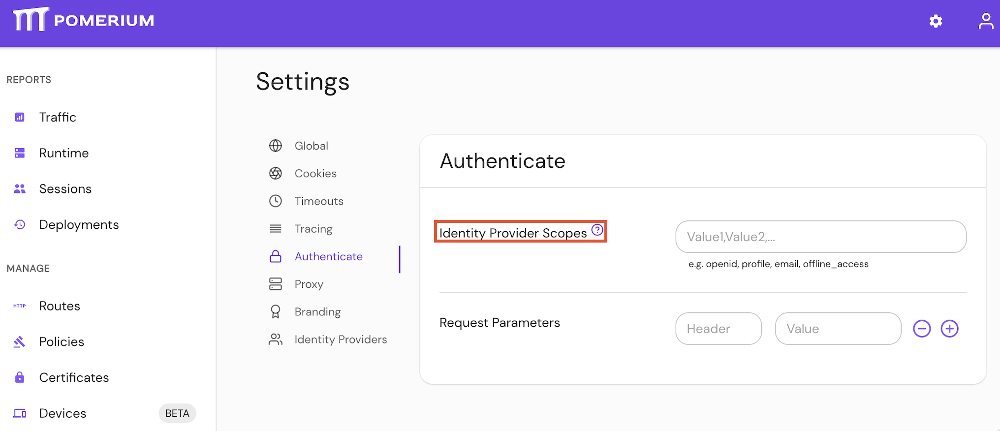

import Tabs from '@theme/Tabs';
import TabItem from '@theme/TabItem';

# Identity Provider Scopes

## Summary

**Identity Provider Scopes** correspond to access privilege scopes as defined in [Section 3.3](https://www.rfc-editor.org/rfc/rfc6749#section-3.3) of OAuth 2.0 RFC6749\. The scopes associated with Access Tokens determine what resources will be available when they are used to access OAuth 2.0 protected endpoints.

:::warning

If you are using a built-in provider, you probably don't want to set customized scopes.

:::

:::warning

Some providers, like Amazon Cognito, _do not_ support the `offline_access` scope.

:::

:::tip **Note:**

Pomerium uses the [**Hosted Authenticate Service**](/docs/capabilities/hosted-authenticate-service) by default.

If you want to run Pomerium with a self-hosted authenticate service, include an [**identity provider**](/docs/identity-providers) and [**authenticate service URL**](/docs/reference/authenticate-service-url) in your configuration.

See [**Self-Hosted Authenticate Service**](/docs/capabilities/self-hosted-authenticate-service) for more information.

:::

## How to configure

| **Type** | **Usage** | **Defaults** |
| :--- | :--- | :--- |
| `string` (list) | **optional** (for built-in identity providers) | `openid` |
| | | `profile` |
| | | `email` |
| | | `offline_access` |
<Tabs>
<TabItem value="Core" label="Core">

| **Config file keys** | **Environment variables** |
| :--- | :--- |
| `idp_scopes` | `IDP_SCOPES` |

</TabItem>
<TabItem value="Enterprise" label="Enterprise">

Configure **Identity Provider Scopes** under **Authenticate** settings in the Console:



</TabItem>
<TabItem value="Kubernetes" label="Kubernetes">

See Kubernetes [`identityProvider.scopes`](/docs/deploying/k8s/reference#identityprovider) for more information

</TabItem>
</Tabs>

### Examples

```yaml
# config file key
idp_scopes: openid, profile, offline_access, email

# environment variable
IDP_SCOPES=openid, profile, offline_access, email
```
