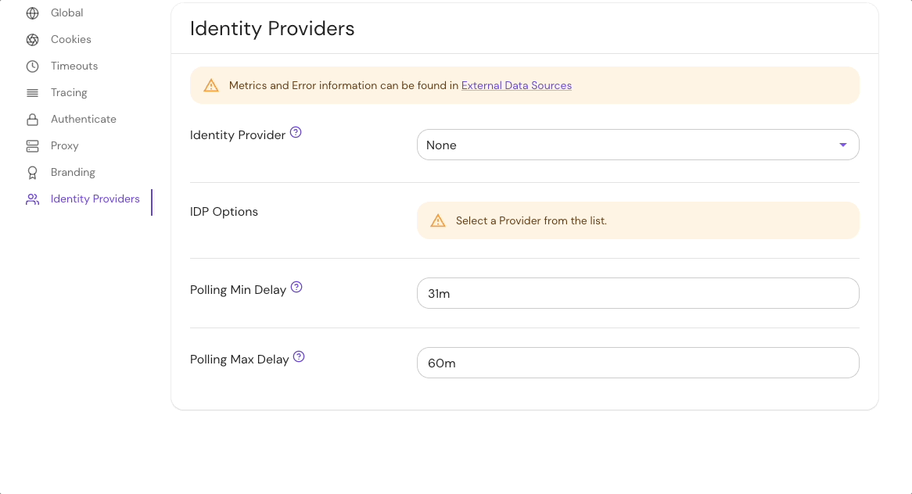
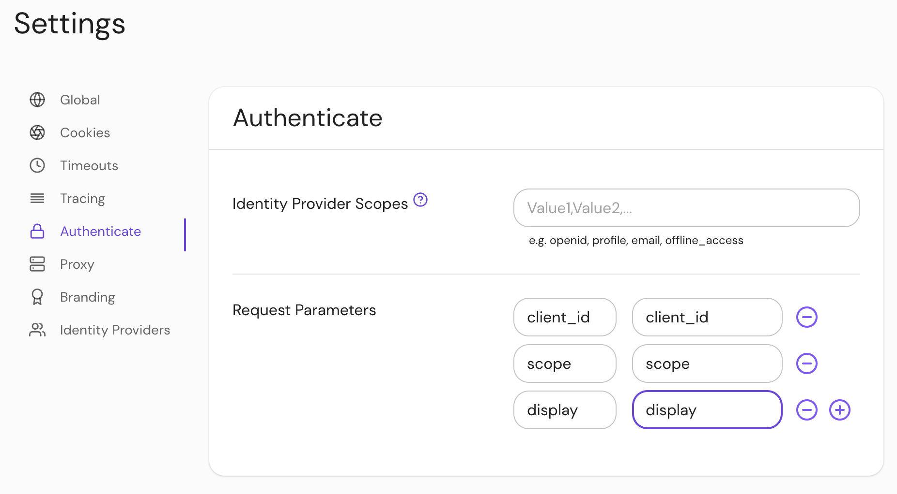
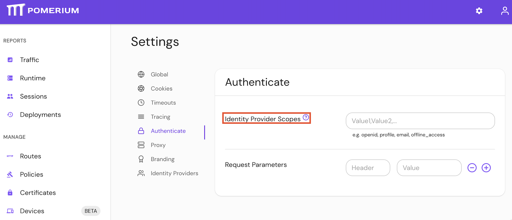
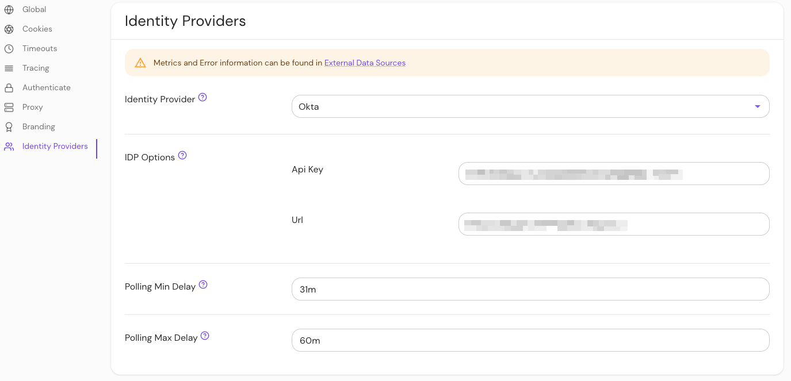
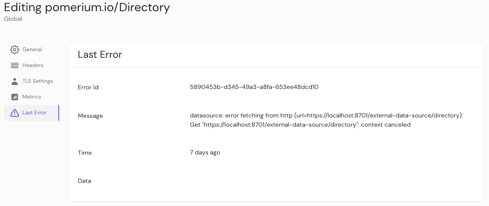
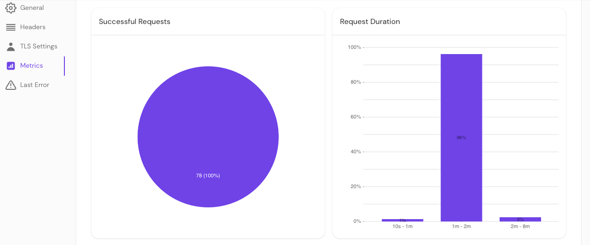

import Tabs from '@theme/Tabs';
import TabItem from '@theme/TabItem';

# Identity Provider Settings

This reference covers all of Pomerium's **Identity Provider Settings**:

- [Identity Provider Client ID](#identity-provider-client-id)
- [Identity Provider Client Secret](#identity-provider-client-secret)
- [Identity Provider Client Secret File](#identity-provider-client-secret-file)
- [Identity Provider Name](#identity-provider-name)
- [Identity Provider Request Params](#identity-provider-request-params)
- [Identity Provider Scopes](#identity-provider-scopes)
- [Identity Provider URL](#identity-provider-url)
- [Identity Provider Polling Min/Max Delay](#identity-provider-polling-minmax-delay)

:::tip **Note:**

Pomerium uses the [**Hosted Authenticate Service**](/docs/capabilities/hosted-authenticate-service) by default.

If you want to run Pomerium with a self-hosted authenticate service, include an [**identity provider**](/docs/identity-providers) and [**authenticate service URL**](/docs/reference/service-urls#authenticate-service-url) in your configuration.

See [**Self-Hosted Authenticate Service**](/docs/capabilities/authentication) for more information.

:::

## Supported identity providers {#supported-identity-providers}

Pomerium supports all major single-sign on (SSO) identity providers. See the [identity providers](/docs/identity-providers) page for a list of supported SSO providers and guides to integrate each provider with Pomerium.

Pomerium can also integrate with any identity provider that supports OAuth 2.0 and OIDC protocols.

## Identity Provider Client ID {#identity-provider-client-id}

**Identity Provider Client ID** is the OAuth 2.0 Client Identifier retrieved from your identity provider. See your identity provider's documentation, and Pomerium's [identity provider](/docs/integrations/) docs for details.

### How to configure {#identity-provider-client-id-how-to-configure}

<Tabs>
<TabItem value="Core" label="Core">

| **Config file keys** | **Environment variables** | **Type** | **Usage** |
| :-- | :-- | :-- | :-- |
| `idp_client_id` | `IDP_CLIENT_ID` | `string` | **required** (if self-hosting) |

#### Examples {#identity-provider-client-id-examples}

```yaml
idp_client_id: idp_client_id
```

```bash
IDP_CLIENT_ID=idp_client_id
```

</TabItem>
<TabItem value="Enterprise" label="Enterprise">

Configure **Identity Provider Client ID** under **IDP Options** in the Console:


</TabItem>
<TabItem value="Kubernetes" label="Kubernetes">

See [`identityProvider.secret`](/docs/k8s/reference#identityprovider)

</TabItem>
</Tabs>

## Identity Provider Client Secret {#identity-provider-client-secret}

**Identity Provider Client Secret** is the OAuth 2.0 Secret Identifier retrieved from your identity provider. See your identity provider's documentation, and Pomerium's [identity provider](/docs/integrations/) docs for details.

### How to configure {#identity-provider-client-secret-how-to-configure}

<Tabs>
<TabItem value="Core" label="Core">

| **Config file keys** | **Environment variables** | **Type** | **Usage** |
| :-- | :-- | :-- | :-- |
| `idp_client_secret` | `IDP_CLIENT_SECRET` | `string` | **required** (unless using [idp_client_secret_file](#identity-provider-client-secret-file)) |

#### Examples {#identity-provider-client-secret-examples}

```yaml
idp_client_secret: idp_client_secret
```

```bash
IDP_CLIENT_SECRET=idp_client_secret
```

</TabItem>
<TabItem value="Enterprise" label="Enterprise">

Configure **Identity Provider Client Secret** under **IDP Settings** in the Console:


</TabItem>
<TabItem value="Kubernetes" label="Kubernetes">

See [`identityProvider.secret`](/docs/k8s/reference#identityprovider) for more information

</TabItem>
</Tabs>

## Identity Provider Client Secret File {#identity-provider-client-secret-file}

**Identity Provider Client Secret File** is the OAuth 2.0 Secret Identifier retrieved from your identity provider. See your identity provider's documentation, and Pomerium's [identity provider](/docs/integrations/) docs for details.

The identity provider client secret file points to a file containing the secret. This is useful when deploying in environments that provide secret management like [Docker Swarm](https://docs.docker.com/engine/swarm/secrets/).

### How to configure {#identity-provider-client-secret-file-how-to-configure}

<Tabs>
<TabItem value="Core" label="Core">

| **Config file keys** | **Environment variables** | **Type** | **Usage** |
| :-- | :-- | :-- | :-- |
| `idp_client_secret_file` | `IDP_CLIENT_SECRET_FILE` | `string` | **required** (unless using [identity_provider_client_secret](#identity-provider-client-secret)) |

#### Examples {#identity-provider-client-secret-file-examples}

```yaml
idp_client_secret_file: '/run/secrets/POMERIUM_CLIENT_SECRET'
```

```bash
IDP_CLIENT_SECRET_FILE='/run/secrets/POMERIUM_CLIENT_SECRET'
```

</TabItem>
<TabItem value="Enterprise" label="Enterprise">

`idp_client_secret_file` is a bootstrap configuration setting and is not configurable in the Console.

</TabItem>
<TabItem value="Kubernetes" label="Kubernetes">

See [`identityProvider.secret`](/docs/k8s/reference#identityprovider) for more information.

</TabItem>
</Tabs>

## Identity Provider Name {#identity-provider-name}

**Identity Provider Name** is the short-hand name of a built-in OpenID Connect (OIDC) identity provider used for authentication.

See [identity provider](/docs/integrations/) for details.

The supported values for this setting are:

- `apple`
- `auth0`
- `azure`
- `cognito`
- `github`
- `gitlab`
- `google`
- `oidc`
- `okta`
- `onelogin`
- `ping`

### How to configure {#identity-provider-name-how-to-configure}

<Tabs>
<TabItem value="Core" label="Core">

| **Config file keys** | **Environment variables** | **Type** | **Usage** |
| :-- | :-- | :-- | :-- |
| `idp_provider` | `IDP_PROVIDER` | `string` | **required** (if [self-hosting](/docs/capabilities/authentication)) |

#### Examples {#identity-provider-name-examples}

```yaml
idp_provider: auth0
```

```bash
IDP_PROVIDER=github
```

</TabItem>
<TabItem value="Enterprise" label="Enterprise">

Set **Identity Provider Name** under the **Identity Provider** options in the Console:



</TabItem>
<TabItem value="Kubernetes" label="Kubernetes">

See [`identityProvider.provider`](/docs/k8s/reference#identityprovider) for more information

</TabItem>
</Tabs>

## Identity Provider Request Params {#identity-provider-request-params}

**Identity Provider Request Params** lists the parameters you want to include as part of a sign-in request using the OAuth 2.0 code flow.

### How to configure {#identity-provider-request-params-how-to-configure}

<Tabs>
<TabItem value="Core" label="Core">

| **Config file keys** | **Environment variables** | **Type** | **Usage** |
| :-- | :-- | :-- | :-- |
| `idp_request_params` | `IDP_REQUEST_PARAMS` | `string` (map of key-value pairs) | **optional** |

#### Examples {#identity-provider-request-params-examples}

```yaml
idp_request_params:
  client_id: client_id
  response_type: response_type
  redirect_uri: redirect_uri
```

```bash
IDP_REQUEST_PARAMS='{"client_id":"client_id", "response_type":"response_type", "redirect_uri":"redirect_uri"}'
```

</TabItem>
<TabItem value="Enterprise" label="Enterprise">

Configure **Identity Provider Request Params** under **Authenticate** settings in the Console:



</TabItem>
<TabItem value="Kubernetes" label="Kubernetes">

See Kubernetes [`identityProvider.requestParams` and `identityProvider.requestParamsSecret`](/docs/k8s/reference#identityprovider) for more information

</TabItem>
</Tabs>

### Defaults {#identity-provider-request-params-defaults}

Pomerium includes some default parameters for specific identity providers. Setting this configuration option will replace these default parameters. To remove the default parameters entirely, set this option to an empty map\* (e.g. `idp_request_params: {}` in the config file).

| **Provider** | **Default parameters** |
| :-- | :-- |
| `apple`\* | <pre>response_mode: form_post</pre> |
| `azure` | <pre>prompt: select_account</pre> |
| `google` | <pre>prompt: select_account consent<br />access_type: offline</pre> |

:::note

\*The default parameters for `apple` behave differently; any values set using this configuration option will be merged with the default parameters.

:::

For more information, see:

- [OIDC Request Parameters](https://openid.net/specs/openid-connect-basic-1_0.html#RequestParameters)
- [IANA OAuth Parameters](https://www.iana.org/assignments/oauth-parameters/oauth-parameters.xhtml)
- [Microsoft Azure Request params](https://docs.microsoft.com/en-us/azure/active-directory/develop/v2-oauth2-auth-code-flow#request-an-authorization-code)
- [Google Authentication URI parameters](https://developers.google.com/identity/protocols/oauth2/openid-connect)

## Identity Provider Scopes {#identity-provider-scopes}

**Identity Provider Scopes** correspond to access privilege scopes as defined in [Section 3.3](https://www.rfc-editor.org/rfc/rfc6749#section-3.3) of OAuth 2.0 RFC6749\.

The scopes associated with Access Tokens determine what resources will be available when they are used to access OAuth 2.0 protected endpoints.

:::warning

If you are using a built-in provider, you probably don't want to set customized scopes.

Some providers, like Amazon Cognito, _do not_ support the `offline_access` scope.

:::

### How to configure {#identity-provider-scopes-how-to-configure}

<Tabs>
<TabItem value="Core" label="Core">

| **Config file keys** | **Environment variables** | **Type** | **Usage** |
| :-- | :-- | :-- | :-- |
| `idp_scopes` | `IDP_SCOPES` | `string` (list) | **optional** (for built-in identity providers) |

#### Examples {#identity-provider-scopes-examples}

```yaml
idp_scopes: openid, profile, offline_access, email
```

```bash
IDP_SCOPES=openid, profile, offline_access, email
```

</TabItem>
<TabItem value="Enterprise" label="Enterprise">

Configure **Identity Provider Scopes** under **Authenticate** settings in the Console:



</TabItem>
<TabItem value="Kubernetes" label="Kubernetes">

See Kubernetes [`identityProvider.scopes`](/docs/k8s/reference#identityprovider) for more information

</TabItem>
</Tabs>

### Defaults {#identity-provider-scopes-defaults}

| **Defaults**     |
| :--------------- |
| `openid`         |
| `profile`        |
| `email`          |
| `offline_access` |

## Identity Provider URL {#identity-provider-url}

**Identity Provider URL** is the base path to an identity provider's [OpenID connect discovery document](https://openid.net/specs/openid-connect-discovery-1_0.html). An example Azure URL would be `https://login.microsoftonline.com/common/v2.0` for [their discovery document](https://login.microsoftonline.com/common/v2.0/.well-known/openid-configuration).

"Base path" is defined as the section of the URL to the discovery document up to (but not including) `/.well-known/openid-configuration`.

### How to configure {#identity-provider-url-how-to-configure}

<Tabs>
<TabItem value="Core" label="Core">

| **Config file keys** | **Environment variables** | **Type** | **Usage** |
| :-- | :-- | :-- | :-- |
| `idp_provider_url` | `IDP_PROVIDER_URL` | `string` | **required** (depending on identity provider) |

#### Examples {#identity-provider-url-examples}

```yaml
idp_provider_url: 'https://awesome-company.auth0.com'
```

```bash
IDP_PROVIDER_URL='https://awesome-company.auth0.com'
```

</TabItem>
<TabItem value="Enterprise" label="Enterprise">

Set the **Identity Provider URL** under **IDP Options** settings in the Console:


</TabItem>
<TabItem value="Kubernetes" label="Kubernetes">

See Kubernetes [`identityProvider.url`](/docs/k8s/reference#identityprovider) for more information

</TabItem>
</Tabs>

## Identity Provider Polling Min/Max Delay {#identity-provider-polling-minmax-delay}

Identity provider **Polling Minimum Delay** and **Polling Maximum Delay** settings define the minimum and maximum delay times between requests to the identity provider data source.

A job starts with the **minimum delay** intervals. If the job fails to complete within the minimum delay period, it will be interrupted and the job will restart. If the job is interrupted due to timeout or an error, it will restart with increasing intervals up to the **maximum delay** period.

:::enterprise

The `minimum_delay` and `maximum_delay` settings are an [**Enterprise Console**](https://www.pomerium.com/enterprise-sales/) feature, and are not configurable in Pomerium Core.

:::

### How to configure {#identity-provider-polling-minmax-delay-how-to-configure}

Set the **Identity Provider Max/Min Delay** settings in the Console:



### Defaults {#identity-provider-polling-minmax-delay-defaults}

While minimum and maximum polling time defaults are set for any Console installation, the required durations will vary depending on your identity provider and the size or your organization's directory.

If the job fails before completing, increase the minimum and maximum durations until the job completes.

Keep in mind that large directories may take several hours to complete.

### Monitor directory sync {#monitor-directory-sync}

To determine the appropriate durations required to sync your directory, check your Console logs and the **Last Error** and **Request Duration** sections of the Console GUI.

#### Last error {#last-error}

You can check if an error interrupted a job by checking **External Data** > **Last Error**.



#### Request duration {#request-duration}

You can also check **External Data** > **Metrics** to view request durations.


