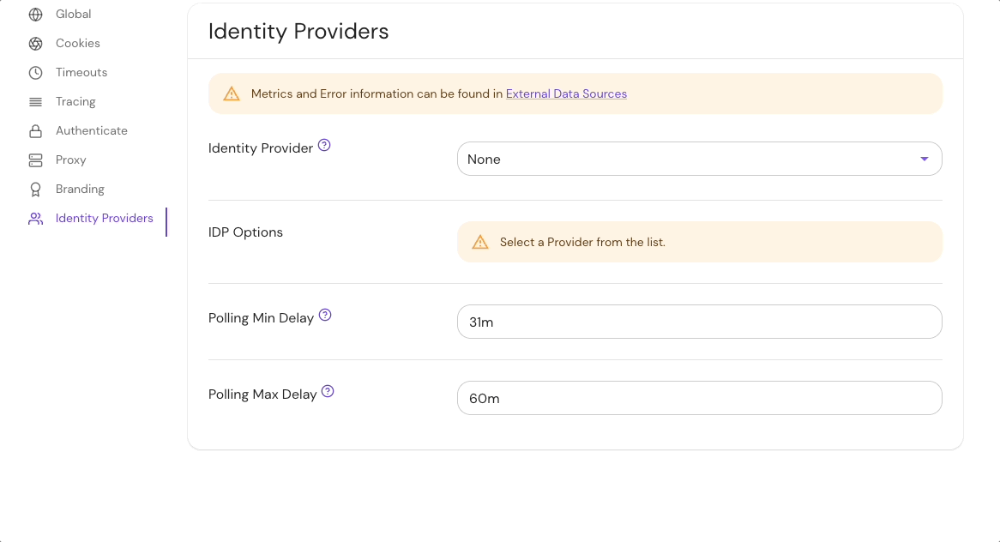
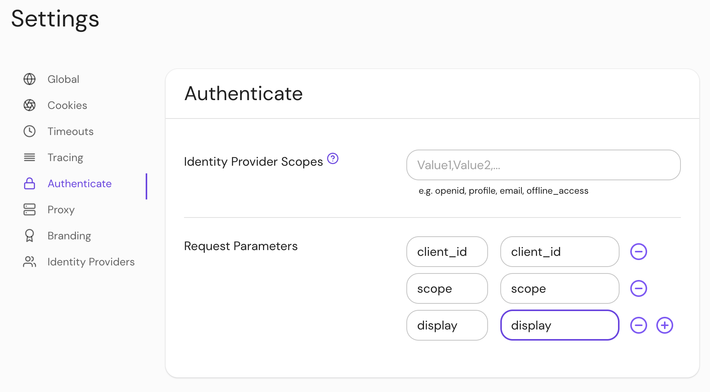

import Tabs from '@theme/Tabs';
import TabItem from '@theme/TabItem';

# Identity Provider Settings

This reference covers all of Pomerium's **Identity Provider Settings**:

- [Identity Provider Client ID](#identity-provider-client-id)
- [Identity Provider Client Secret](#identity-provider-client-secret)
- [Identity Provider Client Secret File](#identity-provider-client-secret-file)
- [Identity Provider Name](#identity-provider-name)
- [Identity Provider Request Params](#identity-provider-request-params)
- [Identity Provider Scopes](#identity-provider-scopes)
- [Identity Provider URL](#identity-provider-url)

:::tip **Note:**

Pomerium uses the [**Hosted Authenticate Service**](/docs/capabilities/hosted-authenticate-service) by default.

If you want to run Pomerium with a self-hosted authenticate service, include an [**identity provider**](/docs/identity-providers) and [**authenticate service URL**](/docs/reference/authenticate-service-url) in your configuration.

See [**Self-Hosted Authenticate Service**](/docs/capabilities/self-hosted-authenticate-service) for more information.

:::

## Supported identity providers

Pomerium supports all major single-sign on (SSO) identity providers. See the [identity providers](/docs/identity-providers) page for a list of supported SSO providers and guides to integrate each provider with Pomerium.

Pomerium can also integrate with any identity provider that supports OAuth 2.0 and OIDC protocols.

## Identity Provider Client ID

**Identity Provider Client ID** is the OAuth 2.0 Client Identifier retrieved from your identity provider. See your identity provider's documentation, and Pomerium's [identity provider](/docs/identity-providers/) docs for details.

### How to configure

<Tabs>
<TabItem value="Core" label="Core">

| **Config file keys** | **Environment variables** | **Type** | **Usage**                      |
| :------- | :----------------------------- | :------- | :----------------------------- |
| `idp_client_id` | `IDP_CLIENT_ID` | `string` | **required** (if self-hosting) |

</TabItem>
<TabItem value="Enterprise" label="Enterprise">

Configure **Identity Provider Client ID** under **IDP Options** in the Console:


</TabItem>
<TabItem value="Kubernetes" label="Kubernetes">

See [`identityProvider.secret`](/docs/deploy/k8s/reference#identityprovider)

</TabItem>
</Tabs>

### Examples

```yaml
# config file key
idp_client_id: idp_client_id

# environment variable
IDP_CLIENT_ID=idp_client_id
```

## Identity Provider Client Secret

**Identity Provider Client Secret** is the OAuth 2.0 Secret Identifier retrieved from your identity provider. See your identity provider's documentation, and Pomerium's [identity provider](/docs/identity-providers/) docs for details.

### How to configure

<Tabs>
<TabItem value="Core" label="Core">

| **Config file keys** | **Environment variables** | **Type** | **Usage** |
| :------------------- | :------------------------ | :-- | :-- |
| `idp_client_secret`  | `IDP_CLIENT_SECRET`       | `string` | **required** (unless using [idp_client_secret_file](#identity-provider-client-secret-file)) |

</TabItem>
<TabItem value="Enterprise" label="Enterprise">

Configure **Identity Provider Client Secret** under **IDP Settings** in the Console:


</TabItem>
<TabItem value="Kubernetes" label="Kubernetes">

See [`identityProvider.secret`](/docs/deploy/k8s/reference#identityprovider) for more information

</TabItem>
</Tabs>

### Examples

```yaml
# config file key
idp_client_secret: idp_client_secret

# environment variable
IDP_CLIENT_SECRET=idp_client_secret
```

## Identity Provider Client Secret File

**Identity Provider Client Secret File** is the OAuth 2.0 Secret Identifier retrieved from your identity provider. See your identity provider's documentation, and Pomerium's [identity provider](/docs/identity-providers/) docs for details.

The identity provider client secret file points to a file containing the secret. This is useful when deploying in environments that provide secret management like [Docker Swarm](https://docs.docker.com/engine/swarm/secrets/).

### How to configure

<Tabs>
<TabItem value="Core" label="Core">

| **Config file keys**     | **Environment variables** | **Type** | **Usage** |
| :----------------------- | :------------------------ | :-- | :-- |
| `idp_client_secret_file` | `IDP_CLIENT_SECRET_FILE`  | `string` | **required** (unless using [identity_provider_client_secret](#identity-provider-client-secret)) |

</TabItem>
<TabItem value="Enterprise" label="Enterprise">

`idp_client_secret_file` is a bootstrap configuration setting and is not configurable in the Console.

</TabItem>
<TabItem value="Kubernetes" label="Kubernetes">

See [`identityProvider.secret`](/docs/deploy/k8s/reference#identityprovider) for more information.

</TabItem>
</Tabs>

### Examples

```yaml
# config file key
idp_client_secret_file: '/run/secrets/POMERIUM_CLIENT_SECRET'

# environment variable
IDP_CLIENT_SECRET_FILE='/run/secrets/POMERIUM_CLIENT_SECRET'
```

## Identity Provider Name

**Identity Provider Name** is the short-hand name of a built-in OpenID Connect (OIDC) identity provider used for authentication.

See [identity provider](/docs/identity-providers/) for details.

### How to configure

<Tabs>
<TabItem value="Core" label="Core">

| **Config file keys** | **Environment variables** | **Type** | **Usage** |
| :------------------- | :------------------------ | :-- | :-- |
| `idp_provider`       | `IDP_PROVIDER`            | `string` | **required** (unless [self-hosting](/docs/capabilities/self-hosted-authenticate-service)) |

</TabItem>
<TabItem value="Enterprise" label="Enterprise">

Set **Identity Provider Name** under the **Identity Provider** options in the Console:



</TabItem>
<TabItem value="Kubernetes" label="Kubernetes">

See [`identityProvider.provider`](/docs/deploy/k8s/reference#identityprovider) for more information

</TabItem>
</Tabs>

### Examples

```yaml
# config file key
idp_provider: auth0

# environment variable
IDP_PROVIDER=github
```

## Identity Provider Request Params

**Identity Provider Request Params** lists the parameters you want to include as part of a sign-in request using the OAuth 2.0 code flow.

Downstream application headers will be overwritten by Pomerium's headers on conflict.

### How to configure

<Tabs>
<TabItem value="Core" label="Core">

| **Config file keys** | **Environment variables** | **Type**                          | **Usage**    |
| :------------------- | :------------------------ | :-------------------------------- | :----------- |
| `ipd_request_params` | `IPD_REQUEST_PARAMS`      | `string` (map of key-value pairs) | **optional** |

</TabItem>
<TabItem value="Enterprise" label="Enterprise">

Configure **Identity Provider Request Params** under **Authenticate** settings in the Console:



</TabItem>
<TabItem value="Kubernetes" label="Kubernetes">

See Kubernetes [`identityProvider.requestParams` and `identityProvider.requestParamsSecret`](/docs/deploy/k8s/reference#identityprovider) for more information

</TabItem>
</Tabs>

### Examples

```yaml
# config file key
idp_request_params:
    client_id: client_id
    response_type: response_type
    redirect_uri: redirect_uri

# environment variable
IDP_REQUEST_PARAMS=
    client_id: client_id
    response_type: response_type
    redirect_uri: redirect_uri
```

For more information, see:

- [OIDC Request Parameters](https://openid.net/specs/openid-connect-basic-1_0.html#RequestParameters)
- [IANA OAuth Parameters](https://www.iana.org/assignments/oauth-parameters/oauth-parameters.xhtml)
- [Microsoft Azure Request params](https://docs.microsoft.com/en-us/azure/active-directory/develop/v2-oauth2-auth-code-flow#request-an-authorization-code)
- [Google Authentication URI parameters](https://developers.google.com/identity/protocols/oauth2/openid-connect)

## Identity Provider Scopes

**Identity Provider Scopes** correspond to access privilege scopes as defined in [Section 3.3](https://www.rfc-editor.org/rfc/rfc6749#section-3.3) of OAuth 2.0 RFC6749\.

The scopes associated with Access Tokens determine what resources will be available when they are used to access OAuth 2.0 protected endpoints.

:::warning

If you are using a built-in provider, you probably don't want to set customized scopes.

Some providers, like Amazon Cognito, _do not_ support the `offline_access` scope.

:::

### How to configure

<Tabs>
<TabItem value="Core" label="Core">

| **Config file keys** | **Environment variables** | **Type** | **Usage** |
| :------------------- | :------------------------ | :-- | :-- |
| `idp_scopes`         | `IDP_SCOPES`              | `string` (list) | **optional** (for built-in identity providers) |

</TabItem>
<TabItem value="Enterprise" label="Enterprise">

Configure **Identity Provider Scopes** under **Authenticate** settings in the Console:


</TabItem>
<TabItem value="Kubernetes" label="Kubernetes">

See Kubernetes [`identityProvider.scopes`](/docs/deploy/k8s/reference#identityprovider) for more information

</TabItem>
</Tabs>

### Defaults

| **Defaults** |
| :-- |
| `openid` |
| `profile` |
| `email` |
| `offline_access` |

### Examples

```yaml
# config file key
idp_scopes: openid, profile, offline_access, email

# environment variable
IDP_SCOPES=openid, profile, offline_access, email
```

## Identity Provider URL

**Identity Provider URL** is the base path to an identity provider's [OpenID connect discovery document](https://openid.net/specs/openid-connect-discovery-1_0.html). An example Azure URL would be `https://login.microsoftonline.com/common/v2.0` for [their discovery document](https://login.microsoftonline.com/common/v2.0/.well-known/openid-configuration).

"Base path" is defined as the section of the URL to the discovery document up to (but not including) `/.well-known/openid-configuration`.

### How to configure

<Tabs>
<TabItem value="Core" label="Core">

| **Config file keys** | **Environment variables** | **Type** | **Usage**                                     |
| :------------------- | :------------------------ | :------- | :-------------------------------------------- |
| `idp_provider_url`   | `IDP_PROVIDER_URL`        | `string` | **required** (depending on identity provider) |

</TabItem>
<TabItem value="Enterprise" label="Enterprise">

Set the **Identity Provider URL** under **IDP Options** settings in the Console:


</TabItem>
<TabItem value="Kubernetes" label="Kubernetes">

See Kubernetes [`identityProvider.url`](/docs/deploy/k8s/reference#identityprovider) for more information

</TabItem>
</Tabs>

### Examples

```yaml
# config file key
idp_provider_url: 'https://awesome-company.auth0.com'

# environment variable
IDP_PROVIDER_URL='https://awesome-company.auth0.com'
```
