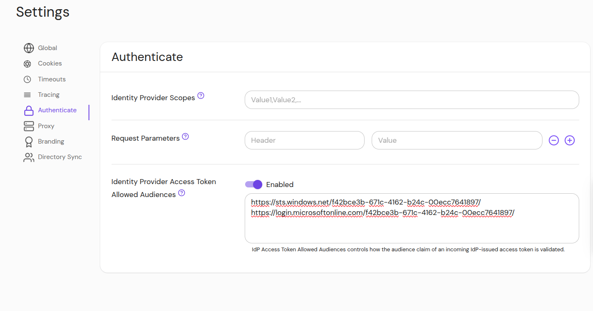

import Tabs from '@theme/Tabs';
import TabItem from '@theme/TabItem';

# IdP Access Token Allowed Audiences

## Summary

**IdP Access Token Allowed Audiences** controls how the audience claim of an incoming IdP-issued access token is validated.

For [Microsoft Entra](../integrations/user-identity/azure) an access-token is a JWT with an audience claim. When the IdP Access Token Allowed Audiences option is set, the `aud` claim of the access token JWT must match one of the entries.

This option can also be configured at the route-level.

## How to Configure

<Tabs>
<TabItem value="Core" label="Core">

| **Config file keys** | **Environment variables** | **Type** |
| :-- | :-- | :-- |
| `idp_access_token_allowed_audiences` | `IDP_ACCESS_TOKEN_ALLOWED_AUDIENCES` | Array of strings |

### Examples

```yaml
idp_access_token_allowed_audiences:
  - https://sts.windows.net/f42bce3b-671c-4162-b24c-00ecc7641897/
  - https://login.microsoftonline.com/f42bce3b-671c-4162-b24c-00ecc7641897/
```

</TabItem>
<TabItem value="Enterprise" label="Enterprise">

Set **IdP Access Token Allowed Audiences** under **Authenticate** settings in the Console:



</TabItem>
<TabItem value="Kubernetes" label="Kubernetes">

```yaml
idpAccessTokenAllowedAudiences:
  - https://sts.windows.net/f42bce3b-671c-4162-b24c-00ecc7641897/
  - https://login.microsoftonline.com/f42bce3b-671c-4162-b24c-00ecc7641897/
```

See [Kubernetes - Global Configuration](/docs/deploy/k8s/configure) for more information.

</TabItem>
</Tabs>
