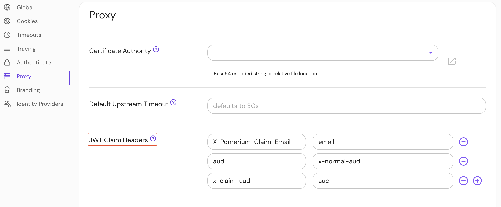

import Tabs from '@theme/Tabs';
import TabItem from '@theme/TabItem';

# JWT Claim Headers

## Summary

The **JWT Claims Headers** setting allows you to pass specific user session data to upstream applications as HTTP request headers. Claims forwarded with JWT Claims Headers are not signed by the Authorization Service (unlike the ` X-Pomerium-Jwt-Assertion` header).

Forwarding a claim with JWT Claims Headers adds the claim to the X-Pomerium-Jwt-Assertion header if the claim is not already included in the assertion header. Both JWT Claims Headers and the signed assertion header are forwarded with the [`pass_identity_headers`](/docs/reference/routes/pass-identity-headers-per-route) setting.

## How to configure

<Tabs>
<TabItem value="Core" label="Core">

| **Config file keys** | **Environment variables** | **Type** | **Usage**    |
| :------------------- | :------------------------ | :------- | :----------- |
| `jwt_claims_headers` | `JWT_CLAIMS_HEADERS`      | `string` | **optional** |

</TabItem>
<TabItem value="Enterprise" label="Enterprise">

Format **JWT Claims Headers** in the Console:



</TabItem>
<TabItem value="Kubernetes" label="Kubernetes">

| **Name**          |
| :---------------- |
| `jwtClaimHeaders` |

See Kubernetes [jwtClaimHeaders](/docs/deploy/k8s/reference#spec) for more information.

</TabItem>
</Tabs>

### Format JWT Claims Headers

Any claim in Pomerium’s session JWT can be placed into a corresponding header and the JWT payload for upstream consumption. Claim information is sourced from your [identity provider](/docs/identity-providers) and Pomerium’s own session metadata.

The header will have the following format:

`X-Pomerium-Claim-{Name}`, where `{Name}` is the name of the requested claim. Underscores will replace dashes. For example, `X-Pomerium-Claim-Given-Name`.

### Customize header names

The JWT Claims Headers setting allows you to customize claim headers with a nested object:

```yaml
jwt_claims_headers:
	X-Email: email
	X-Username: user
```

The JSON payload from this example would look similar to the sample data below:

```json
"X-Email": [
  "user@example.com"
],
"X-Username": [
  "user"
]
```

Use this option if you previously relied on `x-pomerium-authenticated-user-{email|user-id|groups}`.

To pass static values as request headers to the upstream service, see [Set Request Headers](./routes/headers#set-request-headers).
