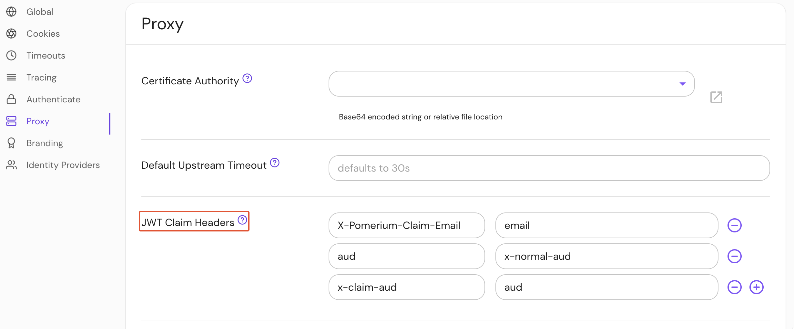

import TabItem from '@theme/TabItem';
import Tabs from '@theme/Tabs';

import EnterpriseConfiguration from '../../../src/components/EnterpriseConfiguration';

# JWT Claim Headers

## Summary

The **JWT Claims Headers** setting allows you to pass specific user session data to upstream applications as HTTP request headers. Claims forwarded with JWT Claims Headers are not signed by the Authorization Service (unlike the ` X-Pomerium-Jwt-Assertion` header).

Forwarding a claim with JWT Claims Headers adds the claim to the X-Pomerium-Jwt-Assertion header if the claim is not already included in the assertion header. Both JWT Claims Headers and the signed assertion header are forwarded with the [`pass_identity_headers`](/docs/reference/routes/pass-identity-headers-per-route) setting.

## How to configure

<Tabs>
<TabItem value="Core" label="Core">

| **Config file keys** | **Environment variables** | **Type** | **Usage** |
| :-- | :-- | :-- | :-- |
| `jwt_claims_headers` | `JWT_CLAIMS_HEADERS` | map of `string` (or comma-separated `string`) | **optional** |

### Examples

```yaml
jwt_claims_headers:
  X-Email: email
  X-Username: user
```

</TabItem>
<TabItem value="Enterprise" label="Enterprise">
<EnterpriseConfiguration name="jwt_claims_headers" resource="settings">

Format **JWT Claims Headers** in the Console:



</EnterpriseConfiguration>
</TabItem>
<TabItem value="Kubernetes" label="Kubernetes">

| **[Parameter name](/docs/deploy/k8s/reference#spec)** | **Type** | **Usage** |
| :-- | :-- | :-- |
| `jwtClaimHeaders` | map of strings | **optional** |

### Examples

```yaml
jwtClaimHeaders:
  X-Email: email
  X-Username: user
```

</TabItem>
</Tabs>

### Format JWT Claims Headers

Any claim in Pomerium's session JWT can be placed into a corresponding header and the JWT payload for upstream consumption. Claim information is sourced from your [identity provider](/docs/integrations/user-identity/identity-providers) and Pomerium's own session metadata.

The header will have the following format:

`X-Pomerium-Claim-{Name}`, where `{Name}` is the name of the requested claim. Underscores will replace dashes. For example, `X-Pomerium-Claim-Given-Name`.

### Customize header names

The JWT Claims Headers setting allows you to customize claim headers with a nested object:

```yaml
jwt_claims_headers:
	X-Email: email
	X-Username: user
```

The JSON payload from this example would look similar to the sample data below:

```json
"X-Email": [
  "user@example.com"
],
"X-Username": [
  "user"
]
```

Use this option if you previously relied on `x-pomerium-authenticated-user-{email|user-id|groups}`.

## Standard claims

Every JWT that Pomerium issues carries a fixed set of claims describing the session. These claims are always present in the signed assertion header (`X-Pomerium-Jwt-Assertion`), whether or not you configure `jwt_claims_headers`. Naming one of them in `jwt_claims_headers` also copies its value into an `X-Pomerium-Claim-*` header.

| Claim    | Description |
| :------- | :---------- |
| `iss`    | The issuer. By default this is the route's hostname. If [`jwt_issuer_format`](/docs/reference/routes/jwt-issuer-format) is set to `uri`, it is `https://HOSTNAME/` instead. |
| `aud`    | The audience: the route's hostname. |
| `jti`    | A unique identifier for the token (a UUID). A new value is generated for every token. |
| `iat`    | The time the token was issued, in seconds since the Unix epoch. |
| `exp`    | The time the token expires, in seconds since the Unix epoch. Pomerium sets this to five minutes after `iat`. |
| `sub`    | The subject: the user's ID. This is the same value as `user`. |
| `user`   | The user's ID, as assigned by the identity provider. |
| `email`  | The user's email address. |
| `groups` | The user's groups, listing both group IDs and group names. When the user has no groups this is an empty list rather than null. |
| `sid`    | The session ID. |
| `name`   | The user's name. |

A standard claim always takes precedence: an identity provider claim of the same name cannot override it.

## Additional claims from your identity provider

Beyond the standard claims, you can forward any claim that your identity provider supplies about the user.

When a user logs in, Pomerium collects claims from two places and stores them on the session:

- the **ID token** returned from the identity provider's token endpoint, and
- the response from the identity provider's [UserInfo endpoint](https://openid.net/specs/openid-connect-core-1_0.html#UserInfo).

Any claim found in either is available to `jwt_claims_headers` by name. The OAuth access token is not read for claims; a claim placed only in the access token has no effect.

To forward an additional claim, first configure your identity provider to include it in the ID token or return it from the UserInfo endpoint, then name the claim in `jwt_claims_headers`:

```yaml
jwt_claims_headers:
  X-Department: department
```

Pomerium transforms claim values before forwarding them:

- **Nested claims are flattened** to dot-separated names. A claim such as `{ "resource_access": { "app": { "roles": [...] } } }` becomes `resource_access.app.roles`; refer to it by that name.
- **A multi-valued claim is forwarded as a single comma-separated string.** For example, a claim whose value is `["a", "b"]` is forwarded as `a,b`.
- **Only scalar values — strings, numbers, and booleans — are forwarded.** Entries whose value is an object are skipped.

To pass static values as request headers to the upstream service, see [Set Request Headers](./routes/headers#set-request-headers).
