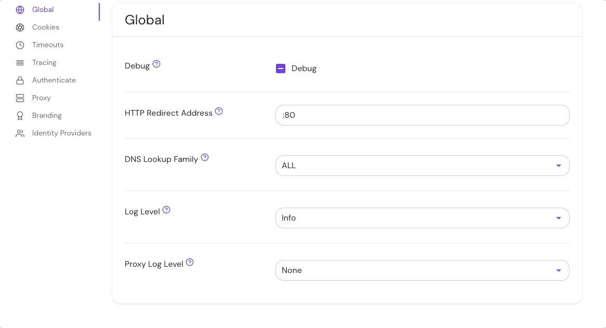

import Tabs from '@theme/Tabs';
import TabItem from '@theme/TabItem';

# Log Level

## Summary

**Log Level** sets the global logging level for Pomerium. Only logs of the desired level and above will be logged.

## How to configure

<Tabs>
<TabItem value="Core" label="Core">

| **Config file keys** | **Environment variables** | **Type** | **Default** |
| :------------------- | :------------------------ | :------- | :---------- |
| `log_level`          | `LOG_LEVEL`               | `string` | `debug`     |

### Examples

```yaml
log_level: error
```

```bash
LOG_LEVEL=warn
```

### Options

- `none`
- `debug`
- `info`
- `warn`
- `error`

</TabItem>
<TabItem value="Enterprise" label="Enterprise">

Set **Log Level** under **Global** settings in the Console:



</TabItem>
<TabItem value="Kubernetes" label="Kubernetes">

Kubernetes does not support `log_level`

</TabItem>
</Tabs>
