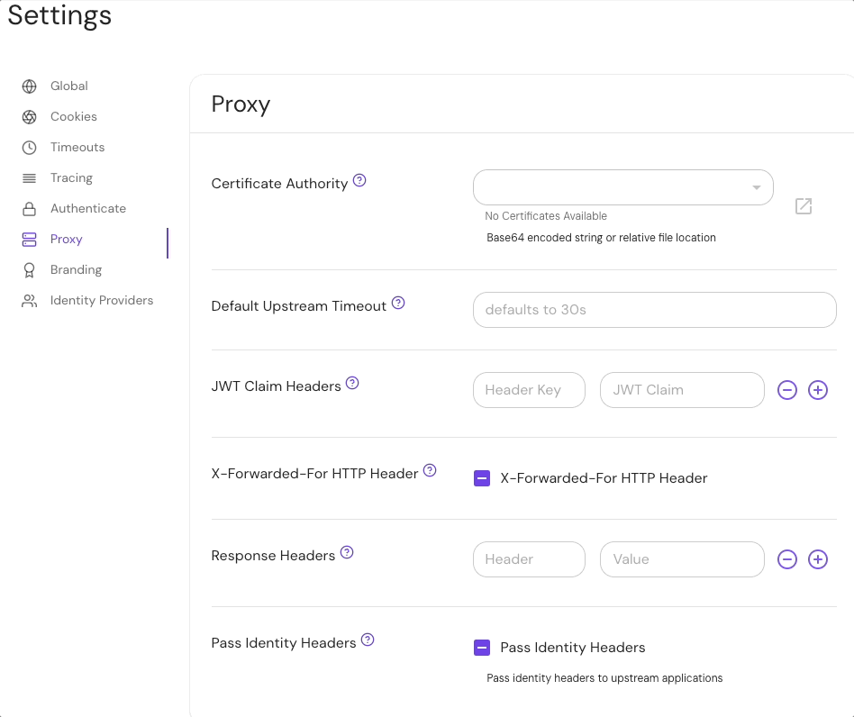

import Tabs from '@theme/Tabs';
import TabItem from '@theme/TabItem';

# Pass Identity Headers

## Summary

When set to true, the **Pass Identity Headers** setting sends identity headers to all upstream applications.

If a route already has the [route-level Pass Identity Headers](/docs/reference/routes/pass-identity-headers-per-route) setting set, the route setting will take precedence over the global setting.

Identity headers include:

- `X-Pomerium-Jwt-Assertion`
- `X-Pomerium-Claim-*` (see [JWT Claim Headers](/docs/reference/jwt-claim-headers) for more information)

## How to configure

<Tabs>
<TabItem value="Core" label="Core">

| **YAML**/**JSON** setting | **Type**  | **Usage**    | **Default** |
| :------------------------ | :-------- | :----------- | :---------- |
| `pass_identity_headers`   | `boolean` | **optional** | \*`false`   |

### Examples

```yaml
pass_identity_headers: true

routes:
  - from: https://service.corp.example.io
    to: http://localhost:3000
```

</TabItem>
<TabItem value="Enterprise" label="Enterprise">

Configure **Pass Identity Headers** in the Console with the **Pass Identity Headers** toggle button.

The button has three states:

- **Unset** ("-") uses the value in your configuration file
- **Checkmark** sets `pass_identity_headers` to `true`
- **Empty** sets `pass_identity_headers` to `false`



</TabItem>
<TabItem value="Kubernetes" label="Kubernetes">

| **Parameter ame**     | **Type**  | **Usage**    | **Default** |
| :-------------------- | :-------- | :----------- | :---------- |
| `passIdentityHeaders` | `boolean` | **optional** | \*`false`   |

### Examples

```yaml
passIdentityHeaders: true
```

See [Kubernetes - Global Configuration](/docs/deploy/k8s/configure) for more information.

</TabItem>
</Tabs>

\* If neither the **global** _nor_ **route-level** `pass_identity_headers` settings are defined, both settings will default to `false`.
