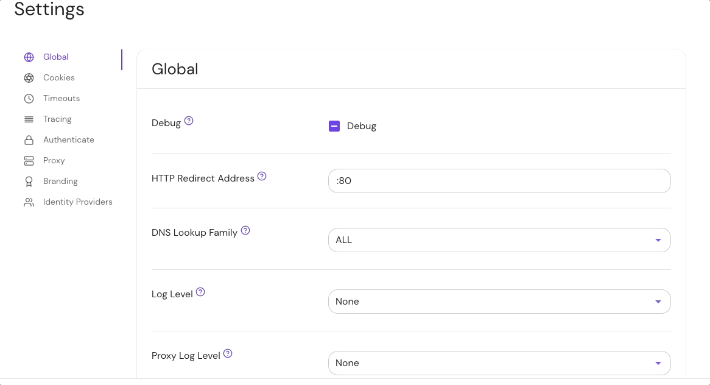

import Tabs from '@theme/Tabs';
import TabItem from '@theme/TabItem';

# Proxy Log Level

## Summary

**Proxy Log Level** sets the logging level for the Pomerium Proxy service access logs. Only logs of the desired level and above will be logged.

## How to configure

| **Type** | **Default** | **Options** |
| :--- | :--- | :--- |
| `string` | value of [`log_level`](/docs/reference/log-level) | `debug` |
|  | `debug` (if `log_level` isn't set) | `info` |
|  |  | `warn` |
|  |  | `error` |

<Tabs>
<TabItem value="Core" label="Core">

| **Config file keys** | **Environment variables** |
| :--- | :--- |
| `proxy_log_level` | `PROXY_LOG_LEVEL` |

</TabItem>
<TabItem value="Enterprise" label="Enterprise">

Set **Proxy Log Level** under **Global** settings in the Console:



</TabItem>
<TabItem value="Kubernetes" label="Kubernetes">

Kubernetes does not support **Proxy Log Level**

</TabItem>
</Tabs>

### Examples

```yaml
# config file key
proxy_log_level: error

# environment variable
PROXY_LOG_LEVEL=debug
```
