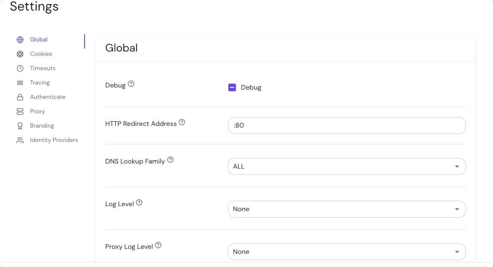

import TabItem from '@theme/TabItem';
import Tabs from '@theme/Tabs';

import EnterpriseConfiguration from '../../../src/components/EnterpriseConfiguration';

# Proxy Log Level

## Summary

**Proxy Log Level** sets the logging level for the Pomerium Proxy service access logs. Only logs of the desired level and above will be logged.

## How to configure

<Tabs>
<TabItem value="Core" label="Core">

| **Config file keys** | **Environment variables** | **Type** | **Default** |
| :-- | :-- | :-- | :-- |
| `proxy_log_level` | `PROXY_LOG_LEVEL` | `string` | `debug` or value of [`log_level`](/docs/reference/log-level) if set |

### Examples

```yaml
proxy_log_level: error
```

```bash
PROXY_LOG_LEVEL=debug
```

</TabItem>
<TabItem value="Enterprise" label="Enterprise">
<EnterpriseConfiguration name="proxy_log_level" resource="settings">

Set **Proxy Log Level** under **Global** settings in the Console:



</EnterpriseConfiguration>
</TabItem>
<TabItem value="Kubernetes" label="Kubernetes">

Kubernetes does not support **Proxy Log Level**

</TabItem>
</Tabs>

### Options

- `debug`
- `info`
- `warn`
- `error`
