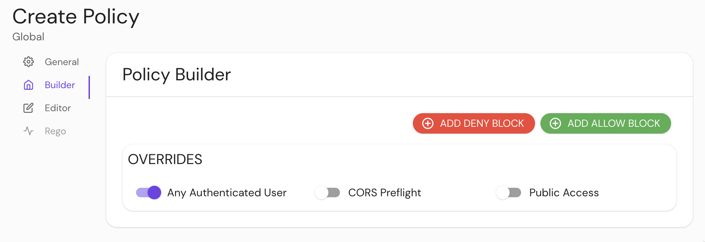

import Tabs from '@theme/Tabs';
import TabItem from '@theme/TabItem';

# Allow Any Authenticated User

## Summary

**Use with caution**: **Allow Any Authenticated User** allows all requests for any user that authenticates against your identity provider.

For example, if you use a corporate GSuite account, an unrelated user with a Gmail account can access the upstream application.

Use of this setting means Pomerium **will not enforce your centralized authorization policy** for this route. The upstream is responsible for handling any authorization.

## How to configure

<Tabs>
<TabItem value="Core" label="Core">

| **YAML**/**JSON** setting      | **Type**  | **Default** | **Usage**    |
| :----------------------------- | :-------- | :---------- | :----------- |
| `allow_any_authenticated_user` | `boolean` | `false`     | **optional** |

### Examples

```yaml
allow_any_authenticated_user: 'true'
```

</TabItem>
<TabItem value="Enterprise" label="Enterprise">

Enable **Any Authenticated User** in the **Policy Builder** in the Console:



</TabItem>
<TabItem value="Kubernetes" label="Kubernetes">

| [**Annotation name**](/docs/deploy/k8s/ingress#set-ingress-annotations) | **Type** | **Default** | **Usage** |
| :-- | :-- | :-- | :-- |
| `allow_any_authenticated_user` | `boolean` | `false` | **optional** |

### Examples

```yaml
ingress.pomerium.io/allow_any_authenticated_user: true
```

</TabItem>
</Tabs>
