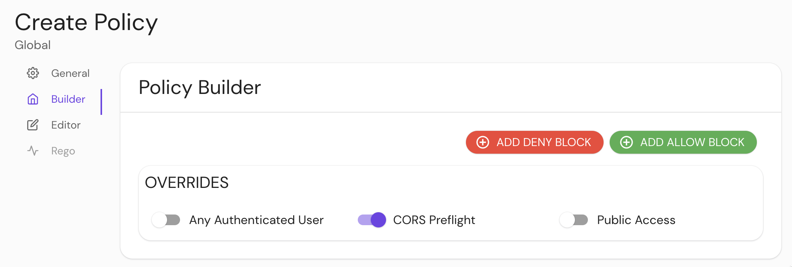

import Tabs from '@theme/Tabs';
import TabItem from '@theme/TabItem';

# CORS Preflight

## Summary

**CORS Preflight** allows unauthenticated HTTP OPTIONS requests as [per the CORS spec](https://developer.mozilla.org/en-US/docs/Web/HTTP/CORS#Preflighted_requests).

## How to configure

<Tabs>
<TabItem value="Core" label="Core">

| **YAML**/**JSON** setting | **Type**  | **Default** | **Usage**    |
| :------------------------ | :-------- | :---------- | :----------- |
| `cors_preflight`          | `boolean` | `false`     | **optional** |

</TabItem>
<TabItem value="Enterprise" label="Enterprise">

Enable **CORS Preflight** in the **Policy Builder** in the Console:



</TabItem>
<TabItem value="Kubernetes" label="Kubernetes">

**CORS Preflight** is not customizable with Kubernetes.

</TabItem>
</Tabs>

### Examples

```yaml
cors_preflight: true
```
