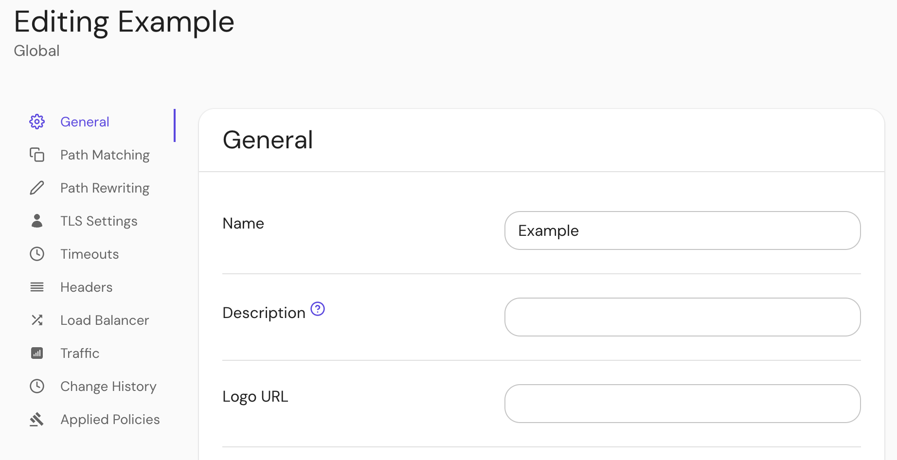

import Tabs from '@theme/Tabs';
import TabItem from '@theme/TabItem';

# Route Description

## Summary

Route description shown in the routes portal.

## How to configure

<Tabs>
<TabItem value="Core" label="Core">

| **Config file key** | **Type** | **Usage**    |
| :------------------ | :------- | :----------- |
| `description`       | `string` | **optional** |

</TabItem>
<TabItem value="Enterprise" label="Enterprise">

Set the route **description** under **General** route settings in the Console:

</TabItem>
<TabItem value="Kubernetes" label="Kubernetes">

| **[Annotation name](/docs/deploy/k8s/ingress#set-ingress-annotations)** | **Type** | **Usage** |
| :-- | :-- | :-- |
| `description` | `string` | **optional** |

</TabItem>
</Tabs>
