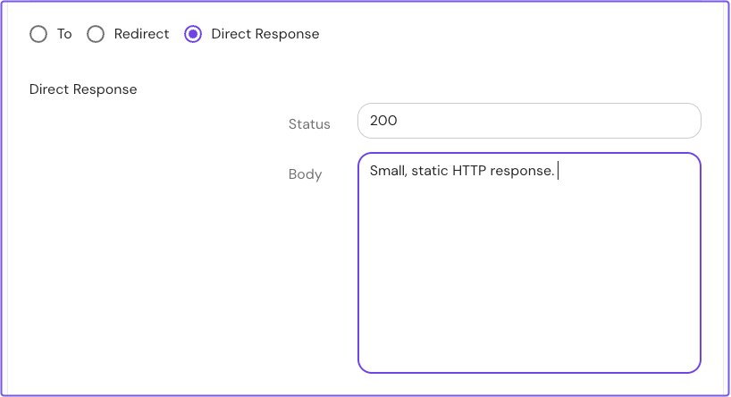
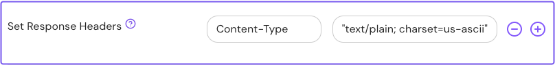

import Tabs from '@theme/Tabs';
import TabItem from '@theme/TabItem';

# Direct Response

## Summary

**Direct Response** instructs Pomerium to send a static HTTP response to the downstream client for a managed route.

## How to configure

<Tabs>
<TabItem value="Core" label="Core">

| **Config file keys** | **Type** | **Usage**    |
| :------------------- | :------- | :----------- |
| `response`          | `object`   | **optional** |
| `status` | `integer` | **optional** |
| `body` | `string` | **optional** |

### Example

The `response` configuration key must replace the `to:` destination URL in a route block:

```yaml
routes:
 - from: https://example.com
   response:
    status: 200
    body: "plain text"
```

Additional HTTP response headers, such as **Content-Type**, can be defined with the [`set_response_headers`](/docs/reference/routes/headers#set-response-headers) setting:

```yaml
routes:
 - from: https://example.com
   response:
    status: 200
    body: "text"
  set_response_headers:
   Content-Type: "text/plain; charset=us-ascii"
```

</TabItem>
<TabItem value="Enterprise" label="Enterprise">

Configure **Direct Response** in the Enterprise Console:



Additional HTTP response headers, such as **Content-Type**, can be defined with the [`set_response_headers`](/docs/reference/routes/headers#set-response-headers) setting.



</TabItem>
<TabItem value="Kubernetes" label="Kubernetes">

Currently, the **Direct Response** setting is not supported for the Ingress Controller. If you'd like support for this feature, see the [GitHub issue](https://github.com/pomerium/ingress-controller/issues/897) and describe your use case.

</TabItem>
</Tabs>
