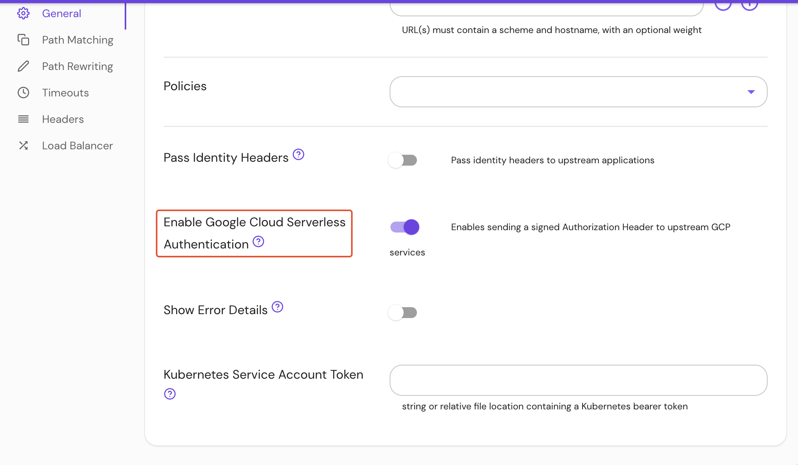

import Tabs from '@theme/Tabs';
import TabItem from '@theme/TabItem';

# Enable Google Cloud Serverless Authentication

## Summary

**Enable Google Cloud Serverless Authentication** enables sending a signed [Authorization Header](https://cloud.google.com/run/docs/authenticating/service-to-service) to upstream GCP services.

This setting requires you to set [Google Cloud Serverless Authentication Service Account](/docs/reference/google-cloud-serverless-authentication-service-account) or run Pomerium in an environment with a GCP service account present in default locations.

## How to configure

| **Type**  | **Default** |
| :-------- | :---------- |
| `boolean` | `false`     |

<Tabs>
<TabItem value="Core" label="Core">

| **Config file keys** | **Environment variables** |
| :-- | :-- |
| `enable_google_cloud_serverless_authentication` | `ENABLE_GOOGLE_CLOUD_SERVERLESS_AUTHENTICATION` |

</TabItem>
<TabItem value="Enterprise" label="Enterprise">

Enable **Google Cloud Serverless Authentication** under **General** route settings in the Console:



</TabItem>
<TabItem value="Kubernetes" label="Kubernetes">

Kubernetes does not support **Enable Google Cloud Serverless Authentication**

</TabItem>
</Tabs>

### Examples

```yaml
enable_google_cloud_serverless_authentication: true

ENABLE_GOOGLE_CLOUD_SERVERLESS_AUTHENTICATION=true
```
