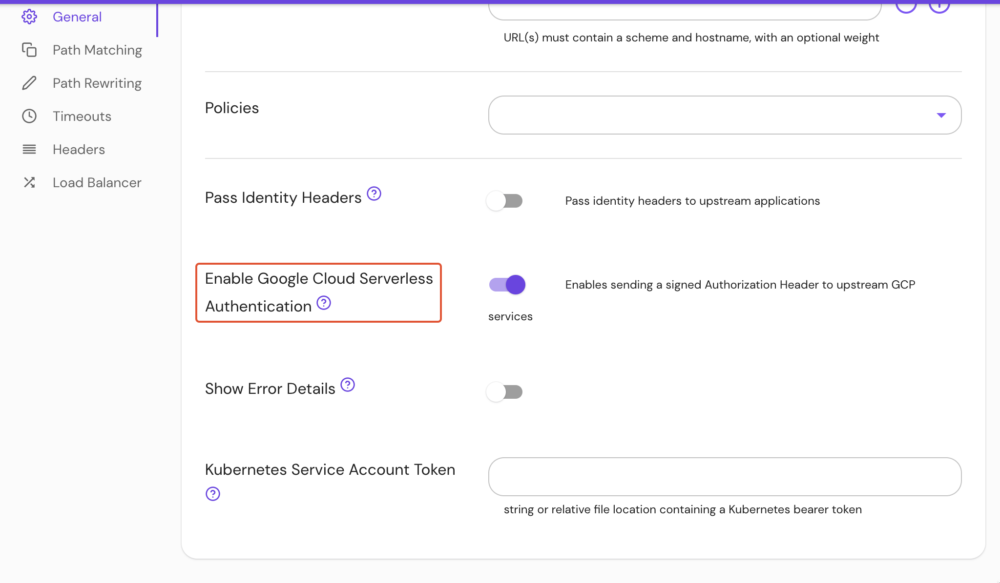

import TabItem from '@theme/TabItem';
import Tabs from '@theme/Tabs';

import EnterpriseConfiguration from '../../../../src/components/EnterpriseConfiguration';

# Enable Google Cloud Serverless Authentication

## Summary

**Enable Google Cloud Serverless Authentication** enables sending a signed [Authorization Header](https://cloud.google.com/run/docs/authenticating/service-to-service) to upstream GCP services.

This setting requires you to set [Google Cloud Serverless Authentication Service Account](/docs/reference/google-cloud-serverless-authentication-service-account) or run Pomerium in an environment with a GCP service account present in default locations.

## How to configure

<Tabs>
<TabItem value="Core" label="Core">

| **Config file keys**                            | **Type**  | **Default** |
| :---------------------------------------------- | :-------- | :---------- |
| `enable_google_cloud_serverless_authentication` | `boolean` | `false`     |

### Examples

```yaml
enable_google_cloud_serverless_authentication: true
```

</TabItem>
<TabItem value="Enterprise" label="Enterprise">
<EnterpriseConfiguration name="enable_google_cloud_serverless_authentication" resource="route">

Enable **Google Cloud Serverless Authentication** under **General** route settings in the Console:



</EnterpriseConfiguration>
</TabItem>
<TabItem value="Kubernetes" label="Kubernetes">

Kubernetes does not support **Enable Google Cloud Serverless Authentication**

</TabItem>
</Tabs>
