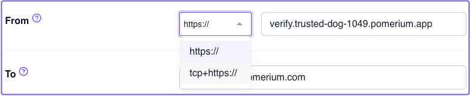
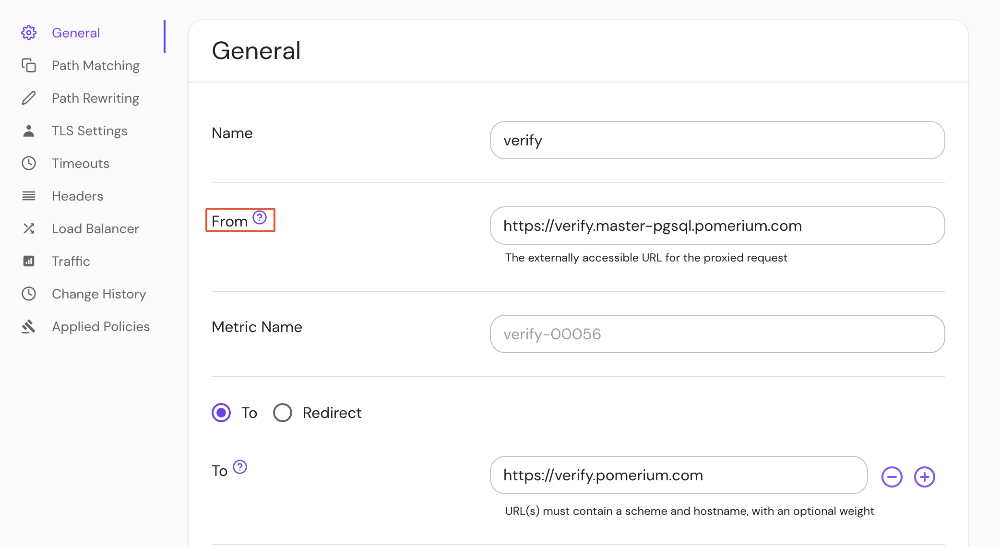

import Tabs from '@theme/Tabs';
import TabItem from '@theme/TabItem';

# From

## Summary

The **From** route is the externally accessible URL for a proxied HTTP request.

## How to configure

The From URL must contain a **scheme** and **hostname**. It can't contain a path.

You may map more than one port through the same hostname by specifying a different `:port` in the URL.

To enable [TCP proxying](/docs/capabilities/tcp/) support, specify the `tcp+https` scheme.

:::note

When defining a From route, you must use `https` or `tcp+https`. Pomerium only supports secure schemes.

:::

<Tabs>
<TabItem value="zero" label="Zero">

To define a From route in the Zero Console:



</TabItem>
<TabItem value="Core" label="Core">

| **YAML**/**JSON** setting | **Type** | **Schemes**          | **Usage**    |
| :------------------------ | :------- | :------------------- | :----------- |
| `from`                    | `URL`    | `https`, `tcp+https` | **required** |

### Examples

```yaml
routes:
  - from: https://verify.corp.example.com
  - to: https://example.com
```

```yaml
# TCP
routes:
  - from: tcp+https://ssh.corp.example.com:22
  - to: tcp://example.com:22
```

</TabItem>
<TabItem value="Enterprise" label="Enterprise">

Define a **From** route under **General** route settings in the Console:



</TabItem>
<TabItem value="Kubernetes" label="Kubernetes">

See Kubernetes [Ingress](/docs/deploy/k8s/ingress) for more information.

</TabItem>
</Tabs>

:::note

See [**Routing - Route matching order**](/docs/capabilities/routing#route-matching-order) for more information on how Pomerium processes and matches routes.

:::

## Wildcard From Routes

:::caution

Kubernetes: Wildcard From Routes in Kubernetes are unofficially supported because Pomerium's implementation behaves differently than what Kubernetes defines in their documentation. See [Wildcard Hostnames](https://kubernetes.io/docs/concepts/services-networking/ingress/#hostname-wildcards) for more information.

:::

**Wildcard From Routes** supports the use of a wildcard asterisk (`*`) placed anywhere within the domain name portion of a `from` URL.

Defining a `from` route with `*` will point any matching routes to the defined [To route](/docs/reference/routes/to). This eliminates the need to define multiple near-identical routes in your configuration. ([Autocert](/docs/reference/autocert) will be disabled for hosts that use Wildcard From Routes.)

For example:

```yaml
# Before:
routes:
  - from: https://a.example.com
    to: https://example.com
  - from: https://b.example.com
    to: https://example.com
  - from: https://c.example.com
    to: https://example.com
  - from: https://d.example.com
    to: https://example.com
  - from: https://e.example.com
    to: https://example.com

# After
routes:
  - from: https://*.example.com
    to: https://example.com

# Or

routes:
  - from: tcp+https://*.example.com:22
    to: tcp://example.com:22
```

### Wildcard processing behavior

Pomerium processes routes in the order they are defined in the configuration file. However, routes which **don't** contain wildcards (`*`) may take precedence over routes which **do** contain wildcards.

For example, given the routes below, if you send a request to `foo.example.com`, Pomerium would redirect the request to `1.example.com`.

If you send a request to `bar.example.com` (a non-wildcard route), Pomerium would redirect the request to `2.example.com`.

```yaml
routes:
  - from: https://*.example.com
    to: http://1.example.com
  - from: https://bar.example.com
    to: http://2.example.com
```
