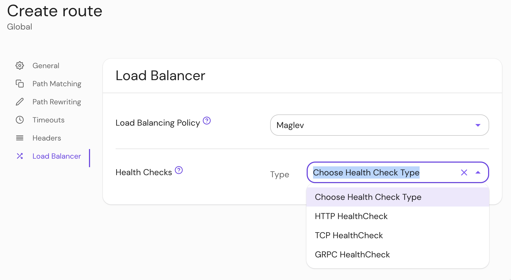

import Tabs from '@theme/Tabs';
import TabItem from '@theme/TabItem';

# Health Checks

## Summary

When defined, **Health Checks** will issue periodic health check requests to upstream servers and unhealthy upstream servers won't serve traffic.

See Envoy's [`outlier_detection`](https://www.envoyproxy.io/docs/envoy/latest/intro/arch_overview/upstream/outlier) for automatic upstream server health detection. In the presence of multiple upstream servers, it is recommended to set up either `health_checks`, `outlier_detection`, or both.

See the [Envoy documentation](https://www.envoyproxy.io/docs/envoy/latest/intro/arch_overview/upstream/health_checking) for a list of [supported parameters](https://www.envoyproxy.io/docs/envoy/latest/api-v3/config/core/v3/health_check.proto#envoy-v3-api-msg-config-core-v3-healthcheck).

## How to configure

| **Type** | **Usage** |
| :--- | :--- |
| `array of objects` | **optional** |

<Tabs>
<TabItem value="Core" label="Core">

| **Config file keys** |
| :--- |
| `health_checks` |

</TabItem>
<TabItem value="Enterprise" label="Enterprise">

Configure **Health Checks** under **Load Balancing** settings in the Console:

</TabItem>
<TabItem value="Kubernetes" label="Kubernetes">

See Kubernetes [Ingress - load balancing](/docs/deploying/k8s/ingress#load-balancing) for more information.

</TabItem>
</Tabs>

Only one of [`http_health_check`](https://www.envoyproxy.io/docs/envoy/latest/api-v3/config/core/v3/health_check.proto#envoy-v3-api-msg-config-core-v3-healthcheck-httphealthcheck), [`tcp_health_check`](https://www.envoyproxy.io/docs/envoy/latest/api-v3/config/core/v3/health_check.proto#envoy-v3-api-msg-config-core-v3-healthcheck-tcphealthcheck), or [`grpc_health_check`](https://www.envoyproxy.io/docs/envoy/latest/api-v3/config/core/v3/health_check.proto#envoy-v3-api-msg-config-core-v3-healthcheck-grpchealthcheck) may be configured per `health_check` object definition.

See [Load Balancing](/docs/capabilities/load-balancing.md) for example [configurations](/docs/capabilities/load-balancing.md#active-health-checks).
