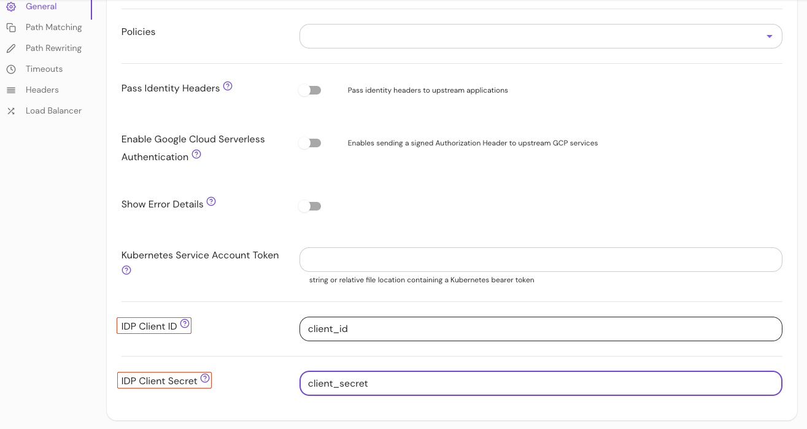

import TabItem from "@theme/TabItem";
import Tabs from "@theme/Tabs";

import EnterpriseConfiguration from "../../../../src/components/EnterpriseConfiguration";

# Identity Provider Client ID (per route)

## Summary

When set, **Identity Provider Client ID (per route)** overrides the value of [idp_client_id](/docs/reference/identity-provider-settings#identity-provider-client-id) set globally for this route.

## How to configure

<Tabs>
<TabItem value="Core" label="Core">

| **YAML**/**JSON** setting | **Type** | **Usage**    |
| :------------------------ | :------- | :----------- |
| `idp_client_id`           | `string` | **optional** |

### Examples

```yaml
routes:
  - from: https://verify.localhost.pomerium.io
    to: http://verify:8000
    idp_client_id: idp_client_id
```

</TabItem>
<TabItem value="Enterprise" label="Enterprise">
<EnterpriseConfiguration name="idp_client_id" resource="route">

Set **Identity Provider Client ID (per route)** in the Console:



</EnterpriseConfiguration>
</TabItem>
<TabItem value="Kubernetes" label="Kubernetes">

The `idp_client_id` can be set via a reference to a secret with a `client_id` key:

| **[Annotation name](/docs/deploy/k8s/ingress#set-ingress-annotations)** | **Type**                    | **Usage**    |
| :---------------------------------------------------------------------- | :-------------------------- | :----------- |
| `identity_provider_secret`                                              | name of a Kubernetes secret | **optional** |

```yaml
ingress.pomerium.io/identity_provider_secret: idp-secret
```

```yaml
apiVersion: v1
kind: Secret
metadata:
  name: idp-secret
data:
  client_id: ...
```

</TabItem>
</Tabs>
