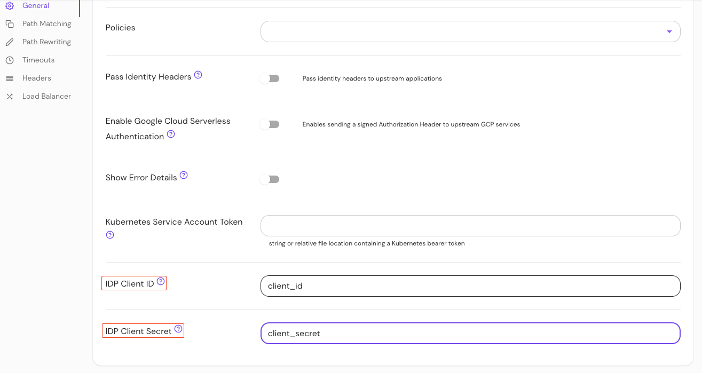

import Tabs from '@theme/Tabs';
import TabItem from '@theme/TabItem';

# Identity Provider Client Secret (per route)

## Summary

When set, **Identity Provider Client Secret (per route)** overrides the value of [idp_client_secret](/docs/reference/identity-provider-settings#identity-provider-client-secret) set globally for this route.

## How to configure

<Tabs>
<TabItem value="Core" label="Core">

| **YAML**/**JSON** setting | **Type** | **Usage**    |
| :------------------------ | :------- | :----------- |
| `idp_client_secret`       | `string` | **optional** |

### Examples

```yaml
routes:
  - from: https://verify.localhost.pomerium.io
    to: http://verify:8000
    idp_client_secret: idp_client_secret
```

</TabItem>
<TabItem value="Enterprise" label="Enterprise">

Set **Identity Provider Client Secret (per route)** in the Console:



</TabItem>
<TabItem value="Kubernetes" label="Kubernetes">

Kubernetes does not support `idp_client_secret` (per route)

</TabItem>
<TabItem value="Enterprise via Terraform" label="Enterprise via Terraform">

| **Parameter name** | **Type** | **Usage**    |
| :------------------------ | :------- | :----------- |
| `idp_client_secret`           | `String` | **optional** |

### Examples

```hcl
resource "pomerium_route" "verify_route" {
  name         = "verify-route"
  namespace_id = pomerium_namespace.test_namespace.id
  from         = "https://verify.localhost.pomerium.io"
  to           = ["https://verify.pomerium.com"]
  idp_client_secret = idp_client_secret
}
```
</TabItem>
</Tabs>
