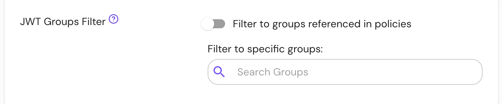

:::enterprise

This setting is available only in [Pomerium Enterprise](/docs/deploy/enterprise).

:::

## Summary

The **JWT Groups Filter (per route)** setting allows you to reduce the size of the groups claim in the [Pomerium JWT](/docs/capabilities/getting-users-identity). See the global [**JWT Groups Filter**](/docs/reference/jwt-groups-filter) reference page for more information about this feature.

When the global setting is enabled, the per-route option will _expand_ the set of allowed groups. A group will be eligible for inclusion in the groups claim if is allowed by either the global setting or the per-route setting.

When the global setting is not enabled, the per-route option will enable groups filtering for a specific route.

## How to configure

The **JWT Groups Filter** setting is available in the Enterprise Console on the route settings page, under the "Headers" tab.

