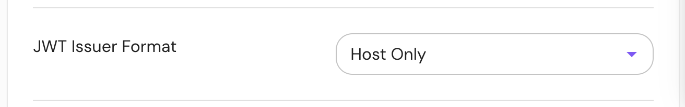

import Tabs from '@theme/Tabs';
import TabItem from '@theme/TabItem';

This setting determines the format of the issuer (`iss`) claim in the Pomerium JWT. See [JWT Authentication](/docs/capabilities/getting-users-identity) for more information about the Pomerium JWT.

Before Pomerium v0.28, this claim was always set to the hostname portion of the route's [**From**](/docs/reference/routes/from) URL. Starting in v0.28, the issue claim can be set to use a full URL instead. This may be necessary for interoperability with some JWT authentication consumers.

The default is hostname-only for backwards compatibility with existing Pomerium deployments.

## How to configure

<Tabs>
<TabItem value="Core" label="Core">

| Config file key | Environment variable | Type | Default |
| :-- | :-- | :-- | :-- |
| `jwt_issuer_format` | `JWT_ISSUER_FORMAT` | string (one of `hostOnly` or `uri`) | `hostOnly` |

### Examples

```yaml
jwt_issuer_format: uri
```

</TabItem>
<TabItem value="Enterprise" label="Enterprise">

**JWT Issuer Format** is listed under the "General" section of the route settings:



</TabItem>
<TabItem value="Kubernetes" label="Kubernetes">

**JWT Issuer Format** is not currently supported in Ingress Controller.

</TabItem>
</Tabs>
